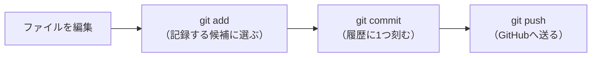

# 第7回　GitとGitHub：仲間・研究室で共有リポジトリを使う

!!! abstract "この回のゴール"
    - Git と GitHub の違いをイメージできる
    - リポジトリを **clone**（手元に複製）できる
    - **add → commit → push** の基本サイクルを回せる
    - **pull** で相手の変更を取り込める
    - 自分の書いたコードを、共有リポジトリに置けるようになる
    - 所要時間の目安: 60分

第1回で Git は入れて、名前とメールも設定しました（まだの人は第1回ステップ4へ）。今回はそれを使います。

---

## 1. Git と GitHub って何が違う？

- **Git** … あなたのパソコンの中で、ファイルの**変更履歴を記録**する仕組み。「いつ・何を・なぜ変えたか」を残せる。**タイムマシン**のようなもの。
- **GitHub** … その履歴を**インターネット上に置いて共有**する場所。**クラウド保存＋共同作業の広場**。

!!! note "なぜ使うの？（研究者にこそ効く）"
    - **やり直せる**：壊しても過去の状態に戻れる。安心して実験できる。
    - **共有できる**：仲間・研究室で同じコードを見て、育てられる。
    - **証拠が残る**：いつ何をしたかの記録は、研究の再現性そのもの。
    - **ポートフォリオになる**：GitHub は「作った証拠」の置き場所。就職でも見られます。

---

## 2. GitHub アカウントを用意する

[github.com](https://github.com/) で無料アカウントを作ります（学習用に、自分専用のアカウントを1つ用意しましょう）。

!!! warning "アカウント作成・パスワードは本人の手で"
    アカウント登録やパスワードの入力は、**必ず本人が自分で**行ってください。ここはAIに任せてはいけない部分です。

誰かと**共有リポジトリ**（例：このコースのリポジトリや、練習用に新しく作ったもの）で共同作業したい場合は、相手を **Collaborator（共同編集者）** として招待すると、お互いに push できます。
（リポジトリの Settings → Collaborators から招待できます。）

---

## 3. clone：リポジトリを手元に複製する

GitHub 上のリポジトリを、自分のパソコンに丸ごとコピーするのが **clone** です。
リポジトリのページで緑色の **「Code」ボタン → HTTPS の URL** をコピーし、ターミナルで次を実行します。

```bash
# 例（URL は自分のものに置き換える）
git clone https://github.com/ichirio/chem-data-course.git

# できたフォルダに入る
cd chem-data-course
```

これで、手元にリポジトリのフォルダができました。VS Code で「フォルダを開く」から、このフォルダを開けば準備完了です。

---

## 4. 基本サイクル：add → commit → push

Git の毎日の使い方は、たった3ステップの繰り返しです。



実際にやってみましょう。手元のフォルダに、練習用のファイルを1つ作ります。

```python title="my_first.py"
# はじめての共有コード
print("これは私が書いた最初のコードです")
```

そして、ターミナルで次を順に実行します。

```bash
# ① いま何が変わったか確認
git status

# ② 記録したいファイルを選ぶ（. は「全部」の意味）
git add my_first.py

# ③ 履歴に1つ刻む（-m のあとに「何をしたか」のメモ）
git commit -m "はじめてのコードを追加"

# ④ GitHub へ送る
git push
```

!!! tip "commit メッセージは「何をしたか」を短く"
    `git commit -m "..."` の `...` には、**変更の内容**を書きます。「グルコースの計算を追加」「pH判定のバグを修正」など、後で見て分かる一言に。未来の自分と仲間への手紙です。

push したら、GitHub のページを再読み込みしてみましょう。さっきのファイルが表示されていれば成功です！

---

## 5. pull：相手の変更を取り込む

複数人で同じリポジトリを使うと、相手が push した変更を**自分の手元にも取り込む**必要があります。それが **pull** です。

```bash
# 作業を始める前に、まず最新を取り込む（毎回の習慣に）
git pull
```

!!! success "おすすめの毎日の流れ"
    1. 作業前に **`git pull`**（最新にする）
    2. コードを書く
    3. **`git add` → `git commit` → `git push`**（記録して共有）

    この「pull で始まり push で終わる」を習慣にすると、複数人でぶつからずに共同作業できます。

---

## 6. よくあるつまずき

??? question "push したら「認証して」と言われた"
    はじめての push では GitHub へのログインを求められます。ブラウザで承認する方式（推奨）に従ってください。パスワードやトークンの入力は、**画面の指示に沿って本人が**行いましょう。

??? question "「Please tell me who you are」と出た"
    第1回の名前・メール設定がまだです。次を一度だけ実行してください。
    ```bash
    git config --global user.name "あなたの名前"
    git config --global user.email "you@example.com"
    ```

??? question "pull したら「conflict（衝突）」と出た"
    同じ場所を二人が別々に直すと起きます。あわてず、ファイルを開いて `<<<<<<<` などの印の部分を見て、どちらを残すか決めて直します。最初のうちは「作業前に必ず pull」を徹底すると、ほとんど起きません。困ったらAIに画面を見せて相談を。

---

## 演習問題

**問1.** 共有リポジトリ（なければ GitHub で練習用に1つ新規作成）を、自分のパソコンに `git clone` してください。フォルダに入り、`git status` を実行して「何も変更がない」状態を確認しましょう。

**問2.** そのフォルダに、これまでの回で作った好きな `.py` ファイル（例：`molar_mass.py`）を1つ置き、**add → commit → push** の3ステップで GitHub に上げてください。commit メッセージは分かりやすい一言にしましょう。

**問3.** GitHub のリポジトリのページをブラウザで開き、いま push したファイルが表示されていることを確認してください。さらに、ファイルをクリックして中身が読めることも確認しましょう。

---

## 解答

??? success "問1 の解答・確認ポイント"
    ```bash
    git clone https://github.com/＜あなた＞/＜リポジトリ名＞.git
    cd ＜リポジトリ名＞
    git status
    ```
    `nothing to commit, working tree clean`（変更なし・きれいな状態）と出れば成功です。

??? success "問2 の解答・確認ポイント"
    ```bash
    # molar_mass.py をフォルダに置いてから
    git add molar_mass.py
    git commit -m "分子量を計算する関数を追加"
    git push
    ```
    `git status` で緑色（add 済み）→ commit で「1 file changed」→ push で「To https://github.com/...」と出れば成功です。

??? success "問3 の解答・確認ポイント"
    GitHub のページを再読み込みすると、ファイル一覧に `molar_mass.py` が現れます。クリックすると中身（コード）が色付きで表示されます。ここまで来たら、あなたのコードはクラウドに安全に保存され、仲間や研究室と共有できる状態です。

---

## この回のまとめ

- **Git** は手元の履歴管理、**GitHub** はそれをクラウドで共有する場所
- **clone** でリポジトリを複製、**pull** で最新を取り込む
- 毎日の基本サイクルは **add →（何を選ぶか）→ commit →（履歴に刻む）→ push →（共有）**
- commit メッセージは「何をしたか」を短く。未来の自分への手紙
- 「pull で始まり push で終わる」を習慣に

### 次回予告

[第8回：まとめ演習](lesson-08.md) では、ここまで学んだ **変数・型・リスト・辞書・if・for・関数** を全部使って、対話式の「ミニ分子量電卓アプリ」を作ります。第1部の総仕上げです。
