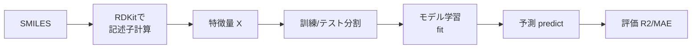
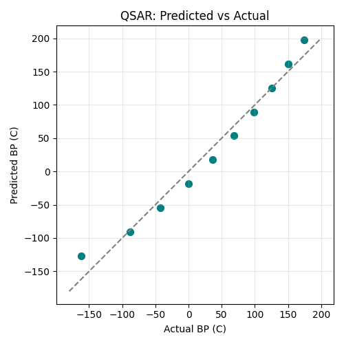

# 第100回　まとめ演習：QSARで物性を予測する

!!! abstract "この回のゴール"
    - 第6部（分子）と第8部（機械学習）を一気通貫でつなぐ
    - SMILES → 記述子 → モデル学習 → 予測 → 評価の全工程を行う
    - QSAR（定量的構造-物性相関）の基本を体験する
    - 所要時間の目安: 60分（第8部の総仕上げ）
    - 使うテーマ：**アルカンの沸点を構造から予測**

**QSAR**（Quantitative Structure-Activity/Property Relationship）は、「分子の構造から性質を予測する」ケモインフォマティクスの中心テーマ。第8部の集大成として、その全工程を作ります。

`ml100.py` を作りましょう。

---

## 1. 全体の流れ

QSAR は、これまで学んだことの組み合わせです。



## 2. SMILES から記述子（特徴量）を作る

直鎖アルカン C1〜C10 の SMILES から、RDKit で分子量を計算し、特徴量にします。

```python
import numpy as np
from rdkit import Chem
from rdkit.Chem import Descriptors

# アルカンの SMILES と沸点[℃]
alkanes = ["C","CC","CCC","CCCC","CCCCC","CCCCCC","CCCCCCC","CCCCCCCC","CCCCCCCCC","CCCCCCCCCC"]
bp = np.array([-161.5,-88.6,-42.1,-0.5,36.1,68.7,98.4,125.7,150.8,174.1])

# RDKit で分子量を計算して特徴量に
mw = np.array([Descriptors.MolWt(Chem.MolFromSmiles(s)) for s in alkanes]).reshape(-1, 1)
print("特徴量（分子量）:", mw.ravel().round(1))
```

出力:

```text
特徴量（分子量）: [ 16.   30.1  44.1  58.1  72.2  86.2 100.2 114.2 128.3 142.3]
```

構造（SMILES）から、機械学習の入力（分子量）ができました。

---

## 3. 学習・予測・評価

第92〜96回の型で、モデルを学習・評価します。

```python
from sklearn.model_selection import train_test_split
from sklearn.linear_model import LinearRegression
from sklearn.metrics import r2_score, mean_absolute_error

X_train, X_test, y_train, y_test = train_test_split(mw, bp, test_size=0.3, random_state=42)

model = LinearRegression()
model.fit(X_train, y_train)                    # 学習
pred = model.predict(X_test)                   # 予測

print("テスト R^2:", round(r2_score(y_test, pred), 4))
print("テスト MAE:", round(mean_absolute_error(y_test, pred), 2), "℃")
```

出力:

```text
テスト R^2: 0.9882
テスト MAE: 9.23 ℃
```

**構造（SMILES）から沸点を、R² 0.99 で予測**できました。未知のアルカンの沸点も、SMILES さえあれば予測できます。

## 4. 予測 vs 実測を可視化する

```python
import matplotlib.pyplot as plt

all_pred = model.predict(mw)
plt.figure(figsize=(5, 5))
plt.scatter(bp, all_pred, color="teal", s=50)
plt.plot([-180, 200], [-180, 200], color="gray", linestyle="--")   # 理想線
plt.xlabel("Actual BP (C)")
plt.ylabel("Predicted BP (C)")
plt.title("QSAR: Predicted vs Actual")
plt.grid(True, alpha=0.3)
plt.tight_layout()
plt.savefig("qsar_parity.png", dpi=100)
plt.show()
```

生成した図（予測 vs 実測）:



点が対角線（理想：予測＝実測）の近くに並んでいます。予測がよく当たっている証拠です。この**パリティプロット**は、QSAR モデルの性能を示す定番の図です。

!!! success "第8部の集大成"
    **SMILES → RDKit で記述子 → 特徴量 → 学習 → 予測 → 評価 → 可視化。**
    分子の構造から性質を予測する QSAR の全工程を、自分の手で作れました。実際の創薬・材料開発では、より多くの記述子と分子、より高度なモデル（ランダムフォレスト等）を使いますが、**基本の流れはまったく同じ**です。あなたは、その土台を手にしました。

---

## 演習問題

**問1.** 本文のアルカンデータで、SMILES から分子量を計算し、`train_test_split`（`random_state=42`）で分けて、線形回帰のテスト R² と MAE を表示してください。

**問2.** 特徴量を「分子量」だけでなく、`Descriptors.MolLogP` も加えた**2特徴量**にして（`np.column_stack`）、テスト R² が変わるか見てください。

**問3.** 学習したモデルで、C11（`"CCCCCCCCCCC"`）の沸点を予測してください。実際の値（約196℃）とどれくらい近いですか？

---

## 解答

??? success "問1 の解答"
    ```python
    import numpy as np
    from rdkit import Chem
    from rdkit.Chem import Descriptors
    from sklearn.model_selection import train_test_split
    from sklearn.linear_model import LinearRegression
    from sklearn.metrics import r2_score, mean_absolute_error

    alkanes = ["C","CC","CCC","CCCC","CCCCC","CCCCCC","CCCCCCC","CCCCCCCC","CCCCCCCCC","CCCCCCCCCC"]
    bp = np.array([-161.5,-88.6,-42.1,-0.5,36.1,68.7,98.4,125.7,150.8,174.1])
    mw = np.array([Descriptors.MolWt(Chem.MolFromSmiles(s)) for s in alkanes]).reshape(-1,1)
    Xtr,Xte,ytr,yte = train_test_split(mw, bp, test_size=0.3, random_state=42)
    m = LinearRegression().fit(Xtr, ytr)
    print("R^2:", round(r2_score(yte, m.predict(Xte)), 4))
    print("MAE:", round(mean_absolute_error(yte, m.predict(Xte)), 2))
    ```

    出力:
    ```text
    R^2: 0.9882
    MAE: 9.23
    ```

??? success "問2 の解答"
    ```python
    logp = np.array([Descriptors.MolLogP(Chem.MolFromSmiles(s)) for s in alkanes])
    X2 = np.column_stack([mw.ravel(), logp])
    Xtr,Xte,ytr,yte = train_test_split(X2, bp, test_size=0.3, random_state=42)
    m2 = LinearRegression().fit(Xtr, ytr)
    print("2特徴量 R^2:", round(m2.score(Xte, yte), 4))
    ```
    特徴量を増やすと結果が変わります（このデータは分子量だけでほぼ説明できるので、大きくは変わりません）。

??? success "問3 の解答"
    ```python
    mw11 = Descriptors.MolWt(Chem.MolFromSmiles("CCCCCCCCCCC"))
    print("C11 予測:", round(m.predict([[mw11]])[0], 1), "℃")
    ```
    直線モデルなので、外挿では実際の196℃より高めに出ます（第93回と同じ傾向）。より広い訓練データや非線形モデルで改善できます。

---

## 第8部　修了

おめでとうございます！ 機械学習で、**回帰・分類・訓練/テスト分割・過学習の理解・評価・特徴量エンジニアリング・PCA・クラスタリング・QSAR**まで身につきました。分子の構造から性質を予測する、データ駆動の化学の入口に立ちました。

!!! tip "ここまでの到達点"
    第1〜8部で、**Python と R による化学データ分析の主要スキル**——データ処理・可視化・統計・分子処理・機械学習——がほぼ揃いました。残るは第9部（研究・実務への総合応用）です。あと少しです！

### 次回予告

このあとは最終章、**第9部：研究・実務に活かす**（レポート・再現性・AI活用・総合プロジェクト）を追加します。ここまで本当によく頑張りました！
