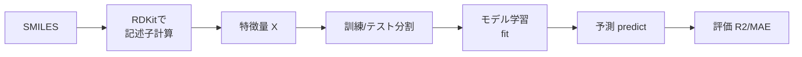
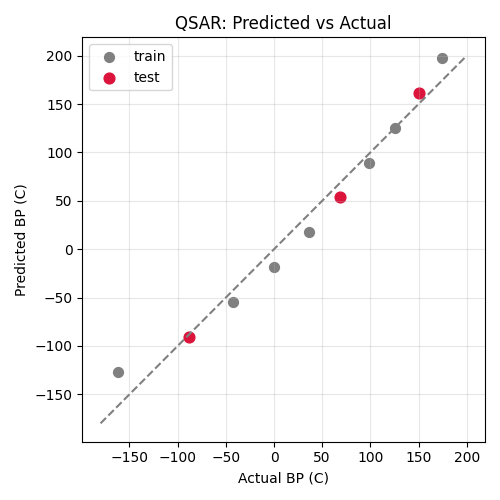

# 第100回　まとめ演習：QSARで物性を予測する

!!! abstract "この回のゴール"
    - 第6部（分子）と第8部（機械学習）を一気通貫でつなぐ
    - SMILES → 記述子 → モデル学習 → 予測 → 評価の全工程を行う
    - QSAR／QSPR（定量的構造-活性／物性相関）の基本を体験する（物性を予測する場合は QSPR とも呼びます）
    - 所要時間の目安: 60分（第8部の総仕上げ）
    - 使うテーマ：**アルカンの沸点を構造から予測**

**QSAR**（Quantitative Structure-Activity/Property Relationship）は、「分子の構造から性質を予測する」ケモインフォマティクスの中心テーマ。第8部の集大成として、その全工程を作ります。

`ml100.py` を作りましょう。

---

## 1. 全体の流れ

QSAR は、これまで学んだことの組み合わせです。


```mermaid
flowchart LR
    A[SMILES] --> B[RDKitで<br/>記述子計算]
    B --> C[特徴量 X]
    C --> D[訓練/テスト分割]
    D --> E[モデル学習<br/>fit]
    E --> F[予測 predict]
    F --> G[評価 R2/MAE]
```

## 2. SMILES から記述子（特徴量）を作る

直鎖アルカン C1〜C10 の SMILES から、RDKit で分子量を計算し、特徴量にします。

```python
import numpy as np
from rdkit import Chem
from rdkit.Chem import Descriptors

# アルカンの SMILES と沸点[℃]
alkanes = ["C","CC","CCC","CCCC","CCCCC","CCCCCC","CCCCCCC","CCCCCCCC","CCCCCCCCC","CCCCCCCCCC"]
bp = np.array([-161.5,-88.6,-42.1,-0.5,36.1,68.7,98.4,125.7,150.8,174.1])

# RDKit で分子量を計算して特徴量に
mw = np.array([Descriptors.MolWt(Chem.MolFromSmiles(s)) for s in alkanes]).reshape(-1, 1)
print("特徴量（分子量）:", mw.ravel().round(1))
```

出力:

```text
特徴量（分子量）: [ 16.   30.1  44.1  58.1  72.2  86.2 100.2 114.2 128.3 142.3]
```

構造（SMILES）から、機械学習の入力（分子量）ができました。

---

## 3. 学習・予測・評価

第92〜96回の型で、モデルを学習・評価します。

```python
from sklearn.model_selection import train_test_split
from sklearn.linear_model import LinearRegression
from sklearn.metrics import r2_score, mean_absolute_error

X_train, X_test, y_train, y_test = train_test_split(mw, bp, test_size=0.3, random_state=42)

model = LinearRegression()
model.fit(X_train, y_train)                    # 学習
pred = model.predict(X_test)                   # 予測

print("テスト R^2:", round(r2_score(y_test, pred), 4))
print("テスト MAE:", round(mean_absolute_error(y_test, pred), 2), "℃")
```

出力:

```text
テスト R^2: 0.9882
テスト MAE: 9.23 ℃
```

**構造（SMILES）から沸点を、テスト R² 0.99 で予測**できました。ただし、テストは3点だけです。また、直鎖アルカンの分子量は「14.03 × 炭素数 + 2.02」なので、この結果は第96回（炭素数で回帰）と**まったく同じ**になります。分子量という特徴量は、ここでは炭素数と同じ情報しか持っていないのです。

## 4. 予測 vs 実測を可視化する

```python
import matplotlib.pyplot as plt

plt.figure(figsize=(5, 5))
plt.scatter(y_train, model.predict(X_train), color="gray", s=50, label="train")
plt.scatter(y_test, model.predict(X_test), color="crimson", s=60, label="test")
plt.plot([-180, 200], [-180, 200], color="gray", linestyle="--")   # 理想線
plt.xlabel("Actual BP (C)")
plt.ylabel("Predicted BP (C)")
plt.title("QSAR: Predicted vs Actual")
plt.legend()
plt.grid(True, alpha=0.3)
plt.tight_layout()
plt.savefig("qsar_parity.png", dpi=100)
plt.show()
```

生成した図（予測 vs 実測）:



点はおおむね対角線（理想：予測＝実測）の近くに並んでいますが、よく見ると両端（メタン・デカン）では対角線より上、中ほどでは下にあり、S字状の系統的なずれがあります（第93回の残差と同じ）。この**パリティプロット**は、QSAR モデルの性能を示す定番の図です。訓練点とテスト点は**色を分けて**描き、評価はテスト点で行います。

## 5. 適用範囲：このモデルは何に使えるか

このモデルは**直鎖アルカンだけ**で学習しました。分子量が同じ枝分かれ異性体を予測させてみます。

```python
# C5H12 の3つの異性体（分子量はすべて同じ）
isomers = {"ペンタン": ("CCCCC", 36.1),
           "イソペンタン": ("CC(C)CC", 27.7),
           "ネオペンタン": ("CC(C)(C)C", 9.5)}
for name, (smi, obs) in isomers.items():
    m = Descriptors.MolWt(Chem.MolFromSmiles(smi))
    print(f"{name}: MW {m:.1f}  予測 {model.predict([[m]])[0]:.1f} ℃  実測 {obs} ℃")
print("学習データの分子量の範囲:", round(X_train.min(), 1), "〜", round(X_train.max(), 1))
```

出力:

```text
ペンタン: MW 72.2  予測 17.5 ℃  実測 36.1 ℃
イソペンタン: MW 72.2  予測 17.5 ℃  実測 27.7 ℃
ネオペンタン: MW 72.2  予測 17.5 ℃  実測 9.5 ℃
学習データの分子量の範囲: 16.0 〜 142.3
```

分子量だけでは枝分かれ（分子の形）を区別できないので、3つとも同じ予測になります。枝分かれが多いほど分子間の接触面積が減って沸点が下がる、という化学はこのモデルに入っていません。モデルが信頼できるのは、**学習データと似た分子（ここでは C1〜C10 の直鎖アルカン）の範囲**だけです。これを**適用範囲（applicability domain）**といいます。

!!! note "化合物データの分割：scaffold split"
    実際の QSAR では、よく似た分子（同じ骨格の類縁体）がデータに多く含まれます。ランダムに分割すると、テストの分子とそっくりな分子が訓練に入り、成績が甘く出ます。そこで、分子の骨格（Bemis–Murcko 骨格。RDKit の `rdkit.Chem.Scaffolds.MurckoScaffold.MurckoScaffoldSmiles`）ごとにまとめて訓練とテストに分ける **scaffold split** がよく使われます（例：アスピリン・イブプロフェン・トルエンはどれも骨格が `c1ccccc1`）。「新しい骨格の分子にも使えるか」を確かめたいときの標準的な方法です。

!!! success "第8部の集大成"
    **SMILES → RDKit で記述子 → 特徴量 → 学習 → 予測 → 評価 → 可視化。**
    分子の構造から性質を予測する QSAR の全工程を、自分の手で作れました。実際の創薬・材料開発では、より多くの記述子と分子、より高度なモデル（ランダムフォレスト等）を使いますが、**基本の流れはまったく同じ**です。あなたは、その土台を手にしました。

---

## AIに任せるときの指示と確認

!!! example "AIへの頼み方（例）"
    「SMILES のリストと沸点 [℃] の配列があります。RDKit で MolWt と MolLogP を計算して特徴量にし、
    train_test_split(test_size=0.3, random_state=42) で分割、make_pipeline(StandardScaler(), LinearRegression()) で学習してください。
    テストの R²・MAE [℃] を表示し、訓練点とテスト点を色分けしたパリティプロットを描いてください。
    最後に、学習データの各特徴量の最小〜最大を表示し、予測したい新しい分子がその範囲内かを判定するコードも付けてください。」

!!! warning "AIの出力で確かめること"
    - **分割の前に全データで前処理していないか**：`StandardScaler().fit_transform(X)` の後に `train_test_split` していたら漏洩。パイプラインに入っているか。
    - **特徴量どうしの相関**：`np.corrcoef` で特徴量間の相関を見る。相関 1.0 の特徴量を足しても情報は増えない（直鎖アルカンの MW と MolLogP）。
    - **適用範囲**：予測したい分子が学習データと似ているか（直鎖だけで学んだモデルに枝分かれ異性体を入れていないか、分子量が学習範囲の外でないか）。AI は範囲外の分子にも平然と数値を返す。
    - **テストの点数**：`len(y_test)` を表示させる。3点の R² 0.99 を「高精度」と書いていたら過大評価。
    - **分割の方法**：類縁体が多いデータでランダム分割していないか。骨格ごとの分割（scaffold split）を検討したかを尋ねる。

---

## 演習問題

**問1.** 本文のアルカンデータで、SMILES から分子量を計算し、`train_test_split`（`random_state=42`）で分けて、線形回帰のテスト R² と MAE を表示してください。

**問2.** 特徴量を「分子量」だけでなく、`Descriptors.MolLogP` も加えた**2特徴量**にして（`np.column_stack`）、テスト R² が変わるか見てください。

**問3.** 学習したモデルで、C11（`"CCCCCCCCCCC"`）の沸点を予測してください。実際の値（約196℃）とどれくらい近いですか？

**問4.** 次は、イソオクタン（2,2,4-トリメチルペンタン、ガソリンのオクタン価の基準物質）の沸点を予測するために AI が書いたコードと出力です。AI は「テスト R² 0.99 の高精度モデルなので、イソオクタンの沸点は 112 ℃ と予測できます」と説明しました。問題点を2つ指摘し、直してください。

```python
import numpy as np
from rdkit import Chem
from rdkit.Chem import Descriptors
from sklearn.preprocessing import StandardScaler
from sklearn.model_selection import train_test_split
from sklearn.linear_model import LinearRegression

alkanes = ["C","CC","CCC","CCCC","CCCCC","CCCCCC","CCCCCCC","CCCCCCCC","CCCCCCCCC","CCCCCCCCCC"]
bp = np.array([-161.5,-88.6,-42.1,-0.5,36.1,68.7,98.4,125.7,150.8,174.1])

def feats(smiles_list):
    return np.array([[Descriptors.MolWt(Chem.MolFromSmiles(s)),
                      Descriptors.MolLogP(Chem.MolFromSmiles(s))] for s in smiles_list])

scaler = StandardScaler()
X = scaler.fit_transform(feats(alkanes))              # 全データで標準化
Xtr, Xte, ytr, yte = train_test_split(X, bp, test_size=0.3, random_state=42)
model = LinearRegression().fit(Xtr, ytr)
print("テスト R^2:", round(model.score(Xte, yte), 4))

# イソオクタン（2,2,4-トリメチルペンタン）の沸点を予測
iso = scaler.transform(feats(["CC(C)CC(C)(C)C"]))
print("イソオクタンの予測沸点:", round(model.predict(iso)[0], 1), "℃")
```

出力:

```text
テスト R^2: 0.9882
イソオクタンの予測沸点: 112.1 ℃
```

---

## 解答

??? success "問1 の解答"
    ```python
    import numpy as np
    from rdkit import Chem
    from rdkit.Chem import Descriptors
    from sklearn.model_selection import train_test_split
    from sklearn.linear_model import LinearRegression
    from sklearn.metrics import r2_score, mean_absolute_error

    alkanes = ["C","CC","CCC","CCCC","CCCCC","CCCCCC","CCCCCCC","CCCCCCCC","CCCCCCCCC","CCCCCCCCCC"]
    bp = np.array([-161.5,-88.6,-42.1,-0.5,36.1,68.7,98.4,125.7,150.8,174.1])
    mw = np.array([Descriptors.MolWt(Chem.MolFromSmiles(s)) for s in alkanes]).reshape(-1,1)
    Xtr,Xte,ytr,yte = train_test_split(mw, bp, test_size=0.3, random_state=42)
    m = LinearRegression().fit(Xtr, ytr)
    print("R^2:", round(r2_score(yte, m.predict(Xte)), 4))
    print("MAE:", round(mean_absolute_error(yte, m.predict(Xte)), 2))
    ```

    出力:
    ```text
    R^2: 0.9882
    MAE: 9.23
    ```

??? success "問2 の解答"
    ```python
    logp = np.array([Descriptors.MolLogP(Chem.MolFromSmiles(s)) for s in alkanes])
    X2 = np.column_stack([mw.ravel(), logp])
    Xtr,Xte,ytr,yte = train_test_split(X2, bp, test_size=0.3, random_state=42)
    m2 = LinearRegression().fit(Xtr, ytr)
    print("2特徴量 R^2:", round(m2.score(Xte, yte), 4))
    ```
    出力:
    ```text
    2特徴量 R^2: 0.9882
    ```
    1特徴量のときと**まったく同じ**です。直鎖アルカンでは、MolLogP も炭素1個あたり 0.39 ずつ増える炭素数の一次関数で、分子量との相関係数は 1.0 です（`np.corrcoef(mw.ravel(), logp)` で確かめられます）。新しい情報を持たない特徴量を足しても、予測は良くなりません（多重共線性、第84回）。

??? success "問3 の解答"
    ```python
    mw11 = Descriptors.MolWt(Chem.MolFromSmiles("CCCCCCCCCCC"))
    print("C11 予測:", round(m.predict([[mw11]])[0], 1), "℃")
    ```

    出力:
    ```text
    C11 予測: 233.3 ℃
    ```
    直線モデルなので、外挿では実際の約196 ℃より 37 ℃ほど高く出ます（第93回と同じ傾向）。より広い訓練データや非線形モデルで改善できます。

??? success "問4 の解答"
    **誤り1（データ漏洩）**：分割の**前に**全データで `StandardScaler` を fit しています。テストの分子の平均・標準偏差が前処理に使われています。この例では線形回帰なので数値は変わりません（下の修正版も 0.9882）が、正則化つきのモデルや距離を使うモデルでは成績が甘く出ます。**数字では気づけないので、コードの順番を読んで見抜く**必要があります。パイプラインに入れて、訓練データだけで標準化します。

    **誤り2（適用範囲の外）**：学習データは**直鎖**アルカンだけです。枝分かれの多いイソオクタンは適用範囲の外で、テスト R² が高くても予測は保証されません。実測の沸点は 99.2 ℃で、予測は 13 ℃高く外れています（テストの MAE 9.2 ℃より大きい）。しかも学習データでは MW と MolLogP が完全に比例しているので、両者が比例しない枝分かれ分子では、2つの係数の分け方しだいで予測がいくらでも変わります。

    ```python
    import numpy as np
    from rdkit import Chem
    from rdkit.Chem import Descriptors
    from sklearn.pipeline import make_pipeline
    from sklearn.preprocessing import StandardScaler
    from sklearn.model_selection import train_test_split
    from sklearn.linear_model import LinearRegression

    alkanes = ["C","CC","CCC","CCCC","CCCCC","CCCCCC","CCCCCCC","CCCCCCCC","CCCCCCCCC","CCCCCCCCCC"]
    bp = np.array([-161.5,-88.6,-42.1,-0.5,36.1,68.7,98.4,125.7,150.8,174.1])

    def feats(smiles_list):
        return np.array([[Descriptors.MolWt(Chem.MolFromSmiles(s)),
                          Descriptors.MolLogP(Chem.MolFromSmiles(s))] for s in smiles_list])

    X = feats(alkanes)
    Xtr, Xte, ytr, yte = train_test_split(X, bp, test_size=0.3, random_state=42)
    model = make_pipeline(StandardScaler(), LinearRegression())   # 標準化は訓練データだけで fit される
    model.fit(Xtr, ytr)
    print("テスト R^2:", round(model.score(Xte, yte), 4))

    # 適用範囲の確認：学習データは「直鎖」アルカンだけ
    for name, smi, obs in [("n-オクタン", "CCCCCCCC", 125.7),
                           ("イソオクタン", "CC(C)CC(C)(C)C", 99.2)]:
        p = model.predict(feats([smi]))[0]
        print(f"{name}: 予測 {p:.1f} ℃ / 実測 {obs} ℃")
    ```

    出力:
    ```text
    テスト R^2: 0.9882
    n-オクタン: 予測 125.4 ℃ / 実測 125.7 ℃
    イソオクタン: 予測 112.1 ℃ / 実測 99.2 ℃
    ```
    直鎖の n-オクタンはよく当たりますが、枝分かれのイソオクタンは外れます。枝分かれ異性体を予測したいなら、枝分かれアルカンを学習データに加え、形を表す記述子（例：分岐の程度を表すトポロジカル指数）を使う必要があります。

---

## 第8部　修了

おめでとうございます！ 機械学習で、**回帰・分類・訓練/テスト分割・過学習の理解・評価・特徴量エンジニアリング・PCA・クラスタリング・QSAR**まで身につきました。分子の構造から性質を予測する、データ駆動の化学の入口に立ちました。

!!! tip "ここまでの到達点"
    第1〜8部で、**Python と R による化学データ分析の主要スキル**——データ処理・可視化・統計・分子処理・機械学習——がほぼ揃いました。残るは第9部（研究・実務への総合応用）です。あと少しです！

### 次回予告

[第101回：Quartoでレポート・論文を書く](lesson-101.md) から、最終章 **第9部：研究・実務に活かす**（レポート・再現性・AI活用・データ管理・総合プロジェクト）が始まります。ここまで本当によく頑張りました！
