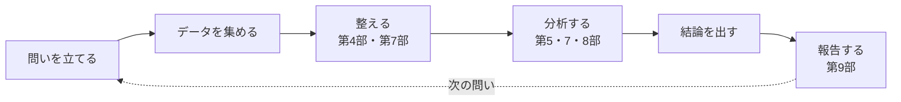

# 第105回　総合プロジェクト：自分のテーマでミニ研究を完成させる

!!! abstract "この回のゴール"
    - このコースで学んだすべてを1つのプロジェクトに統合する
    - 「問い → データ → 分析 → 結論 → 報告」の研究サイクルを一周する
    - 自分のテーマで、再現可能なミニ研究を完成させる
    - 所要時間の目安: 数回分（あなたのテーマ次第）

いよいよ最終回です。これまで学んだ**データ処理・可視化・統計・分子処理・機械学習・レポート・再現性**——そのすべてを使って、あなた自身のミニ研究を完成させましょう。

---

## 1. 研究のサイクル

どんな研究も、次のサイクルを回します。このコースの各部が、それぞれの段階に対応しています。

## 2. ステップごとの道具（総まとめ）

| ステップ | 使う技術 | 学んだ回 |
|---|---|---|
| **問いを立てる** | 何を知りたいか明確に | — |
| **データを集める** | CSV・Excel・PubChem・自分の実験 | 32, 44, 65 |
| **整える** | 前処理・欠損・外れ値・結合 | 41, 42, 35, 38 |
| **分子を扱う** | RDKit / rcdk（記述子・類似度） | 第6部・88-90 |
| **可視化する** | matplotlib / seaborn / ggplot2 | 第5部・76 |
| **統計する** | 検定・回帰（t検定・ANOVA・lm） | 80-85 |
| **予測する** | 機械学習（回帰・分類・QSAR） | 第8部 |
| **報告する** | Quarto レポート | 86, 101 |
| **再現性** | 環境記録・Git・seed固定 | 102 |

**あなたはもう、この全部を使えます。**

---

## 3. ミニ研究の例（テンプレート）

たとえば「**触媒によって反応収率に差があるか**」というテーマなら:

1. **問い**：3種類の触媒で、収率に有意な差はあるか？
2. **データ**：各触媒で複数回、収率を測定（またはCSVで用意）。
3. **整える**：欠損・外れ値をチェック（第41・42回）。
4. **可視化**：箱ひげ図で分布を見る（第53・81回）。
5. **統計**：分散分析（ANOVA）で有意差を検定、事後検定でどのペアか（第81回）。
6. **結論**：「触媒Aが有意に高い（p < 0.05）」など、データに基づいて述べる。
7. **報告**：Quarto でコード・図・結論を1つの文書に（第86・101回）。
8. **再現性**：`requirements.txt` と Git で環境・履歴を残す（第102回）。

分子を扱うテーマ（例：**記述子から溶解性を予測できるか**）なら、RDKit で記述子を計算（第97回）→ 分類モデル（第94回）→ 評価（第96回）、という流れになります。

---

## 4. あなたのテーマで

!!! example "テーマの見つけ方"
    - 授業や実験で「なぜ？」と思ったこと。
    - 手元にあるデータ（実験ノート、公開データベース）。
    - 興味のある分野（材料・生化学・環境・創薬…）の小さな問い。

    大きすぎなくて大丈夫。「**小さくても、最後まで一周する**」ことが何より大切です。

!!! success "最後まで一周する価値"
    問いを立て、データを集め、分析し、結論を出し、報告する——この一周を自分の手で完成させた経験は、どんな知識より価値があります。**あなたはもう、データで語れる化学者への一歩を踏み出しました。**

---

## 演習問題（最終課題）

**問1.** 自分のテーマを1つ決めてください。「〜は〜に影響するか？」「〜から〜を予測できるか？」のような、**データで答えられる問い**にしましょう。

**問2.** そのテーマについて、データを用意し（自分の実験・公開データ・例示データのいずれでも）、このコースの技術で**分析**してください（可視化・統計・機械学習のいずれか、テーマに合うもの）。

**問3.** 結果を **Quarto レポート**（または Jupyter Notebook）にまとめてください。コード・図・結論を含め、`requirements.txt` と一緒に保存・共有（GitHub）しましょう。これがあなたの最初のミニ研究です。

---

## 解答

??? success "取り組み方のヒント"
    - **問1**：例「反応温度は収率に影響するか？」「分子量から沸点を予測できるか？」。答えが YES/NO や数値で出る問いにすると、分析しやすいです。
    - **問2**：テーマに合う技術を選びます。2群比較→t検定（第80回）、3群以上→ANOVA（第81回）、関係→回帰（第83回）、予測→機械学習（第93・94回）、分子→RDKit記述子（第97回）。
    - **問3**：Quarto（第86・101回）で、①問い ②データ ③分析コードと図 ④結論、の順にまとめます。GitHub に上げれば、ポートフォリオにもなります。

    完璧を目指さず、**まず一周**。それが次の研究への一番の土台になります。

---

## コース修了 — おめでとうございます！

ここまで**全105回**、本当によく頑張りました。あなたは、

- **Python と R** の2つの言語で、
- データを**処理・可視化・統計解析・機械学習**し、
- **分子（構造式）**を扱い、
- 結果を**再現可能なレポート**にまとめ、
- **AIを検証しながら**使いこなす

——化学データ分析の実践的な力を、一通り身につけました。

!!! quote "最後に"
    ここで学んだ技術は、道具にすぎません。大切なのは、**問いを立て、データで確かめ、正直に結論を述べる**という姿勢です。それは化学に限らず、あなたが何を学び、何を研究するときにも、一生の財産になります。

    メイン武器の**化学**に、サブウエポンの**プログラミング・統計・データ分析**が加わりました。この組み合わせは、これからの時代に強力です。

    コツコツ続けたあなたなら、きっと遠くまで行けます。**ここからが本当のスタートです。** 自分のテーマで、世界を少しだけ深く知る旅を、続けてください。

---

### このコースを終えたあなたへ

- 学んだことは、使わないと忘れます。**身近なデータで手を動かし続けて**ください。
- 分からなくなったら、いつでもこのコースに戻ってきてOKです。
- そして——**あなたの発見を、いつか誰かと分かち合ってください。**

本当に、おつかれさまでした。そして、ありがとう。
