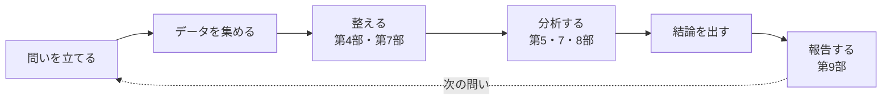

# 第105回　総合プロジェクト：自分のテーマでミニ研究を完成させる

!!! abstract "この回のゴール"
    - このコースで学んだすべてを1つのプロジェクトに統合する
    - 「問い → データ → 分析 → 結論 → 報告」の研究サイクルを一周する
    - 自分のテーマで、再現可能なミニ研究を完成させる
    - 所要時間の目安: 数回分（あなたのテーマ次第）

いよいよ最終回です。これまで学んだ**データ処理・可視化・統計・分子処理・機械学習・レポート・再現性**——そのすべてを使って、あなた自身のミニ研究を完成させましょう。

---

## 1. 研究のサイクル

どんな研究も、次のサイクルを回します。このコースの各部が、それぞれの段階に対応しています。


```mermaid
flowchart LR
    Q[問いを立てる] --> D[データを集める]
    D --> P[整える<br/>第4部・第7部]
    P --> A[分析する<br/>第5・7・8部]
    A --> C[結論を出す]
    C --> R[報告する<br/>第9部]
    R -.次の問い.-> Q
```

## 2. ステップごとの道具（総まとめ）

| ステップ | 使う技術 | 学んだ回 |
|---|---|---|
| **問いを立てる** | 何を知りたいか明確に | — |
| **データを集める** | CSV・Excel・PubChem・自分の実験 | 32, 44, 65 |
| **整える** | 前処理・欠損・外れ値・結合 | 41, 42, 35, 38 |
| **分子を扱う** | RDKit / rcdk（記述子・類似度） | 第6部・88-90 |
| **可視化する** | matplotlib / seaborn / ggplot2 | 第5部・76 |
| **統計する** | 検定・回帰（t検定・ANOVA・lm） | 80-85 |
| **予測する** | 機械学習（回帰・分類・QSAR） | 第8部 |
| **報告する** | Quarto レポート | 86, 101 |
| **再現性** | 環境記録・Git・seed固定 | 102 |

**あなたはもう、この全部を使えます。**

---

## 3. ミニ研究の例（テンプレート）

たとえば「**触媒によって反応収率に差があるか**」というテーマなら:

1. **問い**：3種類の触媒で、収率に有意な差はあるか？
2. **データ**：各触媒で複数回、収率を測定（またはCSVで用意）。
3. **整える**：欠損・外れ値をチェック（第41・42回）。
4. **可視化**：箱ひげ図で分布を見る（第53・81回）。
5. **統計**：分散分析（ANOVA）で有意差を検定、事後検定でどのペアか（第81回）。
6. **結論**：「触媒Aが有意に高い（p < 0.05）」など、データに基づいて述べる。
7. **報告**：Quarto でコード・図・結論を1つの文書に（第86・101回）。
8. **再現性**：`requirements.txt` と Git で環境・履歴を残す（第102回）。
9. **AIとの分担**：コードの下書きは AI に任せてよいが、問い・データの意味・単位・結論は自分で決め、各ステップの出力を自分で確認する（第103回のチェックリスト）。

分子を扱うテーマ（例：**記述子から溶解性を予測できるか**）なら、RDKit で記述子を計算（第97回）→ 分類モデル（第94回）→ 交差検証で評価（第96回：前処理はパイプラインの中で、クラスの偏りも確認）→ 適用範囲の確認（第100回：どんな分子になら使えるか）、という流れになります。

---

## 4. あなたのテーマで

!!! example "テーマの見つけ方"
    - 授業や実験で「なぜ？」と思ったこと。
    - 手元にあるデータ（実験ノート、公開データベース）。
    - 興味のある分野（材料・生化学・環境・創薬…）の小さな問い。

    大きすぎなくて大丈夫。「**小さくても、最後まで一周する**」ことが何より大切です。

!!! success "最後まで一周する価値"
    問いを立て、データを集め、分析し、結論を出し、報告する——この一周を自分の手で完成させた経験は、どんな知識より価値があります。**あなたはもう、データで語れる化学者への一歩を踏み出しました。**

---

## AIに任せるときの指示と確認

!!! example "AIへの頼み方（例）"
    「ミニ研究の解析コードを書いてください。問い：3種類の Pd 触媒で Suzuki–Miyaura カップリングの収率に差があるか。
    データは `data/yields.csv`（列 `catalyst`：3種類、`yield_pct`：単離収率 [%]、各触媒 5 回）。
    SciPy で一元配置分散分析（f_oneway）を行い、事後検定は tukey_hsd で補正した p 値を表にしてください。箱ひげ図を `results/` に保存し、
    触媒ごとの平均・標準偏差・n も表示してください。結論の文は私が書くので、数値の表だけ出してください。」

!!! warning "AIの出力で確かめること"
    - **検定の選び方**：3群以上を `ttest_ind` の繰り返しで比べていないか（多重比較で「有意」が出やすくなる）。まず分散分析、次に補正つきの事後検定になっているか。
    - **データの件数**：触媒ごとの n を表示させ、欠損や読み込みミスで回数が減っていないか。
    - **結論の書きすぎ**：p = 0.08 を「傾向がある」「ほぼ有意」、有意差なしを「差がないことが証明された」と書いていないか。「この実験条件・この回数では差を検出できなかった」が正しい書き方。
    - **単位と桁**：収率が 0〜100 の範囲か（0〜1 の割合と混ざっていないか）。
    - **再現性の一式**：`requirements.txt`・seed・README（実行手順）が揃っているか（第102回）。

---

## 演習問題（最終課題）

**問1.** 自分のテーマを1つ決めてください。「〜は〜に影響するか？」「〜から〜を予測できるか？」のような、**データで答えられる問い**にしましょう。

**問2.** そのテーマについて、データを用意し（自分の実験・公開データ・例示データのいずれでも）、このコースの技術で**分析**してください（可視化・統計・機械学習のいずれか、テーマに合うもの）。

**問3.** 結果を **Quarto レポート**（または Jupyter Notebook）にまとめてください。コード・図・結論を含め、`requirements.txt` と一緒に保存・共有（GitHub）しましょう。研究室の未公開データを使う場合は、公開してよいか指導教員に確認し、必要なら private リポジトリにします（第104回）。これがあなたの最初のミニ研究です。

**問4.** 次は、「3種類の Pd 触媒で収率に差があるか」を調べるために AI が書いたコードと出力です。AI は「Pd(PPh3)4 は Pd(OAc)2 より有意に収率が高い（p = 0.038）」と結論しました。問題点を指摘し、直してください。

```python
from itertools import combinations
from scipy import stats

# 3種類の Pd 触媒での収率 [%]（架空データ、各5回）
yields = {
    "Pd(OAc)2":     [72.1, 75.4, 70.8, 74.0, 73.3],
    "Pd(PPh3)4":    [76.1, 73.9, 78.2, 74.6, 76.3],
    "PdCl2(dppf)":  [74.8, 73.0, 76.2, 72.5, 75.9],
}
for a, b in combinations(yields, 2):
    t, p = stats.ttest_ind(yields[a], yields[b])
    mark = "→ 有意差あり" if p < 0.05 else ""
    print(f"{a} vs {b}: p = {p:.3f} {mark}")
```

出力:

```text
Pd(OAc)2 vs Pd(PPh3)4: p = 0.038 → 有意差あり
Pd(OAc)2 vs PdCl2(dppf): p = 0.246 
Pd(PPh3)4 vs PdCl2(dppf): p = 0.240 
```

---

## 解答

??? success "取り組み方のヒント"
    - **問1**：例「反応温度は収率に影響するか？」「分子量から沸点を予測できるか？」。答えが YES/NO や数値で出る問いにすると、分析しやすいです。
    - **問2**：テーマに合う技術を選びます。2群比較→t検定（第80回）、3群以上→ANOVA（第81回）、関係→回帰（第83回）、予測→機械学習（第93・94回）、分子→RDKit記述子（第97回）。
    - **問3**：Quarto（第86・101回）で、①問い ②データ ③分析コードと図 ④結論、の順にまとめます。GitHub に上げれば、ポートフォリオにもなります。

    完璧を目指さず、**まず一周**。それが次の研究への一番の土台になります。

??? success "問4 の解答"
    **誤り（多重比較）**：3群を t 検定の繰り返しで比べています。1回あたり 5 % の確率で「偶然の有意」が出るので、3回くり返すと少なくとも1回偶然に有意となる確率は約 14 %（1 − 0.95³）に増えます。3群以上は、まず一元配置分散分析（第81回）で全体に差があるかを調べ、どのペアかは多重比較を補正した事後検定で調べます。

    ```python
    from scipy import stats

    yields = {
        "Pd(OAc)2":     [72.1, 75.4, 70.8, 74.0, 73.3],
        "Pd(PPh3)4":    [76.1, 73.9, 78.2, 74.6, 76.3],
        "PdCl2(dppf)":  [74.8, 73.0, 76.2, 72.5, 75.9],
    }
    groups = list(yields.values())
    f, p = stats.f_oneway(*groups)                 # まず3群まとめて一元配置分散分析
    print(f"ANOVA: F = {f:.2f}, p = {p:.3f}")
    res = stats.tukey_hsd(*groups)                 # 事後検定（多重比較を補正）
    names = list(yields)
    for i in range(3):
        for j in range(i + 1, 3):
            print(f"{names[i]} vs {names[j]}: 補正後 p = {res.pvalue[i, j]:.3f}")
    ```

    出力:
    ```text
    ANOVA: F = 3.15, p = 0.080
    Pd(OAc)2 vs Pd(PPh3)4: 補正後 p = 0.066
    Pd(OAc)2 vs PdCl2(dppf): 補正後 p = 0.441
    Pd(PPh3)4 vs PdCl2(dppf): 補正後 p = 0.451
    ```
    分散分析で p = 0.080、補正後もどのペアも 0.05 未満になりません。正しい結論は「各 5 回のこの実験では、触媒間の収率の差は検出できなかった」です。「差がない」と言い切るのではなく、差を調べたいなら反応の回数を増やす、と次の計画につなげます。

---

## コース修了 — おめでとうございます！

ここまで**全105回**、本当によく頑張りました。あなたは、

- **Python と R** の2つの言語で、
- データを**処理・可視化・統計解析・機械学習**し、
- **分子（構造式）**を扱い、
- 結果を**再現可能なレポート**にまとめ、
- **AIを検証しながら**使いこなす

——化学データ分析の実践的な力を、一通り身につけました。

!!! quote "最後に"
    ここで学んだ技術は、道具にすぎません。大切なのは、**問いを立て、データで確かめ、正直に結論を述べる**という姿勢です。それは化学に限らず、あなたが何を学び、何を研究するときにも、一生の財産になります。

    メイン武器の**化学**に、サブウエポンの**プログラミング・統計・データ分析**が加わりました。この組み合わせは、これからの時代に強力です。

    コツコツ続けたあなたなら、きっと遠くまで行けます。**ここからが本当のスタートです。** 自分のテーマで、世界を少しだけ深く知る旅を、続けてください。

---

### このコースを終えたあなたへ

- 学んだことは、使わないと忘れます。**身近なデータで手を動かし続けて**ください。
- 分からなくなったら、いつでもこのコースに戻ってきてOKです。
- そして——**あなたの発見を、いつか誰かと分かち合ってください。**

本当に、おつかれさまでした。そして、ありがとう。
