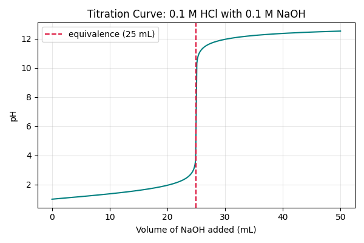

# 第30回　まとめ演習：滴定曲線を数値計算する

!!! abstract "この回のゴール"
    - 第3部（NumPy）と第5部（可視化）を組み合わせる
    - 酸塩基滴定の pH 変化を計算する
    - 滴定曲線をグラフにし、当量点を読み取る
    - 所要時間の目安: 60分（第3部の総仕上げ）
    - 使うテーマ：**強酸-強塩基の中和滴定**

0.1 mol/L の塩酸 HCl 25 mL を、0.1 mol/L の水酸化ナトリウム NaOH で滴定したときの pH 変化を計算します。

`lesson30.py` を作りましょう。`import numpy as np` と `matplotlib.pyplot as plt` を使います。

---

## 1. 考え方

加えた NaOH の体積 $V_b$ ごとに、pH を計算します。

- 酸の物質量（初め）：$0.1 \times 0.025 = 0.0025$ mol
- 加えた塩基の物質量：$0.1 \times V_b$
- **当量点まで**（酸が余る）：余った $[\text{H}^+]$ から pH
- **当量点**（過不足なし）：pH = 7（強酸+強塩基）
- **当量点より後**（塩基が余る）：余った $[\text{OH}^-]$ から pOH → pH = 14 − pOH

当量点は「酸の物質量 = 塩基の物質量」となる $V_b = 25$ mL です。

---

## 2. NumPy で pH を計算する

```python
import numpy as np

Ca, Va = 0.1, 0.025          # 酸: 0.1 mol/L, 25 mL(=0.025 L)
Cb = 0.1                      # 塩基: 0.1 mol/L
mol_acid = Ca * Va           # 酸の物質量 [mol]

Vb_mL = np.linspace(0, 50, 501)   # 塩基を0〜50 mL、501点で
Vb = Vb_mL / 1000                 # L に変換
mol_base = Cb * Vb
total_V = Va + Vb                 # 全体積 [L]

pH = np.zeros_like(Vb)            # 結果を入れる配列（まず0で初期化）

for i in range(len(Vb)):
    if mol_base[i] < mol_acid:                      # 当量点まで（酸が余る）
        H = (mol_acid - mol_base[i]) / total_V[i]
        pH[i] = -np.log10(H)
    elif np.isclose(mol_base[i], mol_acid):         # 当量点
        pH[i] = 7.0
    else:                                           # 当量点より後（塩基が余る）
        OH = (mol_base[i] - mol_acid) / total_V[i]
        pH[i] = 14 + np.log10(OH)

# いくつかの点を確認
for v in [0, 10, 20, 24, 25, 26, 30, 50]:
    idx = np.argmin(np.abs(Vb_mL - v))
    print(f"Vb={v:>2} mL -> pH={pH[idx]:.2f}")
```

出力:

```text
Vb= 0 mL -> pH=1.00
Vb=10 mL -> pH=1.37
Vb=20 mL -> pH=1.95
Vb=24 mL -> pH=2.69
Vb=25 mL -> pH=7.00
Vb=26 mL -> pH=11.29
Vb=30 mL -> pH=11.96
Vb=50 mL -> pH=12.52
```

当量点（25 mL）の直前・直後で、pH が **2.69 → 7.00 → 11.29** と急変しています。これが滴定曲線の特徴です。

!!! note "`np.isclose` の出番（第29回）"
    当量点の判定に `==` を使うと、小数誤差でうまくいきません。第29回で学んだ `np.isclose` で「ちょうど当量点」を安全に判定しています。

---

## 3. 滴定曲線を描く

計算した pH を、加えた体積に対してプロットします（第46・50回の可視化）。

```python
import matplotlib.pyplot as plt

plt.figure(figsize=(6, 4))
plt.plot(Vb_mL, pH, color="teal")
plt.axvline(25, color="crimson", linestyle="--", label="equivalence (25 mL)")
plt.xlabel("Volume of NaOH added (mL)")
plt.ylabel("pH")
plt.title("Titration Curve: 0.1 M HCl with 0.1 M NaOH")
plt.legend()
plt.grid(True, alpha=0.3)
plt.tight_layout()
plt.savefig("titration.png", dpi=100)
plt.show()
```



なめらかな曲線が、当量点（赤い破線・25 mL）で**垂直に近く急上昇**します。この急変を利用して、指示薬の変色や pH の跳ね上がりから当量点を判定するのが、中和滴定の原理です。

!!! success "第3部の集大成"
    **数式（化学）→ NumPy で計算 → matplotlib で可視化。** 第3部と第5部が1つにつながりました。化学の理論を、コードで再現し、図で確かめる——これがデータ分析の醍醐味です。

---

## 演習問題

**問1.** 本文のコードで pH を計算し、`Vb = 12.5` mL（当量点の半分）のときの pH を確認してください（ヒント：`idx = np.argmin(np.abs(Vb_mL - 12.5))`）。

**問2.** 滴定曲線のグラフを描き、当量点（25 mL）に破線（`axvline`）を入れて保存してください。

**問3.**（発展）酸の濃度を `Ca = 0.05`（0.05 mol/L）に変え、他はそのままで滴定曲線を計算・描画してください。当量点の体積は何 mL に変わりますか？（ヒント：酸の物質量が半分になるので…）

---

## 解答

??? success "問1 の解答"
    ```python
    idx = np.argmin(np.abs(Vb_mL - 12.5))
    print(f"Vb=12.5 mL -> pH={pH[idx]:.2f}")
    ```

    出力:
    ```text
    Vb=12.5 mL -> pH=1.48
    ```
    当量点の半分では、まだ酸性寄り（pH 1.48）です。

??? success "問2 の解答"
    本文「3. 滴定曲線を描く」のコードをそのまま実行します。`titration.png` が保存され、当量点で急上昇する曲線が表示されれば成功です。

??? success "問3 の解答・考え方"
    `Ca = 0.05` にすると、酸の物質量は `0.05 × 0.025 = 0.00125` mol。塩基（0.1 mol/L）で中和するのに必要な体積は `0.00125 / 0.1 = 0.0125 L = 12.5 mL`。
    ```python
    Ca = 0.05
    mol_acid = Ca * Va          # 0.00125 mol
    # 以降は本文と同じループで pH を再計算し、axvline を 12.5 に
    ```
    当量点は **12.5 mL** に移ります（酸が薄い＝少ない塩基で中和できる）。

---

## 第3部　修了

おめでとうございます！ NumPy で**配列を使った高速な数値計算**——ベクトル化・統計・乱数・単位換算・濃度計算、そして滴定曲線のシミュレーションまでできるようになりました。これで pandas・matplotlib の土台も、より深く理解できたはずです。

!!! tip "ここまでの到達点"
    第1部〜第5部＋この第3部で、**Python の基礎・数値計算・データ処理・可視化**が一通りそろいました。実験・研究のデータ分析に必要な力の大半は、もう手の中にあります。この先は、化学に特化した RDKit（第6部）、統計の R（第7部）、機械学習（第8部）へと広がります。

### 次回予告

このあとは、化学に特化した **第6部：RDKit（ケモインフォマティクス）** などを順次追加していきます。ここまで本当によく頑張りました！
