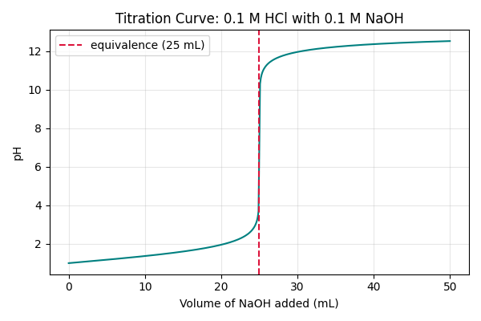

# 第30回　まとめ演習：滴定曲線を数値計算する

!!! abstract "この回のゴール"
    - 第3部（NumPy）で学んだ配列計算を総動員する（グラフ描画は第5部の matplotlib を少しだけ先取り）
    - 酸塩基滴定の pH 変化を計算する
    - 滴定曲線をグラフにし、当量点を読み取る
    - 所要時間の目安: 60分（第3部の総仕上げ）
    - 使うテーマ：**強酸-強塩基の中和滴定**

0.1 mol/L の塩酸 HCl 25 mL を、0.1 mol/L の水酸化ナトリウム NaOH で滴定したときの pH 変化を計算します。

`lesson30.py` を作りましょう。`import numpy as np` と `matplotlib.pyplot as plt` を使います。

---

## 1. 考え方

加えた NaOH の体積 $V_b$ ごとに、pH を計算します。

- 酸の物質量（初め）：$0.1 \times 0.025 = 0.0025$ mol
- 加えた塩基の物質量：$0.1 \times V_b$
- **当量点まで**（酸が余る）：余った $[\text{H}^+]$ から pH
- **当量点**（過不足なし）：pH = 7（強酸+強塩基、25 ℃）
- **当量点より後**（塩基が余る）：余った $[\text{OH}^-]$ から pOH → pH = 14 − pOH（25 ℃ で $K_w = 1.0\times10^{-14}$ のとき）

当量点は「酸の物質量 = 塩基の物質量」となる $V_b = 25$ mL です。

---

## 2. NumPy で pH を計算する

```python
import numpy as np

Ca, Va = 0.1, 0.025          # 酸: 0.1 mol/L, 25 mL(=0.025 L)
Cb = 0.1                      # 塩基: 0.1 mol/L
mol_acid = Ca * Va           # 酸の物質量 [mol]

Vb_mL = np.linspace(0, 50, 501)   # 塩基を0〜50 mL、501点で
Vb = Vb_mL / 1000                 # L に変換
mol_base = Cb * Vb
total_V = Va + Vb                 # 全体積 [L]

pH = np.zeros_like(Vb)            # 結果を入れる配列（まず0で初期化）

for i in range(len(Vb)):
    if np.isclose(mol_base[i], mol_acid):           # 当量点（最初に判定する）
        pH[i] = 7.0
    elif mol_base[i] < mol_acid:                    # 当量点まで（酸が余る）
        H = (mol_acid - mol_base[i]) / total_V[i]
        pH[i] = -np.log10(H)
    else:                                           # 当量点より後（塩基が余る）
        OH = (mol_base[i] - mol_acid) / total_V[i]
        pH[i] = 14 + np.log10(OH)

# いくつかの点を確認
for v in [0, 10, 20, 24, 25, 26, 30, 50]:
    idx = np.argmin(np.abs(Vb_mL - v))
    print(f"Vb={v:>2} mL -> pH={pH[idx]:.2f}")
```

出力:

```text
Vb= 0 mL -> pH=1.00
Vb=10 mL -> pH=1.37
Vb=20 mL -> pH=1.95
Vb=24 mL -> pH=2.69
Vb=25 mL -> pH=7.00
Vb=26 mL -> pH=11.29
Vb=30 mL -> pH=11.96
Vb=50 mL -> pH=12.52
```

当量点（25 mL）の直前・直後で、pH が **2.69 → 7.00 → 11.29** と急変しています。これが滴定曲線の特徴です。

!!! note "`np.isclose` の出番（第29回）"
    当量点では、酸と塩基の物質量が計算上「ほぼ等しい」だけで、ぴったり同じになる保証はありません。たとえば `Cb = 0.25` にすると、10 mL の点で `mol_base` が `mol_acid` よりわずか 4×10⁻¹⁹ mol だけ小さくなります。もし `mol_base[i] < mol_acid` を先に判定すると「酸が余る」側に入り、pH ≈ 16.9 という**ありえない値**が出ます。そこで第29回の `np.isclose` で「ちょうど当量点か」を**最初に**判定しています。

!!! tip "発展：場合分けのいらない厳密な式"
    水の電離（$K_w$）まで含めて電荷のつり合いを解くと、$\delta = \dfrac{C_aV_a - C_bV_b}{V_a + V_b}$ として
    $[\text{H}^+] = \dfrac{\delta + \sqrt{\delta^2 + 4K_w}}{2}$ となり、当量点の前後を1本の式で計算できます（ループも `np.isclose` も不要）。
    ```python
    Kw = 1.0e-14
    delta = (Ca * Va - Cb * Vb) / total_V
    H = (delta + np.sqrt(delta**2 + 4 * Kw)) / 2
    pH_exact = -np.log10(H)
    for v in [0, 24, 25, 26, 50]:
        idx = np.argmin(np.abs(Vb_mL - v))
        print(f"Vb={v:>2} mL -> pH={pH_exact[idx]:.2f}")
    ```
    出力:
    ```text
    Vb= 0 mL -> pH=1.00
    Vb=24 mL -> pH=2.69
    Vb=25 mL -> pH=7.00
    Vb=26 mL -> pH=11.29
    Vb=50 mL -> pH=12.52
    ```
    本文の近似と同じ値になります。近似がずれるのは、当量点のごく近く（[H⁺] や [OH⁻] が 10⁻⁶ mol/L 程度以下）だけです。

---

## 3. 滴定曲線を描く

計算した pH を、加えた体積に対してプロットします。matplotlib は第5部（第46回〜）で詳しく学ぶので、ここではコードをそのまま実行して図を確かめるだけで構いません。

```python
import matplotlib.pyplot as plt

plt.figure(figsize=(6, 4))
plt.plot(Vb_mL, pH, color="teal")
plt.axvline(25, color="crimson", linestyle="--", label="equivalence (25 mL)")
plt.xlabel("Volume of NaOH added (mL)")
plt.ylabel("pH")
plt.title("Titration Curve: 0.1 M HCl with 0.1 M NaOH")
plt.legend()
plt.grid(True, alpha=0.3)
plt.tight_layout()
plt.savefig("titration.png", dpi=100)
plt.show()
```



なめらかな曲線が、当量点（赤い破線・25 mL）で**垂直に近く急上昇**します。この急変を利用して、指示薬の変色や pH の跳ね上がりから当量点を判定するのが、中和滴定の原理です。

!!! success "第3部の集大成"
    **数式（化学）→ NumPy で計算 → 図で確かめる。** 化学の理論を、コードで再現し、図で確かめる——これがデータ分析の醍醐味です。第5部で matplotlib を学ぶと、この図を自在に仕上げられるようになります。

---

## AIに任せるときの指示と確認

!!! example "AIへの頼み方（例）"
    「0.1 mol/L HCl 25.0 mL を 0.1 mol/L NaOH で滴定したときの pH を、NaOH 0〜50 mL の範囲で NumPy で計算してください。
    体積はすべて **L** に直し、濃度は**混合後の全体積 (Va + Vb)** で割って求めてください。
    当量点前は余った [H⁺]、当量点後は余った [OH⁻] から pH = 14 + log₁₀[OH⁻]（25 ℃）とし、当量点は `np.isclose` で**最初に**判定してください。
    0, 10, 24, 25, 26, 50 mL での pH を小数第2位まで表示してください。」

!!! warning "AIの出力で確かめること"
    - 開始点の pH：0.1 mol/L の強酸なら pH 1.00。ここがずれていれば単位（mL と L）か濃度の扱いが誤り。
    - 当量点の位置：$V_{eq} = C_aV_a / C_b$（この例では 25 mL）で pH が急変しているか。当量点後の pH が 7 より大きい（塩基性）か。
    - **希釈**：過剰分の物質量を「酸の体積 Va」ではなく「全体積 Va + Vb」で割っているか。Va で割ると当量点後の pH がずれます（50 mL で 12.52 になるかで確認）。
    - pH の範囲：強酸・強塩基 0.1 mol/L なら pH はおよそ 1〜13 の範囲。16 や −3 のような値が出たら、当量点付近の場合分けを疑う。
    - 当量点以外で `log10(0)` や負の数の log が出ていないか（`RuntimeWarning` や `nan` がないか）。

---

## 演習問題

**問1.** 本文のコードで pH を計算し、`Vb = 12.5` mL（当量点の半分）のときの pH を確認してください（ヒント：`idx = np.argmin(np.abs(Vb_mL - 12.5))`）。

**問2.** 滴定曲線のグラフを描き、当量点（25 mL）に破線（`axvline`）を入れて保存してください。

**問3.**（発展）酸の濃度を `Ca = 0.05`（0.05 mol/L）に変え、他はそのままで滴定曲線を計算・描画してください。当量点の体積は何 mL に変わりますか？（ヒント：酸の物質量が半分になるので…）

**問4.**（検証）次は AI が書いた、ループを使わない滴定曲線のコードです（0.1 mol/L HCl 25 mL を 0.1 mol/L NaOH で滴定）。出力がおかしいようです。問題点を指摘し、直してください。

```python
import numpy as np

Ca, Va, Cb = 0.1, 0.025, 0.1                # mol/L, L, mol/L
Vb_mL = np.array([0.0, 10.0, 20.0, 30.0, 40.0])
Vb = Vb_mL / 1000

excess = (Ca * Va - Cb * Vb) / Va           # 正: 酸が余る, 負: 塩基が余る [mol/L]
pH = np.empty_like(Vb)
acid = excess > 0                           # 酸が余っている点（論理配列）
pH[acid] = -np.log10(excess[acid])
pH[~acid] = -np.log10(-excess[~acid])
print(pH.round(2))
```

出力:
```text
[1.   1.22 1.7  1.7  1.22]
```

---

## 解答

??? success "問1 の解答"
    ```python
    idx = np.argmin(np.abs(Vb_mL - 12.5))
    print(f"Vb=12.5 mL -> pH={pH[idx]:.2f}")
    ```

    出力:
    ```text
    Vb=12.5 mL -> pH=1.48
    ```
    当量点の半分まで塩基を加えても pH は 1.48 で、はじめ（pH 1.00）から 0.5 も上がっていません。強酸の滴定では、pH は当量点のごく近くで一気に変わります。（弱酸の滴定では、半当量点で pH = p$K_a$ になるという大事な性質があります。）

??? success "問2 の解答"
    本文「3. 滴定曲線を描く」のコードをそのまま実行します。`titration.png` が保存され、当量点で急上昇する曲線が表示されれば成功です。

??? success "問3 の解答・考え方"
    `Ca = 0.05` にすると、酸の物質量は `0.05 × 0.025 = 0.00125` mol。塩基（0.1 mol/L）で中和するのに必要な体積は `0.00125 / 0.1 = 0.0125 L = 12.5 mL`。
    ```python
    import numpy as np
    import matplotlib.pyplot as plt

    Ca, Va = 0.05, 0.025         # 酸: 0.05 mol/L, 25 mL
    Cb = 0.1                     # 塩基: 0.1 mol/L
    mol_acid = Ca * Va           # 0.00125 mol
    print(f"当量点: {mol_acid / Cb * 1000:.1f} mL")

    Vb_mL = np.linspace(0, 50, 501)
    Vb = Vb_mL / 1000
    mol_base = Cb * Vb
    total_V = Va + Vb

    pH = np.zeros_like(Vb)
    for i in range(len(Vb)):
        if np.isclose(mol_base[i], mol_acid):
            pH[i] = 7.0
        elif mol_base[i] < mol_acid:
            pH[i] = -np.log10((mol_acid - mol_base[i]) / total_V[i])
        else:
            pH[i] = 14 + np.log10((mol_base[i] - mol_acid) / total_V[i])

    for v in [0, 12, 12.5, 13, 20]:
        idx = np.argmin(np.abs(Vb_mL - v))
        print(f"Vb={v:>4} mL -> pH={pH[idx]:.2f}")

    plt.plot(Vb_mL, pH, color="teal")
    plt.axvline(12.5, color="crimson", linestyle="--")
    plt.xlabel("Volume of NaOH added (mL)")
    plt.ylabel("pH")
    plt.savefig("titration_005.png", dpi=100)
    plt.show()
    ```

    出力:
    ```text
    当量点: 12.5 mL
    Vb=   0 mL -> pH=1.30
    Vb=  12 mL -> pH=2.87
    Vb=12.5 mL -> pH=7.00
    Vb=  13 mL -> pH=11.12
    Vb=  20 mL -> pH=12.22
    ```
    当量点は **12.5 mL** に移ります（酸が薄い＝少ない塩基で中和できる）。はじめの pH も 1.00 から 1.30 に上がっています（[H⁺] が半分 → pH が log₁₀2 ≈ 0.30 上がる）。

??? success "問4 の解答"
    誤りは2か所です。

    1. **希釈を無視している**：余った酸・塩基の濃度は、物質量を**混合後の全体積 `Va + Vb`** で割って求めます。`Va` で割ると濃度を過大に見積もります（10 mL で pH 1.22、正しくは 1.37）。
    2. **塩基が余った側の式**：`-np.log10([OH⁻])` は **pOH** です。pH は `14 + np.log10([OH⁻])`（25 ℃）です。

    **確かめ方**：NaOH を過剰に加えた 30 mL・40 mL で pH が 1.7・1.22（酸性）になっているのは明らかにおかしい。また、当量点をはさんで値が左右対称になっているのも、pOH をそのまま pH としているサインです。

    **修正**：

    ```python
    import numpy as np

    Ca, Va, Cb = 0.1, 0.025, 0.1                # mol/L, L, mol/L
    Vb_mL = np.array([0.0, 10.0, 20.0, 30.0, 40.0])
    Vb = Vb_mL / 1000

    excess = (Ca * Va - Cb * Vb) / (Va + Vb)    # 全体積で割る
    pH = np.empty_like(Vb)
    acid = excess > 0
    pH[acid] = -np.log10(excess[acid])          # 酸が余る: pH = -log[H+]
    pH[~acid] = 14 + np.log10(-excess[~acid])   # 塩基が余る: pH = 14 - pOH
    print(pH.round(2))
    ```

    出力:
    ```text
    [ 1.    1.37  1.95 11.96 12.36]
    ```
    本文のループ版の結果（10 mL で 1.37、20 mL で 1.95、30 mL で 11.96）と一致します。なお、この書き方は当量点ちょうど（25 mL、`excess` が 0）の点を含めると `log10(0)` になるので、含める場合は本文のように `np.isclose` で別扱いにします。

---

## 第3部　修了

おめでとうございます！ NumPy で**配列を使った高速な数値計算**——ベクトル化・統計・乱数・単位換算・濃度計算、そして滴定曲線のシミュレーションまでできるようになりました。NumPy は、次の第4部で学ぶ pandas や、第5部で学ぶ matplotlib の土台になります。

!!! tip "ここまでの到達点"
    第1部〜第3部で、**Python の基礎と NumPy による数値計算**がそろいました。この先は、表データを扱う pandas（第4部）、可視化（第5部）、化学に特化した RDKit（第6部）、統計の R（第7部）、機械学習（第8部）へと広がります。

### 次回予告

[第31回：pandas入門](lesson-31.md) から **第4部：データ処理と pandas** が始まります。実験データを「表（DataFrame）」として扱い、読み込み・集計する方法を学びます。ここまで本当によく頑張りました！
