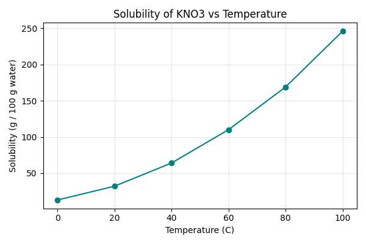

# 第46回　matplotlib入門：はじめてのグラフ

!!! abstract "この回のゴール"
    - グラフ描画ライブラリ **matplotlib** を使う
    - 折れ線グラフを描き、軸ラベル・タイトルをつける
    - グラフをファイルに保存する
    - 所要時間の目安: 60分
    - 使うデータ：**溶解度**（温度と溶解度の関係）

!!! info "第5部スタート：可視化"
    第4部で「集計・テーブル」ができました。第5部では、それを**グラフ**にします。数字の羅列より、1枚の図のほうが桁違いに伝わります。

!!! note "グラフのラベルは英語で書きます"
    matplotlib の既定フォント（DejaVu Sans）には日本語の文字がないため、日本語は □□□ に化け、`Glyph ... missing from font(s) DejaVu Sans.` という警告が出ます。本コースでは**軸やタイトルは英語**で書きます（英語表記は論文でも標準）。日本語を使いたい場合のフォント設定は[第54回](lesson-54.md)の「日本語を使いたいとき」を参照してください。なお `°C` の記号は英語フォントでも表示できるので、`"Temperature (°C)"` と書いて構いません。

`lesson46.py` を作りましょう。

---

## 1. はじめての折れ線グラフ

`import matplotlib.pyplot as plt` と略すのが慣例です。`plt.plot(x, y)` で線を引き、`plt.show()` で表示します。

```python
import matplotlib.pyplot as plt

# 硝酸カリウム KNO3 の溶解度（温度ごと）
temp = [0, 20, 40, 60, 80, 100]            # 温度 [℃]
solubility = [13, 32, 64, 110, 169, 246]   # 溶解度 [g / 100 g 水]

plt.plot(temp, solubility)
plt.show()
```

これだけで折れ線グラフが表示されます。でも、これでは「何のグラフか」が分かりません。装飾を足しましょう。

---

## 2. ラベル・タイトル・目印をつける

```python
import matplotlib.pyplot as plt

temp = [0, 20, 40, 60, 80, 100]
solubility = [13, 32, 64, 110, 169, 246]

plt.figure(figsize=(6, 4))                       # 図の大きさ（横6・縦4インチ）
plt.plot(temp, solubility, marker="o", color="teal")  # 点(marker)つき・色指定
plt.xlabel("Temperature (C)")                    # x軸ラベル
plt.ylabel("Solubility (g / 100 g water)")       # y軸ラベル
plt.title("Solubility of KNO3 vs Temperature")   # タイトル
plt.grid(True, alpha=0.3)                         # 薄い目盛り線
plt.tight_layout()                                # レイアウト自動調整
plt.savefig("solubility.png", dpi=100)            # 画像として保存
plt.show()                                        # 画面に表示
```

生成される図:



温度が上がると溶解度が急に増える様子が、ひと目で分かります。表の数字だけでは気づきにくい「曲がり方」も、グラフなら直感的です。

!!! note "主なパーツ"
    - `plt.figure(figsize=(横, 縦))` … 図のサイズ
    - `marker="o"` … 各データ点に丸印。`"s"`（四角）`"^"`（三角）なども
    - `color="teal"` … 線の色（`"red"` `"navy"` や `"#4c72b0"` などでも）
    - `plt.savefig("名前.png", dpi=100)` … 画像保存（dpi は解像度）

!!! warning "savefig は show より前に"
    `plt.savefig()` は `plt.show()` の**前**に書きます。show の後だと図がクリアされ、空の画像が保存されることがあります。

---

## AIに任せるときの指示と確認

!!! example "AIへの頼み方（例）"
    「KNO3 の溶解度データを matplotlib の pyplot で折れ線グラフにしてください。
    データは Python のリストで、`temp = [0, 20, 40, 60, 80, 100]`（温度 °C）、`solubility = [13, 32, 64, 110, 169, 246]`（g / 100 g 水）です。
    x 軸を温度、y 軸を溶解度とし、軸ラベルは英語で単位つき（例: `Temperature (°C)`）、各点にマーカーをつけてください。
    `solubility.png`（dpi=100）に保存してから画面に表示してください。」

!!! warning "AIの出力で確かめること"
    - `plt.plot(x, y)` は**1つ目が横軸**です。横軸の目盛りが 0〜100（温度）、縦軸が 0〜250（溶解度）になっているか。`print(plt.gca().get_xlim())` で横軸の範囲が約 −5〜105 なら正しく、約 1〜258 なら x と y が入れ替わっています。
    - 軸ラベルに**量と単位の両方**があるか。溶解度の単位は「g / 100 g 水」で、`g/L` や `mol/L` と書かれていたら誤りです。
    - `plt.savefig()` が `plt.show()` より**前**にあるか。保存された PNG を実際に開き、空白の画像でないか確かめる。
    - 日本語のラベルが混ざっていたら、□□□ になっていないか、`Glyph ... missing from font(s) DejaVu Sans.` の警告が出ていないかを見る。

---

## 演習問題

**問1.** 本文のコードを実行し、`solubility.png` が保存され、折れ線グラフが表示されることを確認してください。

**問2.** 別の物質のデータでグラフを描いてみましょう。塩化ナトリウム NaCl の溶解度はほぼ一定です。`temp = [0, 20, 40, 60, 80, 100]`、`solubility = [35.7, 35.8, 36.3, 37.1, 38.0, 39.3]` で折れ線グラフを描き、軸ラベルとタイトルをつけてください。KNO3 と比べて、線の形はどう違いますか？

**問3.** 問2のグラフの線の色を変え（例：`color="crimson"`）、マーカーを四角（`marker="s"`）にして、`nacl.png` という名前で保存してください。

**問4.** 次は AI が書いたコードです。KNO3 の溶解度曲線（横軸が温度）を描いて `kno3.png` に保存するつもりですが、問題が2つあります。指摘して直してください。
```python
import matplotlib.pyplot as plt

temp = [0, 20, 40, 60, 80, 100]            # 温度 [°C]
solubility = [13, 32, 64, 110, 169, 246]   # 溶解度 [g / 100 g 水]

plt.figure(figsize=(6, 4))
plt.plot(solubility, temp, marker="o")
plt.xlabel("Temperature (°C)")
plt.ylabel("Solubility (g / 100 g water)")
plt.tight_layout()
xmin, xmax = plt.gca().get_xlim()
print(f"x軸の範囲: {xmin:.1f} 〜 {xmax:.1f}")
plt.show()
plt.savefig("kno3.png", dpi=100)
```

出力:
```text
x軸の範囲: 1.3 〜 257.6
```

---

## 解答

??? success "問1 の解答・確認ポイント"
    本文のコードをそのまま実行します。ウィンドウにグラフが出て、スクリプトと同じフォルダに `solubility.png` ができていれば成功です。表示されない場合は、`plt.show()` を書いたか確認しましょう。Ubuntu のサーバーや画面のない WSL では `plt.show()` を書いても何も表示されないことがあります。その場合も `solubility.png` を開けば結果を確認できます。

??? success "問2 の解答"
    ```python
    import matplotlib.pyplot as plt

    temp = [0, 20, 40, 60, 80, 100]
    solubility = [35.7, 35.8, 36.3, 37.1, 38.0, 39.3]

    plt.figure(figsize=(6, 4))
    plt.plot(temp, solubility, marker="o", color="teal")
    plt.xlabel("Temperature (C)")
    plt.ylabel("Solubility (g / 100 g water)")
    plt.title("Solubility of NaCl vs Temperature")
    plt.grid(True, alpha=0.3)
    plt.tight_layout()
    plt.show()
    ```
    NaCl はほぼ横ばい（水平に近い直線）。KNO3 の急な右肩上がりとは対照的で、「温度による溶解度の変化」が物質で大きく違うことが、グラフだと一目瞭然です。

??? success "問3 の解答"
    ```python
    plt.figure(figsize=(6, 4))
    plt.plot(temp, solubility, marker="s", color="crimson")
    plt.xlabel("Temperature (C)")
    plt.ylabel("Solubility (g / 100 g water)")
    plt.title("Solubility of NaCl")
    plt.grid(True, alpha=0.3)
    plt.tight_layout()
    plt.savefig("nacl.png", dpi=100)
    plt.show()
    ```

??? success "問4 の解答"
    **誤り1：x と y が逆。** `plt.plot(solubility, temp)` は「横軸＝溶解度、縦軸＝温度」になり、軸ラベルと中身が食い違います。温度は 0〜100 °C なのに、横軸の範囲が 1.3〜257.6 になっていることから分かります。`plt.plot(x, y)` の**1つ目が横軸**です。

    **誤り2：`savefig` が `show` の後。** 画面表示のウィンドウを閉じた後に保存すると、空の画像が保存されることがあります。保存は表示の前に行います。

    ```python
    import matplotlib.pyplot as plt

    temp = [0, 20, 40, 60, 80, 100]            # 温度 [°C]
    solubility = [13, 32, 64, 110, 169, 246]   # 溶解度 [g / 100 g 水]

    plt.figure(figsize=(6, 4))
    plt.plot(temp, solubility, marker="o")     # plot(x, y)：x=温度, y=溶解度
    plt.xlabel("Temperature (°C)")
    plt.ylabel("Solubility (g / 100 g water)")
    plt.tight_layout()
    plt.savefig("kno3.png", dpi=100)           # show より前に保存
    xmin, xmax = plt.gca().get_xlim()
    print(f"x軸の範囲: {xmin:.1f} 〜 {xmax:.1f}")
    plt.show()
    ```

    出力:
    ```text
    x軸の範囲: -5.0 〜 105.0
    ```
    横軸が温度の範囲（0〜100 °C に少し余白）になりました。グラフは「軸ラベル」と「目盛りの数値の範囲」が合っているかを、必ずセットで確認しましょう。

---

## この回のまとめ

- `import matplotlib.pyplot as plt`。`plt.plot(x, y)` で折れ線、`plt.show()` で表示。
- `xlabel` / `ylabel` / `title` / `grid` で読めるグラフに。
- `marker` `color` `figsize` で見た目を調整。
- `plt.savefig("名前.png", dpi=100)` で保存（show の前に）。
- ラベルは英語で（日本語は文字化けするため）。

### 次回予告

[第47回：折れ線・散布図・棒グラフ](lesson-47.md) では、目的別に使い分ける3つの基本グラフを学びます。
