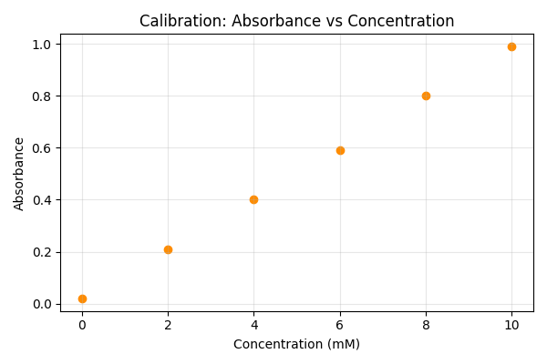
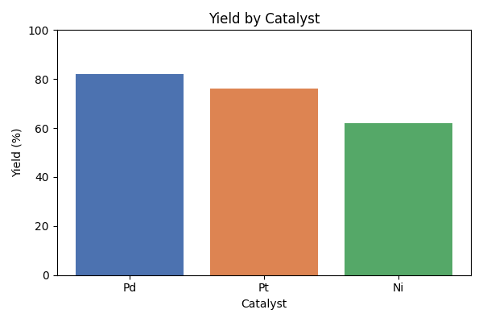

# 第47回　折れ線・散布図・棒グラフ

!!! abstract "この回のゴール"
    - 3つの基本グラフを、目的に応じて使い分ける
    - **散布図**（2量の関係）と**棒グラフ**（カテゴリの比較）を描く
    - どのグラフがどんなデータ向きかを理解する
    - 所要時間の目安: 60分
    - 使うデータ：**検量線**（濃度と吸光度）、**触媒別の収率**

`lesson47.py` を作りましょう。まず使い分けの地図を持ちます。

| グラフ | 向いているデータ | 例 |
|---|---|---|
| 折れ線 `plot` | 連続的に変化する量 | 時間・温度による変化 |
| 散布図 `scatter` | 2つの量の関係 | 濃度 vs 吸光度 |
| 棒グラフ `bar` | カテゴリごとの比較 | 触媒ごとの収率 |

---

## 1. 散布図：2つの量の関係を見る

「濃度が上がると吸光度も上がるか？」のように、**2量の関係**を見るのが散布図です（点だけを打つ）。

```python
import matplotlib.pyplot as plt

conc = [0, 2, 4, 6, 8, 10]              # 濃度 [mM]
absorbance = [0.02, 0.21, 0.40, 0.59, 0.80, 0.99]

plt.figure(figsize=(6, 4))
plt.scatter(conc, absorbance, color="darkorange")
plt.xlabel("Concentration (mM)")
plt.ylabel("Absorbance")
plt.title("Calibration: Absorbance vs Concentration")
plt.grid(True, alpha=0.3)
plt.tight_layout()
plt.savefig("calibration.png", dpi=100)
plt.show()
```



点がきれいな直線状に並んでいます。「濃度と吸光度が比例している（ランバート・ベールの法則）」と読み取れます。直線を当てはめる方法は第50回で扱います。

!!! note "散布図と折れ線の違い"
    - **散布図**：点だけ。個々の測定の**関係・ばらつき**を見る。
    - **折れ線**：点を線でつなぐ。**順序や連続変化**を見る（時間・温度など）。

    検量線のような「実測データの相関」には散布図が向きます。

---

## 2. 棒グラフ：カテゴリを比べる

「どの触媒が一番よいか」のように、**カテゴリごとの値**を比べるのが棒グラフです。

```python
import matplotlib.pyplot as plt

catalysts = ["Pd", "Pt", "Ni"]
yield_pct = [82, 76, 62]

plt.figure(figsize=(6, 4))
plt.bar(catalysts, yield_pct, color=["#4c72b0", "#dd8452", "#55a868"])
plt.xlabel("Catalyst")
plt.ylabel("Yield (%)")
plt.title("Yield by Catalyst")
plt.ylim(0, 100)                 # y軸を0〜100に固定
plt.tight_layout()
plt.savefig("yield_bar.png", dpi=100)
plt.show()
```



Pd が最も高い、と一目で分かります。

!!! tip "棒グラフは0から始める"
    棒グラフの y 軸は**0から**にするのが原則です（`ylim(0, ...)`）。途中から始めると、わずかな差が大げさに見えて誤解を招きます。折れ線や散布図では必ずしも0からでなくて構いません。

---

## 演習問題

**問1.** 検量線データ（本文の `conc`・`absorbance`）で散布図を描いてください。点の色を好きな色に変えてみましょう。

**問2.** 3種類のポリマーの引張強さを棒グラフにしてください。`polymers = ["PE", "PP", "PS"]`、`tensile = [25, 35, 45]`。y軸ラベルとタイトルをつけ、`ylim(0, 100)` を設定しましょう。

**問3.** 反応時間と生成物濃度のデータ `time = [0, 10, 20, 30, 40]`、`conc = [0, 0.35, 0.60, 0.78, 0.88]` を**折れ線グラフ**で描いてください。散布図ではなく折れ線が向く理由（＝時間による連続変化だから）も考えましょう。

---

## 解答

??? success "問1 の解答"
    ```python
    import matplotlib.pyplot as plt
    conc = [0, 2, 4, 6, 8, 10]
    absorbance = [0.02, 0.21, 0.40, 0.59, 0.80, 0.99]

    plt.figure(figsize=(6, 4))
    plt.scatter(conc, absorbance, color="purple")
    plt.xlabel("Concentration (mM)")
    plt.ylabel("Absorbance")
    plt.title("Calibration Curve")
    plt.grid(True, alpha=0.3)
    plt.tight_layout()
    plt.show()
    ```

??? success "問2 の解答"
    ```python
    import matplotlib.pyplot as plt
    polymers = ["PE", "PP", "PS"]
    tensile = [25, 35, 45]

    plt.figure(figsize=(6, 4))
    plt.bar(polymers, tensile, color="#4c72b0")
    plt.xlabel("Polymer")
    plt.ylabel("Tensile strength (MPa)")
    plt.title("Tensile Strength by Polymer")
    plt.ylim(0, 100)
    plt.tight_layout()
    plt.show()
    ```

??? success "問3 の解答"
    ```python
    import matplotlib.pyplot as plt
    time = [0, 10, 20, 30, 40]
    conc = [0, 0.35, 0.60, 0.78, 0.88]

    plt.figure(figsize=(6, 4))
    plt.plot(time, conc, marker="o", color="teal")
    plt.xlabel("Time (min)")
    plt.ylabel("Product concentration (mol/L)")
    plt.title("Reaction Progress")
    plt.grid(True, alpha=0.3)
    plt.tight_layout()
    plt.show()
    ```
    時間は連続的に進み、点の**順序に意味がある**ため、線でつなぐ折れ線が適しています。

---

## この回のまとめ

- 使い分け：**折れ線**＝連続変化、**散布図**＝2量の関係、**棒グラフ**＝カテゴリ比較。
- `plt.scatter(x, y)` / `plt.bar(labels, values)`。
- 棒グラフの y 軸は0から（`ylim(0, ...)`）。
- 検量線は散布図、時間変化は折れ線、触媒比較は棒グラフ。

### 次回予告

[第48回：ヒストグラムと分布](lesson-48.md) では、たくさんの測定値の「散らばり方」を見るヒストグラムを学びます。
