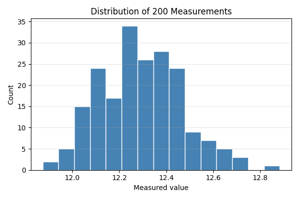

# 第48回　ヒストグラムと分布

!!! abstract "この回のゴール"
    - **ヒストグラム**で、たくさんの測定値の「散らばり方」を見る
    - ビン（階級）の数の意味を理解する
    - 平均・標準偏差と分布の形を結びつける
    - 所要時間の目安: 60分
    - 使うデータ：**繰り返し測定**（200回の測定値）

これまでは少数のデータでした。今回は「同じ測定を200回くり返したらどう散らばるか」を見ます。

`lesson48.py` を作りましょう。乱数で測定データを模擬します（`seed` を固定すると誰がやっても同じ結果になります）。

```python
import numpy as np

rng = np.random.default_rng(42)            # 乱数の種を固定（再現性）
measurements = rng.normal(12.3, 0.2, 200)  # 平均12.3・標準偏差0.2 の値を200個

print("平均:", round(measurements.mean(), 3))
print("標準偏差:", round(measurements.std(ddof=1), 3))
```

出力:

```text
平均: 12.294
標準偏差: 0.176
```

真の平均12.3・標準偏差0.2 に近い値になりました（乱数なので少しずれます）。

---

## 1. ヒストグラムを描く

ヒストグラムは、値をいくつかの**区間（ビン）**に分け、各区間に入った個数を棒の高さで表します。

```python
import numpy as np
import matplotlib.pyplot as plt

rng = np.random.default_rng(42)
measurements = rng.normal(12.3, 0.2, 200)

plt.figure(figsize=(6, 4))
plt.hist(measurements, bins=15, color="steelblue", edgecolor="white")
plt.xlabel("Measured value")
plt.ylabel("Count")
plt.title("Distribution of 200 Measurements")
plt.grid(True, alpha=0.3, axis="y")
plt.tight_layout()
plt.savefig("histogram.png", dpi=100)
plt.show()
```



真ん中（平均の12.3付近）が高く、両側に向かって低くなる**釣鐘型**——これが正規分布（第76回で詳説）です。多くの測定誤差はこの形になります。

!!! note "`bins`（ビンの数）で見え方が変わる"
    - ビンが少なすぎる … 大ざっぱすぎて形が分からない
    - ビンが多すぎる … ガタガタして傾向が読めない

    まずは `bins=15` くらいから試し、データ数に応じて調整します。`edgecolor="white"` は棒の境界を見やすくする工夫です。

---

## 2. 平均の線を重ねる

分布のどこが平均かを示すと、より分かりやすくなります。`axvline`（縦線）を重ねます。

```python
mean_val = measurements.mean()

plt.figure(figsize=(6, 4))
plt.hist(measurements, bins=15, color="steelblue", edgecolor="white")
plt.axvline(mean_val, color="crimson", linestyle="--", label=f"mean = {mean_val:.2f}")
plt.xlabel("Measured value")
plt.ylabel("Count")
plt.title("Distribution with Mean")
plt.legend()
plt.tight_layout()
plt.show()
```

赤い破線が分布の中心（平均）を示します。`linestyle="--"` で破線、`label=` と `legend()` で凡例が付きます。

---

## 演習問題

**問1.** 本文のコードで測定データを作り、平均と標準偏差を表示してください（`seed=42` なら平均 12.294・標準偏差 0.176 になるはずです）。

**問2.** そのデータのヒストグラムを、`bins=10` と `bins=30` の2通りで描いて見比べてください。ビンの数で印象がどう変わりますか？

**問3.** 別の分布を作ってみましょう。`rng.normal(50, 5, 300)`（平均50・標準偏差5・300個）でヒストグラムを描き、平均の縦線（`axvline`）を重ねてください。

---

## 解答

??? success "問1 の解答"
    ```python
    import numpy as np
    rng = np.random.default_rng(42)
    measurements = rng.normal(12.3, 0.2, 200)
    print("平均:", round(measurements.mean(), 3))
    print("標準偏差:", round(measurements.std(ddof=1), 3))
    ```

    出力:
    ```text
    平均: 12.294
    標準偏差: 0.176
    ```

??? success "問2 の解答"
    ```python
    import matplotlib.pyplot as plt
    for b in [10, 30]:
        plt.figure(figsize=(6, 4))
        plt.hist(measurements, bins=b, color="steelblue", edgecolor="white")
        plt.title(f"bins = {b}")
        plt.xlabel("Measured value"); plt.ylabel("Count")
        plt.tight_layout()
        plt.show()
    ```
    `bins=10` はなめらかで大まか、`bins=30` は細かいがガタつきます。同じデータでもビン次第で印象が変わるので、恣意的にならないよう注意します。

??? success "問3 の解答"
    ```python
    import numpy as np, matplotlib.pyplot as plt
    rng = np.random.default_rng(0)
    data = rng.normal(50, 5, 300)

    plt.figure(figsize=(6, 4))
    plt.hist(data, bins=20, color="seagreen", edgecolor="white")
    plt.axvline(data.mean(), color="crimson", linestyle="--", label=f"mean = {data.mean():.1f}")
    plt.xlabel("Value"); plt.ylabel("Count")
    plt.title("Normal Distribution (mean 50, sd 5)")
    plt.legend(); plt.tight_layout()
    plt.show()
    ```

---

## この回のまとめ

- ヒストグラム `plt.hist(data, bins=N)` は値の**散らばり方**を見る。
- 測定誤差の多くは釣鐘型（正規分布）になる。
- `bins` の数で見え方が変わる。まず15前後で試す。
- `axvline` で平均などの基準線を重ねられる。
- `np.random.default_rng(seed)` で再現性のある乱数を作る。

### 次回予告

[第49回：複数グラフとサブプロット](lesson-49.md) では、1枚の図に複数のグラフを並べる方法を学びます。
