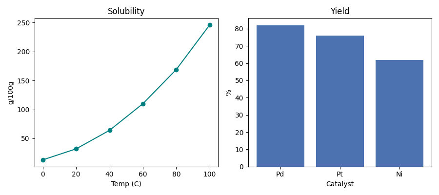

# 第49回　複数グラフとサブプロット

!!! abstract "この回のゴール"
    - 1枚の図に**複数のグラフを並べる**（サブプロット）
    - `plt.subplot()` で縦横に配置する
    - 複数の結果を1枚で見せる図を作る
    - 所要時間の目安: 60分
    - 使うデータ：**溶解度** と **触媒別収率**（別々の図を並べる）

レポートでは「関連する図を並べて見せたい」ことがよくあります。それがサブプロットです。

`lesson49.py` を作りましょう。

---

## 1. subplot：グリッドに並べる

`plt.subplot(行数, 列数, 位置)` で、図を格子に分けて描きます。位置は1から数え、左上→右へ進みます。

```python
import matplotlib.pyplot as plt

temp = [0, 20, 40, 60, 80, 100]
solubility = [13, 32, 64, 110, 169, 246]
catalysts = ["Pd", "Pt", "Ni"]
yield_pct = [82, 76, 62]

plt.figure(figsize=(9, 4))       # 横長にして2枚ぶんの幅を確保

# 1行2列の 1番目（左）
plt.subplot(1, 2, 1)
plt.plot(temp, solubility, marker="o", color="teal")
plt.title("Solubility")
plt.xlabel("Temp (C)")
plt.ylabel("g / 100 g")

# 1行2列の 2番目（右）
plt.subplot(1, 2, 2)
plt.bar(catalysts, yield_pct, color="#4c72b0")
plt.title("Yield")
plt.xlabel("Catalyst")
plt.ylabel("%")

plt.tight_layout()               # 重なりを自動調整
plt.savefig("subplots.png", dpi=100)
plt.show()
```



左に折れ線、右に棒グラフが並びました。異なる種類のグラフも1枚にまとめられます。

!!! note "`subplot(1, 2, 1)` の読み方"
    「1行 × 2列に分けたうちの、1番目」。`subplot(2, 2, 1)` なら2行2列の左上、`subplot(2, 2, 4)` なら右下です。`tight_layout()` を忘れると、ラベルどうしが重なりがちなので必ず付けましょう。

---

## 2. 縦に並べる・2×2に並べる

配置は自由です。行数・列数を変えるだけ。

```python
# 2行1列（縦に並べる）
plt.subplot(2, 1, 1)   # 上
# ...
plt.subplot(2, 1, 2)   # 下

# 2行2列（4枚）
plt.subplot(2, 2, 1)   # 左上
plt.subplot(2, 2, 2)   # 右上
plt.subplot(2, 2, 3)   # 左下
plt.subplot(2, 2, 4)   # 右下
```

!!! tip "図全体のサイズを合わせる"
    枚数を増やすときは `figsize` も大きくします（横に2枚なら幅を2倍、など）。狭いと窮屈で読めない図になります。

---

## 演習問題

**問1.** 本文のコードを実行し、折れ線と棒グラフが左右に並んだ図を保存・表示してください。

**問2.** 1行2列で、左に検量線の**散布図**（`conc=[0,2,4,6,8,10]`, `absorbance=[0.02,0.21,0.40,0.59,0.80,0.99]`）、右に測定値の**ヒストグラム**（`np.random.default_rng(42).normal(12.3, 0.2, 200)`）を並べてください。

**問3.** 2行1列（縦並び）で、上に溶解度の折れ線、下に触媒収率の棒グラフを配置してください。`figsize=(6, 7)` くらいにすると見やすくなります。

---

## 解答

??? success "問1 の解答・確認ポイント"
    本文のコードをそのまま実行。左に折れ線・右に棒グラフの図が出て、`subplots.png` が保存されれば成功です。ラベルが重なる場合は `tight_layout()` を確認しましょう。

??? success "問2 の解答"
    ```python
    import numpy as np, matplotlib.pyplot as plt
    conc = [0, 2, 4, 6, 8, 10]
    absorbance = [0.02, 0.21, 0.40, 0.59, 0.80, 0.99]
    meas = np.random.default_rng(42).normal(12.3, 0.2, 200)

    plt.figure(figsize=(9, 4))
    plt.subplot(1, 2, 1)
    plt.scatter(conc, absorbance, color="darkorange")
    plt.title("Calibration"); plt.xlabel("Conc (mM)"); plt.ylabel("Absorbance")

    plt.subplot(1, 2, 2)
    plt.hist(meas, bins=15, color="steelblue", edgecolor="white")
    plt.title("Distribution"); plt.xlabel("Value"); plt.ylabel("Count")

    plt.tight_layout()
    plt.show()
    ```

??? success "問3 の解答"
    ```python
    import matplotlib.pyplot as plt
    temp = [0, 20, 40, 60, 80, 100]
    solubility = [13, 32, 64, 110, 169, 246]
    catalysts = ["Pd", "Pt", "Ni"]; yield_pct = [82, 76, 62]

    plt.figure(figsize=(6, 7))
    plt.subplot(2, 1, 1)
    plt.plot(temp, solubility, marker="o", color="teal")
    plt.title("Solubility"); plt.xlabel("Temp (C)"); plt.ylabel("g / 100 g")

    plt.subplot(2, 1, 2)
    plt.bar(catalysts, yield_pct, color="#4c72b0")
    plt.title("Yield"); plt.xlabel("Catalyst"); plt.ylabel("%"); plt.ylim(0, 100)

    plt.tight_layout()
    plt.show()
    ```

---

## この回のまとめ

- `plt.subplot(行, 列, 位置)` で図を格子に分けて並べる。位置は1から、左上→右へ。
- 異なる種類のグラフも1枚にまとめられる。
- 枚数に合わせて `figsize` を大きく、`tight_layout()` で重なり回避。

### 次回予告

[第50回：グラフの装飾](lesson-50.md) では、凡例・注釈・近似直線など、グラフを"伝わる図"に仕上げる要素を学びます。
