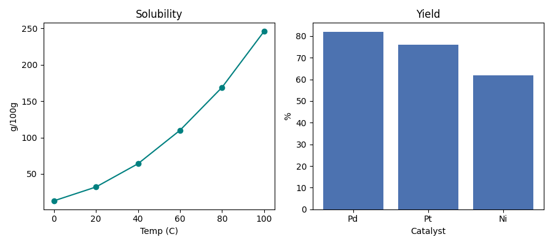

# 第49回　複数グラフとサブプロット

!!! abstract "この回のゴール"
    - 1枚の図に**複数のグラフを並べる**（サブプロット）
    - `plt.subplot()` で縦横に配置する
    - 複数の結果を1枚で見せる図を作る
    - 所要時間の目安: 60分
    - 使うデータ：**溶解度** と **触媒別収率**（別々の図を並べる）

レポートでは「関連する図を並べて見せたい」ことがよくあります。それがサブプロットです。

`lesson49.py` を作りましょう。

---

## 1. subplot：グリッドに並べる

`plt.subplot(行数, 列数, 位置)` で、図を格子に分けて描きます。位置は1から数え、左上→右へ進みます。

```python
import matplotlib.pyplot as plt

temp = [0, 20, 40, 60, 80, 100]
solubility = [13, 32, 64, 110, 169, 246]
catalysts = ["Pd", "Pt", "Ni"]
yield_pct = [82, 76, 62]

plt.figure(figsize=(9, 4))       # 横長にして2枚ぶんの幅を確保

# 1行2列の 1番目（左）
plt.subplot(1, 2, 1)
plt.plot(temp, solubility, marker="o", color="teal")
plt.title("Solubility")
plt.xlabel("Temp (C)")
plt.ylabel("g / 100 g")

# 1行2列の 2番目（右）
plt.subplot(1, 2, 2)
plt.bar(catalysts, yield_pct, color="#4c72b0")
plt.title("Yield")
plt.xlabel("Catalyst")
plt.ylabel("%")

plt.tight_layout()               # 重なりを自動調整
plt.savefig("subplots.png", dpi=100)
plt.show()
```



左に折れ線、右に棒グラフが並びました。異なる種類のグラフも1枚にまとめられます。`plt.xlabel()` や `plt.title()` は**直前の `plt.subplot()` で選んだ1枚にだけ**効くので、各パネルの装飾は、そのパネルの `subplot` の直後に書きます。

!!! note "`subplot(1, 2, 1)` の読み方"
    「1行 × 2列に分けたうちの、1番目」。`subplot(2, 2, 1)` なら2行2列の左上、`subplot(2, 2, 4)` なら右下です。`tight_layout()` を忘れると、ラベルどうしが重なりがちなので必ず付けましょう。

!!! note "AI がよく書く `plt.subplots`（sがつく）"
    AI にサブプロットを頼むと、たいてい次の書き方が返ってきます（第54回で詳しく扱います）。
    ```python
    fig, axes = plt.subplots(1, 2, figsize=(9, 4))
    axes[0].plot(temp, solubility, marker="o")   # 左
    axes[1].bar(catalysts, yield_pct)            # 右
    ```
    `plt.subplot(1, 2, 1)` は**1から**数えますが、`axes[0]` は**0から**数えます。`axes[1]` は「右（2枚目）」です。2行2列なら `axes[0, 1]`（右上）のように2つの番号で指定します。

---

## 2. 縦に並べる・2×2に並べる

配置は自由です。行数・列数を変えるだけ。

```python
# 2行1列（縦に並べる）
plt.subplot(2, 1, 1)   # 上
# ...
plt.subplot(2, 1, 2)   # 下

# 2行2列（4枚）
plt.subplot(2, 2, 1)   # 左上
plt.subplot(2, 2, 2)   # 右上
plt.subplot(2, 2, 3)   # 左下
plt.subplot(2, 2, 4)   # 右下
```

!!! tip "図全体のサイズを合わせる"
    枚数を増やすときは `figsize` も大きくします（横に2枚なら幅を2倍、など）。狭いと窮屈で読めない図になります。

---

## AIに任せるときの指示と確認

!!! example "AIへの頼み方（例）"
    「1行2列のサブプロットを作ってください。左に KNO3 の溶解度（温度 °C と g / 100 g 水のリスト）の折れ線、右に触媒 Pd・Pt・Ni の収率（%）の棒グラフです。
    `fig, axes = plt.subplots(1, 2, figsize=(9, 4))` を使い、各パネルに英語の軸ラベル（単位つき）とタイトルをつけてください。
    収率の y 軸は 0〜100 に固定し、`tight_layout()` の後に `subplots.png` として保存してください。」

!!! warning "AIの出力で確かめること"
    - 各パネルの軸ラベルが中身と合っているか。`plt.xlabel()` は最後に選んだパネルにしか効かないので、左の図のラベルが右に付くことがあります。`for ax in plt.gcf().axes: print(ax.get_xlabel(), "|", ax.get_ylabel())` で全パネルを確認する。
    - 番号の数え方：`plt.subplot(1, 2, 1)` は1始まり、`axes[0]` は0始まり。「右の図」は `axes[1]` です。
    - 2行2列では `axes` が2次元になり、`axes[1].plot(...)` は `AttributeError: 'numpy.ndarray' object has no attribute 'plot'` になります。`axes[1, 0]` のように行と列を指定しているか。
    - 比べたいパネル同士（例：2つの触媒条件の収率）で y 軸の範囲がそろっているか（`sharey=True` や `set_ylim`）。そろっていないと、同じ高さの棒でも値が違います。
    - 保存した画像でラベルや目盛りが重なっていないか（`tight_layout()` の有無）。

---

## 演習問題

**問1.** 本文のコードを実行し、折れ線と棒グラフが左右に並んだ図を保存・表示してください。

**問2.** 1行2列で、左に検量線の**散布図**（`conc=[0,2,4,6,8,10]`, `absorbance=[0.02,0.21,0.40,0.59,0.80,0.99]`）、右に測定値の**ヒストグラム**（`np.random.default_rng(42).normal(12.3, 0.2, 200)`）を並べてください。

**問3.** 2行1列（縦並び）で、上に溶解度の折れ線、下に触媒収率の棒グラフを配置してください。`figsize=(6, 7)` くらいにすると見やすくなります。

**問4.** 次は AI が書いたサブプロットのコードです。左に溶解度、右に収率を描くつもりですが、軸ラベルがおかしな場所に付いています。何が起きているかを確かめ、直してください。
```python
import matplotlib.pyplot as plt

temp = [0, 20, 40, 60, 80, 100]
solubility = [13, 32, 64, 110, 169, 246]
catalysts = ["Pd", "Pt", "Ni"]
yield_pct = [82, 76, 62]

plt.figure(figsize=(9, 4))
plt.subplot(1, 2, 1)
plt.plot(temp, solubility, marker="o", color="teal")
plt.subplot(1, 2, 2)
plt.bar(catalysts, yield_pct, color="#4c72b0")
plt.xlabel("Temperature (°C)")
plt.ylabel("Solubility (g / 100 g water)")
plt.tight_layout()
for i, ax in enumerate(plt.gcf().axes, start=1):
    print(f"{i}枚目: x = '{ax.get_xlabel()}', y = '{ax.get_ylabel()}'")
```

出力:
```text
1枚目: x = '', y = ''
2枚目: x = 'Temperature (°C)', y = 'Solubility (g / 100 g water)'
```

---

## 解答

??? success "問1 の解答・確認ポイント"
    本文のコードをそのまま実行。左に折れ線・右に棒グラフの図が出て、`subplots.png` が保存されれば成功です。ラベルが重なる場合は `tight_layout()` を確認しましょう。

??? success "問2 の解答"
    ```python
    import numpy as np, matplotlib.pyplot as plt
    conc = [0, 2, 4, 6, 8, 10]
    absorbance = [0.02, 0.21, 0.40, 0.59, 0.80, 0.99]
    meas = np.random.default_rng(42).normal(12.3, 0.2, 200)

    plt.figure(figsize=(9, 4))
    plt.subplot(1, 2, 1)
    plt.scatter(conc, absorbance, color="darkorange")
    plt.title("Calibration"); plt.xlabel("Conc (mM)"); plt.ylabel("Absorbance")

    plt.subplot(1, 2, 2)
    plt.hist(meas, bins=15, color="steelblue", edgecolor="white")
    plt.title("Distribution"); plt.xlabel("Value"); plt.ylabel("Count")

    plt.tight_layout()
    plt.show()
    ```

??? success "問3 の解答"
    ```python
    import matplotlib.pyplot as plt
    temp = [0, 20, 40, 60, 80, 100]
    solubility = [13, 32, 64, 110, 169, 246]
    catalysts = ["Pd", "Pt", "Ni"]; yield_pct = [82, 76, 62]

    plt.figure(figsize=(6, 7))
    plt.subplot(2, 1, 1)
    plt.plot(temp, solubility, marker="o", color="teal")
    plt.title("Solubility"); plt.xlabel("Temp (C)"); plt.ylabel("g / 100 g")

    plt.subplot(2, 1, 2)
    plt.bar(catalysts, yield_pct, color="#4c72b0")
    plt.title("Yield"); plt.xlabel("Catalyst"); plt.ylabel("%"); plt.ylim(0, 100)

    plt.tight_layout()
    plt.show()
    ```

??? success "問4 の解答"
    **誤り：溶解度用のラベルが、右の収率の棒グラフに付いている。** `plt.xlabel()` / `plt.ylabel()` は、直前の `plt.subplot()` で選んだパネル（ここでは右）にだけ効きます。そのため左の溶解度の図はラベルなし、右の棒グラフには「温度」「溶解度」という誤ったラベルが付きました。さらに右の収率には単位 (%) のラベルもありません。出力の print で、各パネルのラベルを1枚ずつ確かめると分かります。

    ```python
    import matplotlib.pyplot as plt

    temp = [0, 20, 40, 60, 80, 100]
    solubility = [13, 32, 64, 110, 169, 246]
    catalysts = ["Pd", "Pt", "Ni"]
    yield_pct = [82, 76, 62]

    plt.figure(figsize=(9, 4))
    plt.subplot(1, 2, 1)                          # 左：ここで左の装飾まで済ませる
    plt.plot(temp, solubility, marker="o", color="teal")
    plt.xlabel("Temperature (°C)")
    plt.ylabel("Solubility (g / 100 g water)")

    plt.subplot(1, 2, 2)                          # 右
    plt.bar(catalysts, yield_pct, color="#4c72b0")
    plt.xlabel("Catalyst")
    plt.ylabel("Yield (%)")
    plt.ylim(0, 100)

    plt.tight_layout()
    for i, ax in enumerate(plt.gcf().axes, start=1):
        print(f"{i}枚目: x = '{ax.get_xlabel()}', y = '{ax.get_ylabel()}'")
    plt.show()
    ```

    出力:
    ```text
    1枚目: x = 'Temperature (°C)', y = 'Solubility (g / 100 g water)'
    2枚目: x = 'Catalyst', y = 'Yield (%)'
    ```

---

## この回のまとめ

- `plt.subplot(行, 列, 位置)` で図を格子に分けて並べる。位置は1から、左上→右へ。
- 異なる種類のグラフも1枚にまとめられる。
- 枚数に合わせて `figsize` を大きく、`tight_layout()` で重なり回避。

### 次回予告

[第50回：グラフの装飾](lesson-50.md) では、凡例・注釈・近似直線など、グラフを"伝わる図"に仕上げる要素を学びます。
