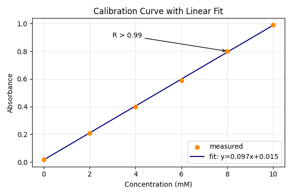

# 第50回　グラフの装飾（軸・凡例・注釈・近似直線）

!!! abstract "この回のゴール"
    - 凡例（legend）・注釈（annotate）でグラフに情報を足す
    - 近似直線（最小二乗法）を重ねる
    - 軸の範囲・目盛りを調整する
    - 所要時間の目安: 60分
    - 使うデータ：**検量線**（濃度と吸光度）＋直線あてはめ

第47回で検量線の散布図を描きました。今回はそこに**近似直線・式・注釈**を足して、"伝わる図"に仕上げます。

`lesson50.py` を作りましょう。

---

## 1. 近似直線を求める（最小二乗法）

散布図の点に最もよく合う直線を、`numpy` の `polyfit` で求めます（`1` は1次＝直線の意味）。

```python
import numpy as np

conc = np.array([0, 2, 4, 6, 8, 10])
absorbance = np.array([0.02, 0.21, 0.40, 0.59, 0.80, 0.99])

slope, intercept = np.polyfit(conc, absorbance, 1)
print(f"傾き = {slope:.4f}, 切片 = {intercept:.4f}")
```

出力:

```text
傾き = 0.0973, 切片 = 0.0152
```

「吸光度 = 0.0973 × 濃度 + 0.0152」という検量線の式が得られました。未知試料の吸光度から濃度を逆算する、まさに実務そのものです。

!!! note "`np.array` にする理由"
    `slope * conc` のように配列全体へ一括計算するため、リストではなく `np.array` にします（第21回の NumPy で詳説）。

---

## 2. 散布図に直線・凡例・注釈を重ねる

```python
import numpy as np
import matplotlib.pyplot as plt

conc = np.array([0, 2, 4, 6, 8, 10])
absorbance = np.array([0.02, 0.21, 0.40, 0.59, 0.80, 0.99])
slope, intercept = np.polyfit(conc, absorbance, 1)

plt.figure(figsize=(6, 4))
# 実測点
plt.scatter(conc, absorbance, color="darkorange", label="measured", zorder=3)
# 近似直線（式を凡例に）
plt.plot(conc, slope * conc + intercept, color="navy",
         label=f"fit: y={slope:.3f}x+{intercept:.3f}")

plt.xlabel("Concentration (mM)")
plt.ylabel("Absorbance")
plt.title("Calibration Curve with Linear Fit")
plt.legend()                      # 凡例を表示（label を拾う）
plt.grid(True, alpha=0.3)

# 注釈（矢印つきコメント）
plt.annotate("R > 0.99", xy=(8, 0.8), xytext=(3, 0.9),
             arrowprops=dict(arrowstyle="->"))

plt.tight_layout()
plt.savefig("calibration_fit.png", dpi=100)
plt.show()
```



実測点（オレンジ）に、近似直線（紺）がぴたりと重なっています。凡例に式、図中に注釈——これで「何を測り、どんな関係が得られたか」が1枚で伝わります。

!!! note "装飾パーツの意味"
    - `label="..."` ＋ `plt.legend()` … 凡例（線や点の説明）
    - `zorder=3` … 重なり順（大きいほど前面。点を線より前に）
    - `plt.annotate("文", xy=指す点, xytext=文字位置, arrowprops=...)` … 矢印つき注釈

---

## 3. 軸の範囲・目盛りを整える

```python
plt.xlim(0, 12)                  # x軸の範囲
plt.ylim(0, 1.1)                 # y軸の範囲
plt.xticks([0, 2, 4, 6, 8, 10])  # x軸の目盛り位置
```

軸範囲をそろえると、複数の図を比べやすくなります。

---

## 演習問題

**問1.** 本文のデータで `np.polyfit` を使い、検量線の傾きと切片を求めて表示してください（傾き 0.0973・切片 0.0152 になるはずです）。

**問2.** 散布図に近似直線を重ね、凡例（`legend`）を表示してください。凡例に近似式が出るようにしましょう。

**問3.** そのグラフに、`plt.annotate` で「linear range」などの注釈を1つ足し、`xlim(0, 12)`・`ylim(0, 1.1)` で軸範囲を整えてください。

---

## 解答

??? success "問1 の解答"
    ```python
    import numpy as np
    conc = np.array([0, 2, 4, 6, 8, 10])
    absorbance = np.array([0.02, 0.21, 0.40, 0.59, 0.80, 0.99])
    slope, intercept = np.polyfit(conc, absorbance, 1)
    print(f"傾き = {slope:.4f}, 切片 = {intercept:.4f}")
    ```

    出力:
    ```text
    傾き = 0.0973, 切片 = 0.0152
    ```

??? success "問2・問3 の解答"
    ```python
    import numpy as np, matplotlib.pyplot as plt
    conc = np.array([0, 2, 4, 6, 8, 10])
    absorbance = np.array([0.02, 0.21, 0.40, 0.59, 0.80, 0.99])
    slope, intercept = np.polyfit(conc, absorbance, 1)

    plt.figure(figsize=(6, 4))
    plt.scatter(conc, absorbance, color="darkorange", label="measured", zorder=3)
    plt.plot(conc, slope * conc + intercept, color="navy",
             label=f"y={slope:.3f}x+{intercept:.3f}")
    plt.xlabel("Concentration (mM)"); plt.ylabel("Absorbance")
    plt.title("Calibration Curve")
    plt.legend(); plt.grid(True, alpha=0.3)
    plt.annotate("linear range", xy=(6, 0.59), xytext=(1, 0.85),
                 arrowprops=dict(arrowstyle="->"))
    plt.xlim(0, 12); plt.ylim(0, 1.1)
    plt.tight_layout()
    plt.show()
    ```

---

## この回のまとめ

- `np.polyfit(x, y, 1)` で近似直線（傾き・切片）を求める。
- `label=` ＋ `plt.legend()` で凡例、`plt.annotate()` で矢印つき注釈。
- `zorder` で重なり順、`xlim`/`ylim`/`xticks` で軸を調整。
- 検量線＋近似式＋注釈で「伝わる1枚」に仕上がる。

### 次回予告

[第51回：seabornで美しい統計グラフ](lesson-51.md) では、より少ないコードで見栄えのする統計グラフを描ける seaborn を導入します。
