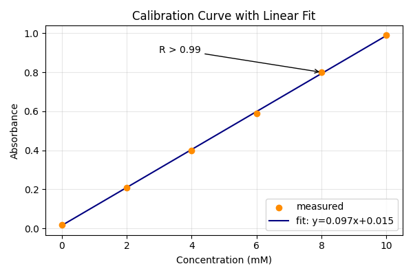

# 第50回　グラフの装飾（軸・凡例・注釈・近似直線）

!!! abstract "この回のゴール"
    - 凡例（legend）・注釈（annotate）でグラフに情報を足す
    - 近似直線（最小二乗法）を重ねる
    - 軸の範囲・目盛りを調整する
    - 所要時間の目安: 60分
    - 使うデータ：**検量線**（濃度と吸光度）＋直線あてはめ

第47回で検量線の散布図を描きました。今回はそこに**近似直線・式・注釈**を足して、"伝わる図"に仕上げます。

`lesson50.py` を作りましょう。

---

## 1. 近似直線を求める（最小二乗法）

散布図の点に最もよく合う直線を、`numpy` の `polyfit` で求めます（`1` は1次＝直線の意味）。

```python
import numpy as np

conc = np.array([0, 2, 4, 6, 8, 10])
absorbance = np.array([0.02, 0.21, 0.40, 0.59, 0.80, 0.99])

slope, intercept = np.polyfit(conc, absorbance, 1)
r = np.corrcoef(conc, absorbance)[0, 1]          # 相関係数
print(f"傾き = {slope:.4f}, 切片 = {intercept:.4f}")
print(f"r = {r:.4f}, R^2 = {r**2:.4f}")
```

出力:

```text
傾き = 0.0973, 切片 = 0.0152
r = 0.9999, R^2 = 0.9997
```

「吸光度 = 0.0973 × 濃度 + 0.0152」という検量線の式が得られました。未知試料の吸光度 A から濃度を逆算するには、この式を濃度について解いて「濃度 = (A − 0.0152) / 0.0973」とします（例：A = 0.50 なら 4.98 mM）。まさに実務そのものです。ただし逆算してよいのは、検量線を作った範囲（ここでは吸光度 0.02〜0.99）の中だけです。

!!! note "`np.array` にする理由"
    `slope * conc` のように配列全体へ一括計算するため、リストではなく `np.array` にします（第21回の NumPy で詳説）。

---

## 2. 散布図に直線・凡例・注釈を重ねる

```python
import numpy as np
import matplotlib.pyplot as plt

conc = np.array([0, 2, 4, 6, 8, 10])
absorbance = np.array([0.02, 0.21, 0.40, 0.59, 0.80, 0.99])
slope, intercept = np.polyfit(conc, absorbance, 1)

plt.figure(figsize=(6, 4))
# 実測点
plt.scatter(conc, absorbance, color="darkorange", label="measured", zorder=3)
# 近似直線（式を凡例に）
plt.plot(conc, slope * conc + intercept, color="navy",
         label=f"fit: y={slope:.3f}x+{intercept:.3f}")

plt.xlabel("Concentration (mM)")
plt.ylabel("Absorbance")
plt.title("Calibration Curve with Linear Fit")
plt.legend()                      # 凡例を表示（label を拾う）
plt.grid(True, alpha=0.3)

# 注釈（矢印つきコメント）
plt.annotate("R > 0.99", xy=(8, 0.8), xytext=(3, 0.9),   # 第1節で計算した r = 0.9999 を確認して書く
             arrowprops=dict(arrowstyle="->"))

plt.tight_layout()
plt.savefig("calibration_fit.png", dpi=100)
plt.show()
```



実測点（オレンジ）に、近似直線（紺）がぴたりと重なっています。凡例に式、図中に注釈——これで「何を測り、どんな関係が得られたか」が1枚で伝わります。

!!! warning "図に書く数値は、必ずコードで計算したもの"
    注釈の「R > 0.99」は、第1節で `np.corrcoef` により r = 0.9999 と計算したから書ける文です。AI は「R² = 0.999」のような**それらしい数値を直書き**することがあるので、図中の数値はコードで計算した値と一致しているか必ず確かめます。

!!! note "装飾パーツの意味"
    - `label="..."` ＋ `plt.legend()` … 凡例（線や点の説明）
    - `zorder=3` … 重なり順（大きいほど前面。点を線より前に）
    - `plt.annotate("文", xy=指す点, xytext=文字位置, arrowprops=...)` … 矢印つき注釈

---

## 3. 軸の範囲・目盛りを整える

```python
plt.xlim(0, 12)                  # x軸の範囲
plt.ylim(0, 1.1)                 # y軸の範囲
plt.xticks([0, 2, 4, 6, 8, 10])  # x軸の目盛り位置
```

軸範囲をそろえると、複数の図を比べやすくなります。

---

## AIに任せるときの指示と確認

!!! example "AIへの頼み方（例）"
    「検量線データ（`conc` = 濃度 [mM]、`absorbance` = 吸光度 [無次元]、どちらも NumPy 配列）に `np.polyfit` で1次式を当てはめ、傾き・切片・決定係数 R² を print してください。
    R² は `np.corrcoef` で計算し、図に直書きしないこと。
    散布図に近似直線を重ね、凡例に近似式を表示してください（切片が負でも符号が正しく出るように）。
    最後に、未知試料の吸光度 0.50 から濃度 [mM] を逆算し、検量線の範囲外の吸光度なら警告を出してください。」

!!! warning "AIの出力で確かめること"
    - `np.polyfit(x, y, 1)` の戻り値は **[傾き, 切片]** の順。print して、傾きが本文の約 0.097（吸光度/mM）と同じ桁か確認する。
    - 逆算の式が `(A - 切片) / 傾き` になっているか。`傾き * A + 切片` と書かれていたら誤りです。A = 0.50 で約 4.98 mM（吸光度 0.40〜0.59 の間なので 4〜6 mM の間）になるか、グラフと見比べる。
    - 図や凡例に書かれた「R² = 0.999」などの数値が、コードで計算した値と一致しているか。
    - 凡例の式が `y=0.097x+-0.004` のようになっていないか。`f"{intercept:+.3f}"` と書くと `-0.004` / `+0.015` のように符号つきで表示されます。
    - 検量線の範囲（本文では吸光度 0.02〜0.99）の外を外挿していないか。

---

## 演習問題

**問1.** 本文のデータで `np.polyfit` を使い、検量線の傾きと切片を求めて表示してください（傾き 0.0973・切片 0.0152 になるはずです）。

**問2.** 散布図に近似直線を重ね、凡例（`legend`）を表示してください。凡例に近似式が出るようにしましょう。

**問3.** そのグラフに、`plt.annotate` で「linear range」などの注釈を1つ足し、`xlim(0, 12)`・`ylim(0, 1.1)` で軸範囲を整えてください。

**問4.** 次は AI が書いた「未知試料の濃度を検量線から求める」コードです。未知試料の吸光度は 0.50 と 1.20 でした。問題点を2つ指摘し、直してください。
```python
import numpy as np

conc = np.array([0, 2, 4, 6, 8, 10])                        # 濃度 [mM]
absorbance = np.array([0.02, 0.21, 0.40, 0.59, 0.80, 0.99])
slope, intercept = np.polyfit(conc, absorbance, 1)

for A in [0.50, 1.20]:                                      # 未知試料の吸光度
    c = slope * A + intercept
    print(f"A = {A:.2f} → 濃度 = {c:.2f} mM")
```

出力:
```text
A = 0.50 → 濃度 = 0.06 mM
A = 1.20 → 濃度 = 0.13 mM
```

---

## 解答

??? success "問1 の解答"
    ```python
    import numpy as np
    conc = np.array([0, 2, 4, 6, 8, 10])
    absorbance = np.array([0.02, 0.21, 0.40, 0.59, 0.80, 0.99])
    slope, intercept = np.polyfit(conc, absorbance, 1)
    print(f"傾き = {slope:.4f}, 切片 = {intercept:.4f}")
    ```

    出力:
    ```text
    傾き = 0.0973, 切片 = 0.0152
    ```

??? success "問2・問3 の解答"
    ```python
    import numpy as np, matplotlib.pyplot as plt
    conc = np.array([0, 2, 4, 6, 8, 10])
    absorbance = np.array([0.02, 0.21, 0.40, 0.59, 0.80, 0.99])
    slope, intercept = np.polyfit(conc, absorbance, 1)

    plt.figure(figsize=(6, 4))
    plt.scatter(conc, absorbance, color="darkorange", label="measured", zorder=3)
    plt.plot(conc, slope * conc + intercept, color="navy",
             label=f"y={slope:.3f}x+{intercept:.3f}")
    plt.xlabel("Concentration (mM)"); plt.ylabel("Absorbance")
    plt.title("Calibration Curve")
    plt.legend(); plt.grid(True, alpha=0.3)
    plt.annotate("linear range", xy=(6, 0.59), xytext=(1, 0.85),
                 arrowprops=dict(arrowstyle="->"))
    plt.xlim(0, 12); plt.ylim(0, 1.1)
    plt.tight_layout()
    plt.show()
    ```

??? success "問4 の解答"
    **誤り1：逆算の式が違う。** 検量線は「A = 傾き × c + 切片」なので、濃度は c = (A − 切片) / 傾き です。AI のコードは検量線の式に A を代入しているだけです。確かめ方：A = 0.50 は標準液の 0.40（4 mM）と 0.59（6 mM）の間なので、答えは 4〜6 mM のはず。0.06 mM はありえません。

    **誤り2：検量線の範囲外（A = 1.20）を外挿している。** 検量線は吸光度 0.99（10 mM）までしか作っていません。範囲外では直線性が保証されないので、試料を希釈して測り直します。

    ```python
    import numpy as np

    conc = np.array([0, 2, 4, 6, 8, 10])                        # 濃度 [mM]
    absorbance = np.array([0.02, 0.21, 0.40, 0.59, 0.80, 0.99])
    slope, intercept = np.polyfit(conc, absorbance, 1)
    r = np.corrcoef(conc, absorbance)[0, 1]
    print(f"A = {slope:.4f} × c + {intercept:.4f},  R^2 = {r**2:.4f}")

    for A in [0.50, 1.20]:                                      # 未知試料の吸光度
        if not (absorbance.min() <= A <= absorbance.max()):
            print(f"A = {A:.2f} → 検量線の範囲外（希釈して再測定）")
            continue
        c = (A - intercept) / slope                             # A = slope*c + intercept を c について解く
        print(f"A = {A:.2f} → 濃度 = {c:.2f} mM")
    ```

    出力:
    ```text
    A = 0.0973 × c + 0.0152,  R^2 = 0.9997
    A = 0.50 → 濃度 = 4.98 mM
    A = 1.20 → 検量線の範囲外（希釈して再測定）
    ```

---

## この回のまとめ

- `np.polyfit(x, y, 1)` で近似直線（傾き・切片）を求める。
- `label=` ＋ `plt.legend()` で凡例、`plt.annotate()` で矢印つき注釈。
- `zorder` で重なり順、`xlim`/`ylim`/`xticks` で軸を調整。
- 検量線＋近似式＋注釈で「伝わる1枚」に仕上がる。

### 次回予告

[第51回：seabornで美しい統計グラフ](lesson-51.md) では、より少ないコードで見栄えのする統計グラフを描ける seaborn を導入します。
