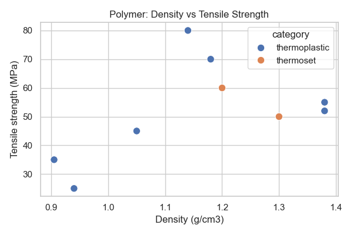

# 第51回　seabornで美しい統計グラフ

!!! abstract "この回のゴール"
    - **seaborn** で、少ないコードで見栄えのする統計グラフを描く
    - DataFrame を直接渡し、`hue` でカテゴリ分けする
    - matplotlib との関係を理解する
    - 所要時間の目安: 60分
    - 使うデータ：**高分子（ポリマー）**の物性

**seaborn** は matplotlib の上に作られた、統計グラフ向けのライブラリです。**DataFrame をそのまま渡せて**、色分けや見た目の調整を自動でやってくれます。

!!! info "準備"
    ```bash
    conda install -c conda-forge seaborn -y   # conda環境の人
    pip install seaborn                        # venvの人
    ```

`lesson51.py` を作りましょう。

```python
import pandas as pd

polymers = pd.DataFrame({
    "polymer":     ["PE", "PP", "PS", "PVC", "PET", "PMMA", "Nylon6", "Epoxy", "Phenolic"],
    "category":    ["thermoplastic"]*7 + ["thermoset"]*2,
    "density":     [0.94, 0.905, 1.05, 1.38, 1.38, 1.18, 1.14, 1.20, 1.30],
    "tensile_MPa": [25, 35, 45, 52, 55, 70, 80, 60, 50],
    "Tg_C":        [-110, -10, 100, 80, 76, 105, 50, 120, 180],
})
```

---

## 1. DataFrame を渡して散布図＋色分け

matplotlib では x と y のリストを渡しました。seaborn では **DataFrame と「列名」**を渡します。しかも `hue` にカテゴリ列を指定すると、**自動で色分け＋凡例**まで作ってくれます。

```python
import seaborn as sns
import matplotlib.pyplot as plt

sns.set_theme(style="whitegrid")      # seaborn の見た目テーマ

plt.figure(figsize=(6, 4))
sns.scatterplot(data=polymers, x="density", y="tensile_MPa", hue="category", s=80)
plt.xlabel("Density (g/cm3)")
plt.ylabel("Tensile strength (MPa)")
plt.title("Polymer: Density vs Tensile Strength")
plt.tight_layout()
plt.savefig("seaborn_scatter.png", dpi=100)
plt.show()
```



`hue="category"` だけで、熱可塑性と熱硬化性が**別の色**になり、凡例も自動でつきました。matplotlib で同じことをすると、カテゴリごとに手作業で分ける必要があります。

!!! note "seaborn と matplotlib の関係"
    seaborn は matplotlib の"上"で動きます。だから `plt.xlabel()` `plt.title()` `plt.savefig()` など、これまでの matplotlib の命令が**そのまま使えます**。「描くのは seaborn、仕上げは matplotlib」と覚えましょう。

---

## 2. カテゴリごとの棒グラフ（自動で平均＋誤差棒）

`barplot` にカテゴリと数値を渡すと、**グループの平均**を棒にし、ばらつき（信頼区間）を細い線で表してくれます。

```python
import seaborn as sns
import matplotlib.pyplot as plt

plt.figure(figsize=(6, 4))
sns.barplot(data=polymers, x="category", y="tensile_MPa")
plt.xlabel("Category")
plt.ylabel("Mean tensile strength (MPa)")
plt.title("Average Tensile Strength by Category")
plt.tight_layout()
plt.show()
```

第36回では `groupby` で平均を計算してから棒グラフにしました。seaborn なら**集計とグラフ化を一度に**やってくれます。

---

## 演習問題

**問1.** `sns.scatterplot` で、x に `Tg_C`、y に `tensile_MPa`、`hue="category"` を指定した散布図を描いてください。

**問2.** `sns.barplot` で、カテゴリ別の平均**密度**（`density`）を棒グラフにしてください。

**問3.** `sns.set_theme(style="darkgrid")` に変えてから問1のグラフを描き、テーマで見た目がどう変わるか確かめてください（`whitegrid` / `darkgrid` / `ticks` などがあります）。

---

## 解答

??? success "問1 の解答"
    ```python
    import seaborn as sns, matplotlib.pyplot as plt
    sns.set_theme(style="whitegrid")

    plt.figure(figsize=(6, 4))
    sns.scatterplot(data=polymers, x="Tg_C", y="tensile_MPa", hue="category", s=80)
    plt.xlabel("Glass transition temp (C)")
    plt.ylabel("Tensile strength (MPa)")
    plt.title("Tg vs Tensile Strength")
    plt.tight_layout()
    plt.show()
    ```

??? success "問2 の解答"
    ```python
    import seaborn as sns, matplotlib.pyplot as plt
    plt.figure(figsize=(6, 4))
    sns.barplot(data=polymers, x="category", y="density")
    plt.ylabel("Mean density (g/cm3)")
    plt.title("Average Density by Category")
    plt.tight_layout()
    plt.show()
    ```

??? success "問3 の解答"
    ```python
    import seaborn as sns, matplotlib.pyplot as plt
    sns.set_theme(style="darkgrid")      # テーマを変更
    plt.figure(figsize=(6, 4))
    sns.scatterplot(data=polymers, x="Tg_C", y="tensile_MPa", hue="category", s=80)
    plt.tight_layout()
    plt.show()
    ```
    背景がグレー＋白グリッドに変わります。テーマは図全体の印象を一括で変えられます。

---

## この回のまとめ

- seaborn は DataFrame と列名を渡すだけで統計グラフを描ける。
- `hue="カテゴリ列"` で自動の色分け＋凡例。
- `barplot` は集計（平均・信頼区間）とグラフ化を同時に。
- seaborn は matplotlib の上で動く。仕上げ命令はそのまま使える。
- `sns.set_theme(style=...)` で見た目を一括変更。

### 次回予告

[第52回：相関のヒートマップ](lesson-52.md) では、複数の物性どうしの関係を、色の濃淡で一望する図を作ります。
