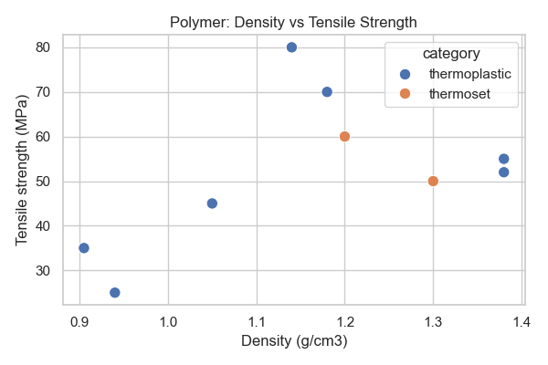

# 第51回　seabornで美しい統計グラフ

!!! abstract "この回のゴール"
    - **seaborn** で、少ないコードで見栄えのする統計グラフを描く
    - DataFrame を直接渡し、`hue` でカテゴリ分けする
    - matplotlib との関係を理解する
    - 所要時間の目安: 60分
    - 使うデータ：**高分子（ポリマー）**の物性

**seaborn** は matplotlib の上に作られた、統計グラフ向けのライブラリです。**DataFrame をそのまま渡せて**、色分けや見た目の調整を自動でやってくれます。

!!! info "準備"
    ```bash
    conda install -c conda-forge seaborn -y   # conda環境の人
    pip install seaborn                        # venvの人
    ```

`lesson51.py` を作りましょう。

```python
import pandas as pd

polymers = pd.DataFrame({
    "polymer":     ["PE", "PP", "PS", "PVC", "PET", "PMMA", "Nylon6", "Epoxy", "Phenolic"],
    "category":    ["thermoplastic"]*7 + ["thermoset"]*2,
    "density":     [0.94, 0.905, 1.05, 1.38, 1.38, 1.18, 1.14, 1.20, 1.30],
    "tensile_MPa": [25, 35, 45, 52, 55, 70, 80, 60, 50],
    "Tg_C":        [-110, -10, 100, 80, 76, 105, 50, 120, 180],
})
```

---

## 1. DataFrame を渡して散布図＋色分け

matplotlib では x と y のリストを渡しました。seaborn では **DataFrame と「列名」**を渡します。しかも `hue` にカテゴリ列を指定すると、**自動で色分け＋凡例**まで作ってくれます。

```python
import seaborn as sns
import matplotlib.pyplot as plt

sns.set_theme(style="whitegrid")      # seaborn の見た目テーマ

plt.figure(figsize=(6, 4))
sns.scatterplot(data=polymers, x="density", y="tensile_MPa", hue="category", s=80)
plt.xlabel("Density (g/cm3)")
plt.ylabel("Tensile strength (MPa)")
plt.title("Polymer: Density vs Tensile Strength")
plt.tight_layout()
plt.savefig("seaborn_scatter.png", dpi=100)
plt.show()
```



`hue="category"` だけで、熱可塑性と熱硬化性が**別の色**になり、凡例も自動でつきました。matplotlib で同じことをすると、カテゴリごとに手作業で分ける必要があります。

!!! note "seaborn と matplotlib の関係"
    seaborn は matplotlib の"上"で動きます。だから `plt.xlabel()` `plt.title()` `plt.savefig()` など、これまでの matplotlib の命令が**そのまま使えます**。「描くのは seaborn、仕上げは matplotlib」と覚えましょう。

---

## 2. カテゴリごとの棒グラフ（自動で平均＋誤差棒）

`barplot` にカテゴリと数値を渡すと、**グループの平均**を棒にし、細い線（誤差棒）を付けてくれます。誤差棒は、既定では**平均の95%信頼区間**（ブートストラップ法という乱数を使う方法で計算）で、**標準偏差ではありません**。

```python
import seaborn as sns
import matplotlib.pyplot as plt

plt.figure(figsize=(6, 4))
sns.barplot(data=polymers, x="category", y="tensile_MPa")
plt.xlabel("Category")
plt.ylabel("Mean tensile strength (MPa)")
plt.title("Average Tensile Strength by Category")
plt.tight_layout()
plt.show()
```

第36回では `groupby` でカテゴリ別の平均を**表として**計算しました。seaborn の `barplot` なら、**集計とグラフ化を一度に**やってくれます。

!!! warning "誤差棒の意味と、件数を必ず確かめる"
    - 誤差棒の既定は95%信頼区間です。乱数を使って計算するため、実行するたびに長さが少し変わります。標準偏差を示したいときは `sns.barplot(..., errorbar="sd")` と指定し、図のラベルや説明文にも「mean ± SD」と書きます。
    - 件数を `polymers.groupby("category")["tensile_MPa"].agg(["mean", "std", "count"])` で確認しましょう。thermoset は**2件だけ**なので、その誤差棒は2つの値（50 と 60 MPa）の間を示しているにすぎません。件数の少ないグループの平均の比較は、参考程度にとどめます。

---

## AIに任せるときの指示と確認

!!! example "AIへの頼み方（例）"
    「pandas の DataFrame `polymers`（列: `polymer`, `category`, `density` [g/cm3], `tensile_MPa`, `Tg_C`）から、seaborn で `category` 別の平均引張強さの棒グラフを描いてください。
    誤差棒は標準偏差（`errorbar="sd"`）にし、各ポリマーの値を `stripplot` で黒い点として重ねてください。
    y 軸ラベルは `Tensile strength (MPa, mean ± SD)` とし、あわせて各カテゴリの平均・標準偏差・件数を `groupby` で print してください。」

!!! warning "AIの出力で確かめること"
    - `barplot` の誤差棒の既定は**95%信頼区間**で、標準偏差ではありません。ラベルや説明に「± SD」とあるなら、コードに `errorbar="sd"` があるか。
    - グループごとの**件数**を print する。thermoset は2件しかなく、平均や誤差棒はほとんど意味を持ちません。
    - 棒の高さと誤差棒の端が、`groupby` の値と合っているか。例えば thermoplastic は平均 51.7・標準偏差 19.1 なので、`errorbar="sd"` の誤差棒は 32.6〜70.8 MPa です。
    - `hue` の凡例のカテゴリ名・色が元データと対応しているか（thermoplastic が7件、thermoset が2件）。
    - `sns.set_theme()` を呼ぶと、その後に描く matplotlib の図の見た目も変わります。別の図が意図せず変わっていないか。

---

## 演習問題

**問1.** `sns.scatterplot` で、x に `Tg_C`、y に `tensile_MPa`、`hue="category"` を指定した散布図を描いてください。

**問2.** `sns.barplot` で、カテゴリ別の平均**密度**（`density`）を棒グラフにしてください。

**問3.** `sns.set_theme(style="darkgrid")` に変えてから問1のグラフを描き、テーマで見た目がどう変わるか確かめてください（`whitegrid` / `darkgrid` / `ticks` などがあります）。

**問4.** 次は AI が書いた「カテゴリ別の平均引張強さ（平均 ± 標準偏差）」の図のコードです（`polymers` は本文のもの）。図の説明と中身が食い違っています。問題点を指摘し、直してください。
```python
import seaborn as sns, matplotlib.pyplot as plt

plt.figure(figsize=(6, 4))
sns.barplot(data=polymers, x="category", y="tensile_MPa")
plt.ylabel("Tensile strength (MPa, mean ± SD)")
plt.tight_layout()
plt.show()
```

---

## 解答

??? success "問1 の解答"
    ```python
    import seaborn as sns, matplotlib.pyplot as plt
    sns.set_theme(style="whitegrid")

    plt.figure(figsize=(6, 4))
    sns.scatterplot(data=polymers, x="Tg_C", y="tensile_MPa", hue="category", s=80)
    plt.xlabel("Glass transition temp (C)")
    plt.ylabel("Tensile strength (MPa)")
    plt.title("Tg vs Tensile Strength")
    plt.tight_layout()
    plt.show()
    ```

??? success "問2 の解答"
    ```python
    import seaborn as sns, matplotlib.pyplot as plt
    plt.figure(figsize=(6, 4))
    sns.barplot(data=polymers, x="category", y="density")
    plt.ylabel("Mean density (g/cm3)")
    plt.title("Average Density by Category")
    plt.tight_layout()
    plt.show()
    ```

??? success "問3 の解答"
    ```python
    import seaborn as sns, matplotlib.pyplot as plt
    sns.set_theme(style="darkgrid")      # テーマを変更
    plt.figure(figsize=(6, 4))
    sns.scatterplot(data=polymers, x="Tg_C", y="tensile_MPa", hue="category", s=80)
    plt.tight_layout()
    plt.show()
    ```
    背景がグレー＋白グリッドに変わります。テーマは図全体の印象を一括で変えられます。ただし `set_theme` はそのスクリプトで**以後に描くすべての図**に効きます（matplotlib だけで描いた図も含む）。

??? success "問4 の解答"
    **誤り1：誤差棒は標準偏差（SD）ではない。** `sns.barplot` の誤差棒は、既定では平均の**95%信頼区間**（ブートストラップ法）です。ラベルに「mean ± SD」と書くなら `errorbar="sd"` を指定します。既定のままだと、乱数を使うため実行のたびに誤差棒の長さが少し変わることからも、SD ではないと分かります。

    **誤り2（注意点）：件数を確認していない。** thermoset は2件だけです。平均 ± SD を示すなら、件数も確認し、個々の値も重ねて見せるのが誠実です。

    ```python
    import seaborn as sns, matplotlib.pyplot as plt

    print(polymers.groupby("category")["tensile_MPa"].agg(["mean", "std", "count"]).round(1))

    plt.figure(figsize=(6, 4))
    sns.barplot(data=polymers, x="category", y="tensile_MPa", errorbar="sd")   # 誤差棒を標準偏差に
    sns.stripplot(data=polymers, x="category", y="tensile_MPa", color="black") # 個々の値も重ねる
    plt.ylabel("Tensile strength (MPa, mean ± SD)")
    plt.tight_layout()
    plt.show()
    ```

    出力:
    ```text
                   mean   std  count
    category                        
    thermoplastic  51.7  19.1      7
    thermoset      55.0   7.1      2
    ```
    誤差棒の端が、thermoplastic で 51.7 ± 19.1（32.6〜70.8 MPa）、thermoset で 55.0 ± 7.1（47.9〜62.1 MPa）になっていれば正しく SD が描かれています。

---

## この回のまとめ

- seaborn は DataFrame と列名を渡すだけで統計グラフを描ける。
- `hue="カテゴリ列"` で自動の色分け＋凡例。
- `barplot` は集計（平均・信頼区間）とグラフ化を同時に。
- seaborn は matplotlib の上で動く。仕上げ命令はそのまま使える。
- `sns.set_theme(style=...)` で見た目を一括変更。

### 次回予告

[第52回：相関のヒートマップ](lesson-52.md) では、複数の物性どうしの関係を、色の濃淡で一望する図を作ります。
