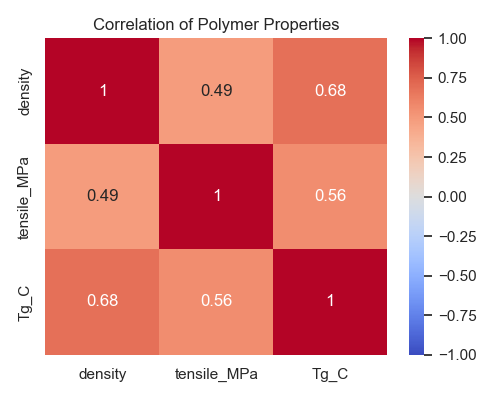

# 第52回　相関のヒートマップ

!!! abstract "この回のゴール"
    - 複数の量の関係を表す**相関係数**を求める
    - `corr()` で相関行列を作る
    - **ヒートマップ**で相関を色の濃淡として一望する
    - 所要時間の目安: 60分
    - 使うデータ：**高分子（ポリマー）**の物性

「密度が高いポリマーは引張強さも高い？」——複数の物性どうしの関係を、まとめて見たいときに使うのが**相関行列**と**ヒートマップ**です。

`lesson52.py` を作りましょう。

```python
import pandas as pd

polymers = pd.DataFrame({
    "polymer":     ["PE", "PP", "PS", "PVC", "PET", "PMMA", "Nylon6", "Epoxy", "Phenolic"],
    "density":     [0.94, 0.905, 1.05, 1.38, 1.38, 1.18, 1.14, 1.20, 1.30],
    "tensile_MPa": [25, 35, 45, 52, 55, 70, 80, 60, 50],
    "Tg_C":        [-110, -10, 100, 80, 76, 105, 50, 120, 180],
})
```

---

## 1. 相関行列を作る

**相関係数**は、2つの量が「一緒に増えるか」を −1〜+1 で表す数です。

- **+1 に近い** … 一方が増えると他方も増える（正の相関）
- **0 に近い** … 関係が薄い
- **−1 に近い** … 一方が増えると他方は減る（負の相関）

数値列だけの相関を一気に求めるのが `corr()` です。

```python
corr = polymers[["density", "tensile_MPa", "Tg_C"]].corr().round(2)
print(corr)
```

出力:

```text
             density  tensile_MPa  Tg_C
density         1.00         0.49  0.68
tensile_MPa     0.49         1.00  0.56
Tg_C            0.68         0.56  1.00
```

対角線はすべて 1.00（自分自身との相関）。密度と Tg は 0.68 とやや強めの正の相関、と読めます。

---

## 2. ヒートマップで一望する

数字の行列も良いですが、**色**にすると関係が直感的に見えます。seaborn の `heatmap` を使います。

```python
import seaborn as sns
import matplotlib.pyplot as plt

corr = polymers[["density", "tensile_MPa", "Tg_C"]].corr()

plt.figure(figsize=(5, 4))
sns.heatmap(corr, annot=True, cmap="coolwarm", vmin=-1, vmax=1, center=0)
plt.title("Correlation of Polymer Properties")
plt.tight_layout()
plt.savefig("heatmap.png", dpi=100)
plt.show()
```



赤いほど正の相関、青いほど負の相関。`annot=True` で数値も重ねています。ひと目で「どの物性どうしが関係するか」が分かります。

!!! note "heatmap の引数"
    - `annot=True` … 各マスに数値を表示
    - `cmap="coolwarm"` … 色の配色（赤=高・青=低）
    - `vmin=-1, vmax=1, center=0` … 色スケールを −1〜+1・中心0に固定（相関の標準）

!!! warning "相関 ≠ 因果"
    相関があっても「原因と結果」とは限りません（たまたま一緒に動くだけのことも）。相関は「関係の手がかり」であり、因果の証明ではない——これは科学で最重要の注意点です。

---

## 演習問題

**問1.** `polymers` の数値3列（density, tensile_MPa, Tg_C）の相関行列を `corr()` で作り、小数第2位に丸めて表示してください。density と Tg_C の相関はいくつですか？

**問2.** その相関行列を `sns.heatmap`（`annot=True`, `cmap="coolwarm"`）でヒートマップにしてください。

**問3.** 配色を変えてみましょう。`cmap="viridis"` でヒートマップを描き、`coolwarm` との印象の違いを見てください（相関の可視化には赤青の `coolwarm` 系が向く理由も考えましょう）。

---

## 解答

??? success "問1 の解答"
    ```python
    corr = polymers[["density", "tensile_MPa", "Tg_C"]].corr().round(2)
    print(corr)
    ```

    出力:
    ```text
                 density  tensile_MPa  Tg_C
    density         1.00         0.49  0.68
    tensile_MPa     0.49         1.00  0.56
    Tg_C            0.68         0.56  1.00
    ```
    density と Tg_C の相関は **0.68**（やや強い正の相関）。

??? success "問2 の解答"
    ```python
    import seaborn as sns, matplotlib.pyplot as plt
    corr = polymers[["density", "tensile_MPa", "Tg_C"]].corr()
    plt.figure(figsize=(5, 4))
    sns.heatmap(corr, annot=True, cmap="coolwarm", vmin=-1, vmax=1, center=0)
    plt.title("Correlation")
    plt.tight_layout()
    plt.show()
    ```

??? success "問3 の解答"
    ```python
    import seaborn as sns, matplotlib.pyplot as plt
    corr = polymers[["density", "tensile_MPa", "Tg_C"]].corr()
    plt.figure(figsize=(5, 4))
    sns.heatmap(corr, annot=True, cmap="viridis")
    plt.title("Correlation (viridis)")
    plt.tight_layout()
    plt.show()
    ```
    `viridis` は連続量向き。相関は「正・負・ゼロ」に意味があるので、**中心0で赤青に分かれる `coolwarm`** のほうが、正負が直感的に読めます。

---

## この回のまとめ

- 相関係数は 2量の連動を −1〜+1 で表す。`df.corr()` で相関行列。
- `sns.heatmap(corr, annot=True, cmap="coolwarm", center=0)` で色の濃淡に。
- 相関の可視化は中心0の赤青系（coolwarm）が読みやすい。
- **相関は因果ではない**。関係の手がかりとして使う。

### 次回予告

[第53回：箱ひげ図・バイオリンプロット](lesson-53.md) では、カテゴリごとの「分布の違い」を比べる図を学びます。
