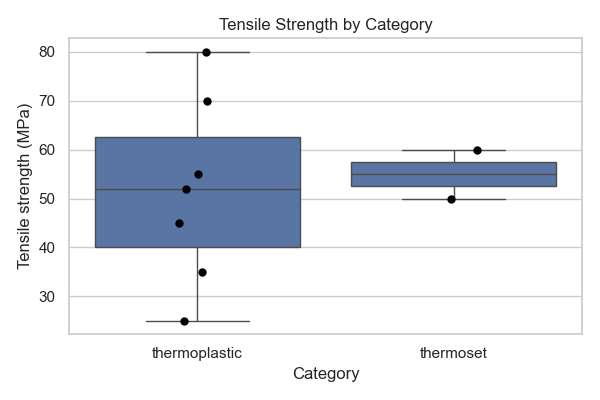
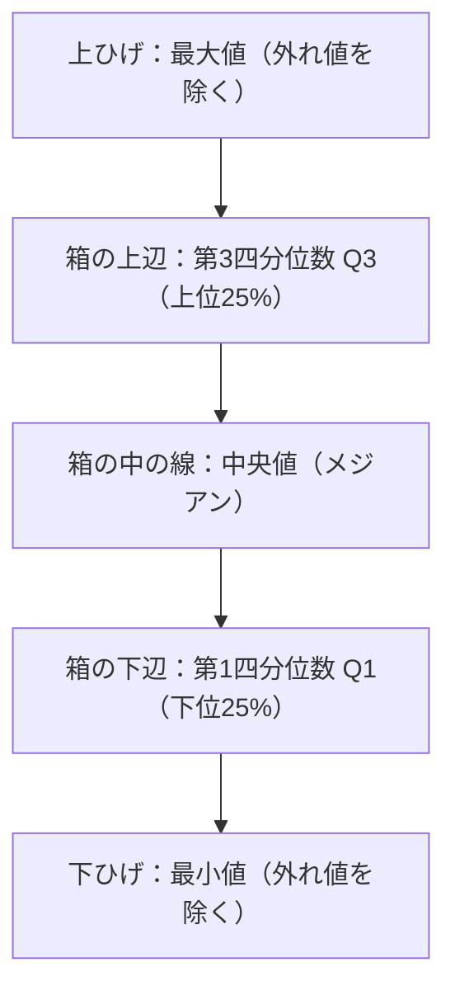

# 第53回　箱ひげ図・バイオリンプロット

!!! abstract "この回のゴール"
    - **箱ひげ図**で、カテゴリごとの分布（中央値・ばらつき・外れ値）を比べる
    - 箱ひげ図の各部分の意味を読める
    - **バイオリンプロット**（分布の形も見せる）を知る
    - 所要時間の目安: 60分
    - 使うデータ：**高分子（ポリマー）**の物性

平均だけでは「ばらつき」や「外れ値」は分かりません。**箱ひげ図**は、分布の要点をコンパクトに見せ、グループ間の比較に最適です。

`lesson53.py` を作りましょう。

```python
import pandas as pd

polymers = pd.DataFrame({
    "polymer":     ["PE", "PP", "PS", "PVC", "PET", "PMMA", "Nylon6", "Epoxy", "Phenolic"],
    "category":    ["thermoplastic"]*7 + ["thermoset"]*2,
    "tensile_MPa": [25, 35, 45, 52, 55, 70, 80, 60, 50],
})
```

---

## 1. 箱ひげ図を描く

`sns.boxplot` にカテゴリ列と数値列を渡します。実際のデータ点も重ねる（`stripplot`）と、少数データでは分かりやすくなります。

```python
import seaborn as sns
import matplotlib.pyplot as plt

sns.set_theme(style="whitegrid")

plt.figure(figsize=(6, 4))
sns.boxplot(data=polymers, x="category", y="tensile_MPa")
sns.stripplot(data=polymers, x="category", y="tensile_MPa", color="black", size=6)
plt.xlabel("Category")
plt.ylabel("Tensile strength (MPa)")
plt.title("Tensile Strength by Category")
plt.tight_layout()
plt.savefig("boxplot.png", dpi=100)
plt.show()
```



黒い点が実際の測定値、箱がその分布の要約です。

---

## 2. 箱ひげ図の読み方



- **箱の高さ** … データの真ん中50%が入る範囲（＝IQR、第42回）
- **箱の中の線** … 中央値
- **ひげ** … 外れ値を除いた最大・最小
- **ひげの外の点** … 外れ値の候補

つまり箱ひげ図は、第42回で学んだ**四分位数と外れ値**を、そのまま図にしたものです。

---

## 3. バイオリンプロット：分布の形も見せる

箱ひげ図は要約だけですが、**バイオリンプロット**は「どのあたりにデータが密集しているか（分布の形）」も見せます。

```python
import seaborn as sns
import matplotlib.pyplot as plt

plt.figure(figsize=(6, 4))
sns.violinplot(data=polymers, x="category", y="tensile_MPa")
plt.xlabel("Category")
plt.ylabel("Tensile strength (MPa)")
plt.title("Tensile Strength (Violin)")
plt.tight_layout()
plt.show()
```

横幅が広いところにデータが多い、という見方です。データが多いときに威力を発揮します（少数だと形が不安定なので、その場合は箱ひげ図が無難）。

!!! note "使い分け"
    - **箱ひげ図** … 要約を正確に。少数データでも安定。
    - **バイオリン** … 分布の形まで見せたい。データが多いとき向き。

---

## 演習問題

**問1.** `polymers` で、カテゴリ別の引張強さの箱ひげ図を描き、実測点を `stripplot` で重ねてください。

**問2.** 箱ひげ図から、thermoplastic の**中央値**がだいたいどのあたりか読み取ってください（数値は `polymers[polymers["category"]=="thermoplastic"]["tensile_MPa"].median()` で確認）。

**問3.** 同じデータで `violinplot` を描き、箱ひげ図と見え方を比べてください。少数データではどちらが読みやすいと感じますか？

---

## 解答

??? success "問1 の解答"
    ```python
    import seaborn as sns, matplotlib.pyplot as plt
    sns.set_theme(style="whitegrid")
    plt.figure(figsize=(6, 4))
    sns.boxplot(data=polymers, x="category", y="tensile_MPa")
    sns.stripplot(data=polymers, x="category", y="tensile_MPa", color="black", size=6)
    plt.title("Tensile Strength by Category")
    plt.tight_layout()
    plt.show()
    ```

??? success "問2 の解答"
    ```python
    tp = polymers[polymers["category"] == "thermoplastic"]
    print("thermoplastic の中央値:", tp["tensile_MPa"].median())
    ```

    出力:
    ```text
    thermoplastic の中央値: 52.0
    ```
    箱ひげ図の「箱の中の線」が、この 52 付近にあるはずです。

??? success "問3 の解答"
    ```python
    import seaborn as sns, matplotlib.pyplot as plt
    plt.figure(figsize=(6, 4))
    sns.violinplot(data=polymers, x="category", y="tensile_MPa")
    plt.tight_layout()
    plt.show()
    ```
    今回のように件数が少ない（thermoset は2件）ときは、バイオリンの形が過剰に見えることがあり、**箱ひげ図のほうが素直**に読めます。

---

## この回のまとめ

- 箱ひげ図はカテゴリ別の分布（中央値・IQR・外れ値）を比較する図。
- 各部分は第42回の四分位数・外れ値そのもの。
- `stripplot` で実測点を重ねると少数データで分かりやすい。
- バイオリンは分布の形まで見せる（データが多いとき向き）。

### 次回予告

[第54回：論文品質の図をつくる](lesson-54.md) では、解像度・フォント・体裁を整えて、レポートや論文にそのまま載せられる図に仕上げます。
