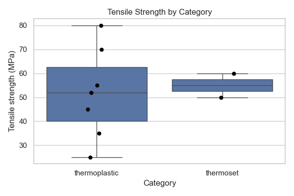
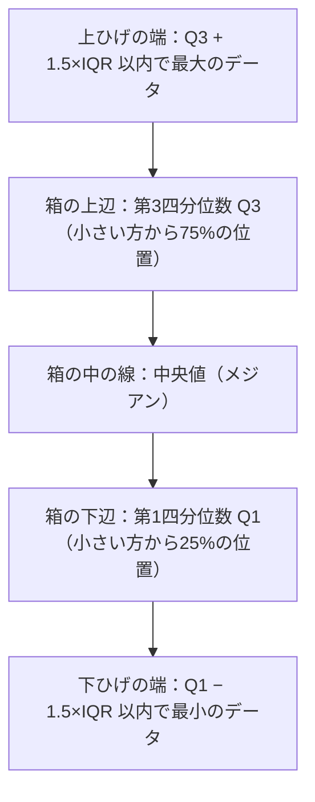

# 第53回　箱ひげ図・バイオリンプロット

!!! abstract "この回のゴール"
    - **箱ひげ図**で、カテゴリごとの分布（中央値・ばらつき・外れ値）を比べる
    - 箱ひげ図の各部分の意味を読める
    - **バイオリンプロット**（分布の形も見せる）を知る
    - 所要時間の目安: 60分
    - 使うデータ：**高分子（ポリマー）**の物性

平均だけでは「ばらつき」や「外れ値」は分かりません。**箱ひげ図**は、分布の要点をコンパクトに見せ、グループ間の比較に最適です。

`lesson53.py` を作りましょう。

```python
import pandas as pd

polymers = pd.DataFrame({
    "polymer":     ["PE", "PP", "PS", "PVC", "PET", "PMMA", "Nylon6", "Epoxy", "Phenolic"],
    "category":    ["thermoplastic"]*7 + ["thermoset"]*2,
    "tensile_MPa": [25, 35, 45, 52, 55, 70, 80, 60, 50],
})
```

---

## 1. 箱ひげ図を描く

`sns.boxplot` にカテゴリ列と数値列を渡します。実際のデータ点も重ねる（`stripplot`）と、少数データでは分かりやすくなります。外れ値があるデータで点を重ねるときは、`sns.boxplot(..., showfliers=False)` として外れ値の点が二重に描かれないようにします（今回のデータには外れ値はありません）。

```python
import seaborn as sns
import matplotlib.pyplot as plt

sns.set_theme(style="whitegrid")

plt.figure(figsize=(6, 4))
sns.boxplot(data=polymers, x="category", y="tensile_MPa")
sns.stripplot(data=polymers, x="category", y="tensile_MPa", color="black", size=6)
plt.xlabel("Category")
plt.ylabel("Tensile strength (MPa)")
plt.title("Tensile Strength by Category")
plt.tight_layout()
plt.savefig("boxplot.png", dpi=100)
plt.show()
```



黒い点が個々のポリマーの値、箱がその分布の要約です。ただし thermoset は**2件しかない**ので、その「箱」は2つの値の間を示しているだけで、分布の要約にはなっていません。件数が数件以下のグループは、点（`stripplot`）だけを示すほうが誤解がありません。

---

## 2. 箱ひげ図の読み方


```mermaid
flowchart TB
    A["上ひげの端：Q3 + 1.5×IQR 以内で最大のデータ"] --> B["箱の上辺：第3四分位数 Q3（小さい方から75%の位置）"]
    B --> C["箱の中の線：中央値（メジアン）"]
    C --> D["箱の下辺：第1四分位数 Q1（小さい方から25%の位置）"]
    D --> E["下ひげの端：Q1 − 1.5×IQR 以内で最小のデータ"]
```

- **箱の高さ** … データの真ん中50%が入る範囲（＝IQR、第42回）
- **箱の中の線** … 中央値
- **ひげ** … 箱から 1.5×IQR 以内に入るデータのうち、最も外側の値まで（第42回の IQR 法の境界の内側）
- **ひげの外の点** … 外れ値の候補

つまり箱ひげ図は、第42回で学んだ**四分位数と外れ値**を、そのまま図にしたものです。

---

## 3. バイオリンプロット：分布の形も見せる

箱ひげ図は要約だけですが、**バイオリンプロット**は「どのあたりにデータが密集しているか（分布の形）」も見せます。

```python
import seaborn as sns
import matplotlib.pyplot as plt

plt.figure(figsize=(6, 4))
sns.violinplot(data=polymers, x="category", y="tensile_MPa", cut=0)
plt.xlabel("Category")
plt.ylabel("Tensile strength (MPa)")
plt.title("Tensile Strength (Violin)")
plt.tight_layout()
plt.show()
```

横幅が広いところにデータが多い、という見方です。データが多いときに威力を発揮します（少数だと形が不安定なので、その場合は箱ひげ図が無難）。バイオリンの形はデータから推定した「なめらかな曲線」なので、既定ではデータの最小値・最大値より外まで伸びます。引張強さのように負にならない量では、`cut=0` を付けてデータの範囲内で止めます。

!!! note "使い分け"
    - **箱ひげ図** … 要約を正確に。バイオリンより少数データに向く（ただし数件以下なら、点だけを示すほうが正直）。
    - **バイオリン** … 分布の形まで見せたい。データが多いとき向き。

---

## AIに任せるときの指示と確認

!!! example "AIへの頼み方（例）"
    「DataFrame `polymers` の `category` 別に、`tensile_MPa`（引張強さ, MPa）の箱ひげ図を seaborn の `boxplot` で描き、全データ点を `stripplot` で重ねてください。
    点が二重にならないよう `boxplot` は `showfliers=False` にしてください。
    あわせて、カテゴリごとの件数・中央値・Q1・Q3 を `groupby` で print してください。」

!!! warning "AIの出力で確かめること"
    - ひげの端は「最小値・最大値」ではありません。既定（`whis=1.5`）では、Q1 − 1.5×IQR 〜 Q3 + 1.5×IQR の内側で最も外側のデータまでで、その外の点が外れ値です。AI の説明文が「ひげ＝最小〜最大」になっていたら誤り。
    - 各グループの**件数**を print する。thermoset は2件だけで、2点の「箱」は分布の要約になりません。
    - 箱の中の線が print した中央値と一致するか（thermoplastic は 52.0 MPa）。平均値と取り違えていないか。
    - `stripplot` を重ねたとき、外れ値が二重に描かれていないか（`showfliers=False`）。
    - バイオリンプロットが、負の引張強さのようなありえない範囲まで伸びていないか。`ax.get_ylim()` を print して確認し、必要なら `cut=0`。

---

## 演習問題

**問1.** `polymers` で、カテゴリ別の引張強さの箱ひげ図を描き、実測点を `stripplot` で重ねてください。

**問2.** 箱ひげ図から、thermoplastic の**中央値**がだいたいどのあたりか読み取ってください（数値は `polymers[polymers["category"]=="thermoplastic"]["tensile_MPa"].median()` で確認）。

**問3.** 同じデータで `violinplot` を描き、箱ひげ図と見え方を比べてください。少数データではどちらが読みやすいと感じますか？

**問4.** PP の試験片8本の引張強さ [MPa]（架空）を測りました。8本目は気泡を含む試験片です。AI に「箱ひげ図のひげの範囲を求めて」と頼んだところ、次のコードと答えが返ってきました。どこがおかしいか指摘し、第42回の IQR 法を使って正しいひげの範囲と外れ値を求めてください。
```python
import pandas as pd

# PP 試験片8本の引張強さ [MPa]（架空）。8本目は気泡を含む試験片
pp = pd.Series([33.5, 34.1, 34.8, 35.0, 35.2, 35.6, 36.3, 18.2])
print(f"ひげの範囲: {pp.min()} 〜 {pp.max()} MPa")
```

出力:
```text
ひげの範囲: 18.2 〜 36.3 MPa
```

---

## 解答

??? success "問1 の解答"
    ```python
    import seaborn as sns, matplotlib.pyplot as plt
    sns.set_theme(style="whitegrid")
    plt.figure(figsize=(6, 4))
    sns.boxplot(data=polymers, x="category", y="tensile_MPa")
    sns.stripplot(data=polymers, x="category", y="tensile_MPa", color="black", size=6)
    plt.title("Tensile Strength by Category")
    plt.tight_layout()
    plt.show()
    ```

??? success "問2 の解答"
    ```python
    tp = polymers[polymers["category"] == "thermoplastic"]
    print("thermoplastic の中央値:", tp["tensile_MPa"].median())
    ```

    出力:
    ```text
    thermoplastic の中央値: 52.0
    ```
    箱ひげ図の「箱の中の線」が、この 52 付近にあるはずです。

??? success "問3 の解答"
    ```python
    import seaborn as sns, matplotlib.pyplot as plt
    plt.figure(figsize=(6, 4))
    sns.violinplot(data=polymers, x="category", y="tensile_MPa", cut=0)
    plt.tight_layout()
    plt.show()
    ```
    今回のように件数が少ない（thermoset は2件）ときは、バイオリンの形が過剰に見えることがあり、**箱ひげ図のほうが素直**に読めます。

??? success "問4 の解答"
    **誤り：ひげの範囲を「最小値〜最大値」としている。** 箱ひげ図のひげは、Q1 − 1.5×IQR 〜 Q3 + 1.5×IQR の境界の内側にあるデータのうち、最も外側の値までです。境界の外の 18.2 MPa（気泡のある試験片）は外れ値として、ひげの外に点で描かれます。最小値〜最大値をひげとすると、1本の不良試験片のせいで PP のばらつきが実際よりずっと大きく見えてしまいます。

    ```python
    import pandas as pd

    # PP 試験片8本の引張強さ [MPa]（架空）。8本目は気泡を含む試験片
    pp = pd.Series([33.5, 34.1, 34.8, 35.0, 35.2, 35.6, 36.3, 18.2])
    q1, q3 = pp.quantile(0.25), pp.quantile(0.75)
    iqr = q3 - q1
    low, high = q1 - 1.5 * iqr, q3 + 1.5 * iqr
    inside = pp[(pp >= low) & (pp <= high)]
    print(f"Q1 = {q1:.2f}, Q3 = {q3:.2f}, IQR = {iqr:.2f}")
    print(f"外れ値の境界: {low:.2f} 〜 {high:.2f} MPa")
    print(f"ひげの範囲: {inside.min()} 〜 {inside.max()} MPa")
    print("外れ値:", pp[(pp < low) | (pp > high)].tolist())
    ```

    出力:
    ```text
    Q1 = 33.95, Q3 = 35.30, IQR = 1.35
    外れ値の境界: 31.93 〜 37.33 MPa
    ひげの範囲: 33.5 〜 36.3 MPa
    外れ値: [18.2]
    ```
    `sns.boxplot(y=pp)` で描くと、ひげは 33.5〜36.3 MPa、18.2 MPa は下に離れた点として表示され、この計算と一致します。外れ値を除くかどうかは、「気泡があった」という実験上の理由とともに記録して判断します（第42回）。

---

## この回のまとめ

- 箱ひげ図はカテゴリ別の分布（中央値・IQR・外れ値）を比較する図。
- 各部分は第42回の四分位数・外れ値そのもの。
- `stripplot` で実測点を重ねると少数データで分かりやすい。
- バイオリンは分布の形まで見せる（データが多いとき向き）。

### 次回予告

[第54回：論文品質の図をつくる](lesson-54.md) では、解像度・フォント・体裁を整えて、レポートや論文にそのまま載せられる図に仕上げます。
