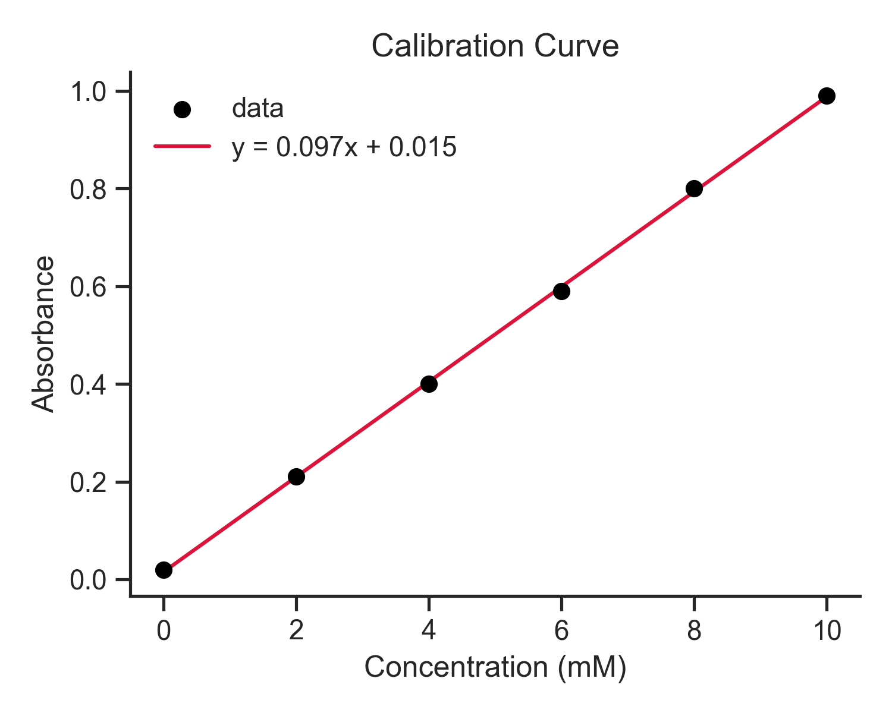

# 第54回　論文品質の図をつくる（解像度・フォント）

!!! abstract "この回のゴール"
    - レポート・論文に載せられる図の要件を知る
    - **解像度（dpi）**・フォントサイズ・余白を整える
    - 不要な枠を消してすっきり見せる
    - 図をファイルに正しく書き出す
    - 所要時間の目安: 60分
    - 使うデータ：**検量線**（濃度と吸光度）

同じデータでも、体裁ひとつで「実験メモ」にも「論文の図」にも見えます。今回は仕上げの技術です。

`lesson54.py` を作りましょう。

---

## 1. 論文品質の図の要件

| 要素 | 目安 |
|---|---|
| 解像度 | **300 dpi 以上**（印刷でぼやけない） |
| フォント | 軸ラベル・タイトルが十分大きい（11〜13pt程度） |
| 軸ラベル | 量と**単位**を必ず明記（例：Concentration (mM)） |
| 体裁 | 不要な枠線を消す、凡例は枠なし、色は控えめ |
| 形式 | 印刷は PNG(高dpi) か PDF/SVG（ベクター） |

---

## 2. 仕上げたコード

これまでの検量線を、論文品質に整えます。`fig, ax = plt.subplots()` という書き方（オブジェクト指向スタイル）を使うと、細かい調整がしやすくなります。

```python
import numpy as np
import matplotlib.pyplot as plt
import seaborn as sns

sns.set_theme(style="ticks")          # すっきりしたテーマ

conc = np.array([0, 2, 4, 6, 8, 10])
absorbance = np.array([0.02, 0.21, 0.40, 0.59, 0.80, 0.99])
slope, intercept = np.polyfit(conc, absorbance, 1)

fig, ax = plt.subplots(figsize=(5, 4))
ax.scatter(conc, absorbance, color="black", zorder=3, label="data")
ax.plot(conc, slope * conc + intercept, color="crimson",
        label=f"y = {slope:.3f}x + {intercept:.3f}")

ax.set_xlabel("Concentration (mM)", fontsize=12)
ax.set_ylabel("Absorbance", fontsize=12)
ax.set_title("Calibration Curve", fontsize=13)
ax.legend(frameon=False)              # 凡例の枠を消す
sns.despine()                         # 上と右の枠線を消す

fig.tight_layout()
fig.savefig("figure_publication.png", dpi=300)   # 高解像度で保存
fig.savefig("figure_publication.pdf")            # ベクター形式でも
plt.show()
```



上と右の枠が消え、凡例の枠もなく、必要な情報（軸ラベル＋単位、近似式）が過不足なく載っています。300 dpi なので拡大してもぼやけません。

!!! note "`fig, ax` スタイルについて"
    `fig, ax = plt.subplots()` で、図全体(`fig`)と1枚の軸(`ax`)を取り出します。以降 `ax.set_xlabel(...)` のように `ax` に対して指定します。複数の図を細かく制御でき、実務ではこちらが主流です（これまでの `plt.xlabel()` 方式と結果は同じ）。

---

## 3. 保存形式の選び方

- **PNG（dpi=300）** … 手軽で万能。スライドやWordに貼るならこれ。
- **PDF / SVG** … ベクター形式。**いくら拡大してもぼやけない**。論文の投稿で好まれます。
- **dpi を上げる** … 保存時 `dpi=300` を忘れない。画面表示は粗くても、保存が高解像度なら印刷はきれいです。

!!! tip "日本語を使いたいとき（発展）"
    軸に日本語を入れたい場合は、日本語フォントの設定が必要です。手軽なのは `japanize-matplotlib`（`pip install japanize-matplotlib` して `import japanize_matplotlib` するだけ）。本コースは英語ラベルで進めますが、卒論などで必要になったら試してください。

---

## 演習問題

**問1.** 本文のコードを実行し、`figure_publication.png`（300 dpi）と `figure_publication.pdf` の両方が保存されることを確認してください。PNG を開いて拡大し、ぼやけないことを見ましょう。

**問2.** `sns.despine()` の行を消して実行し、上・右の枠線があるとどう印象が変わるか比べてください。

**問3.** 第47回で作った「触媒別収率の棒グラフ」を、`fontsize` を大きく・`sns.despine()` で枠を消し・`dpi=300` で保存して、論文品質に仕上げてください。

---

## 解答

??? success "問1 の解答・確認ポイント"
    本文のコードをそのまま実行。同じフォルダに `.png` と `.pdf` ができます。PNG を画像ビューアで拡大しても、線や文字がなめらか（＝高解像度）なら成功です。

??? success "問2 の解答・確認ポイント"
    `sns.despine()` を消すと、グラフの四辺すべてに枠線が付きます。上と右の線は情報を持たないため、消したほうが**すっきりしてデータに目が向く**——というのが論文図の定石です。

??? success "問3 の解答"
    ```python
    import matplotlib.pyplot as plt
    import seaborn as sns
    sns.set_theme(style="ticks")

    catalysts = ["Pd", "Pt", "Ni"]
    yield_pct = [82, 76, 62]

    fig, ax = plt.subplots(figsize=(5, 4))
    ax.bar(catalysts, yield_pct, color="#4c72b0")
    ax.set_xlabel("Catalyst", fontsize=12)
    ax.set_ylabel("Yield (%)", fontsize=12)
    ax.set_title("Yield by Catalyst", fontsize=13)
    ax.set_ylim(0, 100)
    sns.despine()
    fig.tight_layout()
    fig.savefig("yield_pub.png", dpi=300)
    plt.show()
    ```

---

## この回のまとめ

- 論文図は **300 dpi 以上**・十分なフォント・**単位つき軸ラベル**・すっきりした体裁。
- `fig, ax = plt.subplots()` のオブジェクト指向スタイルが細かい制御に便利。
- `sns.despine()` で上・右の枠を消す、`legend(frameon=False)` で凡例の枠を消す。
- 保存は PNG(dpi=300) か PDF/SVG。日本語は追加フォント設定で対応。

### 次回予告

[第55回：まとめ演習（反応速度データの可視化）](lesson-55.md) では、第5部の総仕上げとして、化学反応の時間変化データをグラフで解析します。
