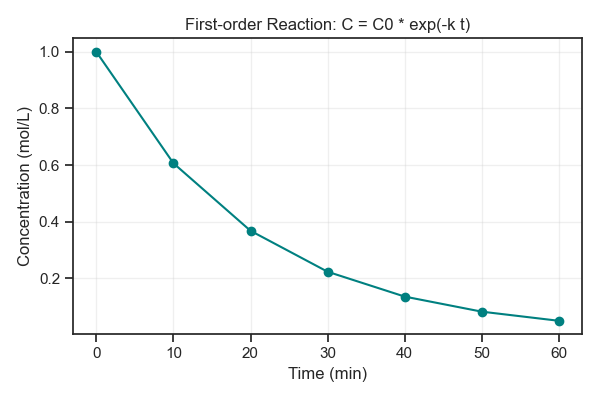
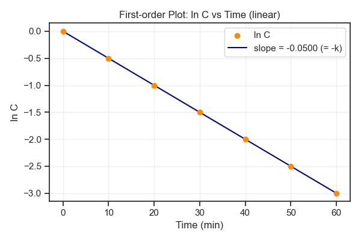

# 第55回　まとめ演習：反応速度データを可視化する

!!! abstract "この回のゴール"
    - 第5部の技術を使って、化学反応の**時間変化**を可視化する
    - 一次反応の濃度変化を折れ線で描く
    - 対数をとると直線になることを、グラフで確かめる
    - 直線の傾きから**反応速度定数 k** を求める
    - 所要時間の目安: 60分（第5部の総仕上げ）
    - 使うデータ：**一次反応の濃度モニタリング**

一次反応では、濃度が時間とともに $C = C_0 e^{-kt}$ で減っていきます。この実データを、グラフで解析します。

`lesson55.py` を作りましょう。

```python
import numpy as np

# 一次反応のモニタリングデータ（時間ごとの濃度）
time = np.arange(0, 61, 10)          # 0,10,20,...,60 分
C0, k = 1.0, 0.05
conc = C0 * np.exp(-k * time)        # 理論値（実験ではここが測定値）

for t, c in zip(time, conc):
    print(f"t={t:>2} min : C={c:.4f} mol/L")
```

出力:

```text
t= 0 min : C=1.0000 mol/L
t=10 min : C=0.6065 mol/L
t=20 min : C=0.3679 mol/L
t=30 min : C=0.2231 mol/L
t=40 min : C=0.1353 mol/L
t=50 min : C=0.0821 mol/L
t=60 min : C=0.0498 mol/L
```

---

## 1. 濃度の時間変化を折れ線で描く

```python
import numpy as np
import matplotlib.pyplot as plt

time = np.arange(0, 61, 10)
conc = 1.0 * np.exp(-0.05 * time)

plt.figure(figsize=(6, 4))
plt.plot(time, conc, marker="o", color="teal")
plt.xlabel("Time (min)")
plt.ylabel("Concentration (mol/L)")
plt.title("First-order Reaction: C = C0 * exp(-k t)")
plt.grid(True, alpha=0.3)
plt.tight_layout()
plt.savefig("first_order.png", dpi=100)
plt.show()
```



なめらかに減っていく曲線（指数関数的減衰）が見えます。でもこの曲線からは、速度定数 k を直接は読み取れません。そこで**対数**を使います。

---

## 2. 対数をとると直線になる

$C = C_0 e^{-kt}$ の両辺の自然対数をとると、$\ln C = \ln C_0 - k t$。**$\ln C$ を時間に対してプロットすると直線**になり、その**傾きが −k** になります。

```python
import numpy as np
import matplotlib.pyplot as plt

time = np.arange(0, 61, 10)
conc = 1.0 * np.exp(-0.05 * time)
ln_conc = np.log(conc)                    # 自然対数

slope, intercept = np.polyfit(time, ln_conc, 1)
print(f"傾き = {slope:.4f}  → 速度定数 k = {-slope:.4f} /min")

plt.figure(figsize=(6, 4))
plt.scatter(time, ln_conc, color="darkorange", zorder=3, label="ln C")
plt.plot(time, slope * time + intercept, color="navy", label=f"slope = {slope:.4f} (= -k)")
plt.xlabel("Time (min)")
plt.ylabel("ln C")
plt.title("First-order Plot: ln C vs Time (linear)")
plt.legend()
plt.grid(True, alpha=0.3)
plt.tight_layout()
plt.savefig("ln_plot.png", dpi=100)
plt.show()
```

出力:

```text
傾き = -0.0500  → 速度定数 k = 0.0500 /min
```



点が見事に一直線！ 傾き −0.0500 から、**速度定数 k = 0.05 /min** が求まりました。設定した値とぴたり一致します。

!!! success "これが速度論解析の基本"
    「曲線 → 対数変換 → 直線化 → 傾きから定数」。これは一次反応だけでなく、アレニウスの式（ln k vs 1/T）など、化学の多くの解析で使う強力な考え方です。グラフと数式がつながる瞬間です。

---

## 演習問題

**問1.** 本文のデータを作り、各時刻の濃度を表示してください。20分後の濃度はいくつですか？

**問2.** 濃度の時間変化を折れ線グラフで描いてください（マーカーつき、軸ラベル・タイトルつき）。

**問3.** $\ln C$ を時間に対してプロットし、`np.polyfit` で傾きを求めて、速度定数 k を計算・表示してください（k ≒ 0.05 になるはずです）。直線あてはめの線も重ねましょう。

---

## 解答

??? success "問1 の解答"
    ```python
    import numpy as np
    time = np.arange(0, 61, 10)
    conc = 1.0 * np.exp(-0.05 * time)
    for t, c in zip(time, conc):
        print(f"t={t:>2} min : C={c:.4f} mol/L")
    ```
    出力の20分の行より、**20分後の濃度は 0.3679 mol/L**（およそ初期の37%）。

??? success "問2 の解答"
    ```python
    import numpy as np, matplotlib.pyplot as plt
    time = np.arange(0, 61, 10)
    conc = 1.0 * np.exp(-0.05 * time)

    plt.figure(figsize=(6, 4))
    plt.plot(time, conc, marker="o", color="teal")
    plt.xlabel("Time (min)"); plt.ylabel("Concentration (mol/L)")
    plt.title("First-order Reaction")
    plt.grid(True, alpha=0.3); plt.tight_layout()
    plt.show()
    ```

??? success "問3 の解答"
    ```python
    import numpy as np, matplotlib.pyplot as plt
    time = np.arange(0, 61, 10)
    conc = 1.0 * np.exp(-0.05 * time)
    ln_conc = np.log(conc)

    slope, intercept = np.polyfit(time, ln_conc, 1)
    print(f"k = {-slope:.4f} /min")

    plt.figure(figsize=(6, 4))
    plt.scatter(time, ln_conc, color="darkorange", zorder=3, label="ln C")
    plt.plot(time, slope * time + intercept, color="navy", label=f"slope = {slope:.4f}")
    plt.xlabel("Time (min)"); plt.ylabel("ln C")
    plt.title("First-order Plot"); plt.legend(); plt.grid(True, alpha=0.3)
    plt.tight_layout(); plt.show()
    ```
    出力:
    ```text
    k = 0.0500 /min
    ```

---

## 第5部　修了

おめでとうございます！ これで、化学データを**折れ線・散布図・棒グラフ・ヒストグラム・箱ひげ図・ヒートマップ**で可視化し、**近似直線や速度定数**まで求められるようになりました。第4部（集計）と第5部（可視化）で、「データを読み、整え、集計し、図にして、解析する」という一連の力が身につきました。

!!! tip "次のステップ"
    ここまでで、実験データを扱う土台は完成です。この先は——
    
    - **第6部**：RDKit で分子そのものを扱う（ケモインフォマティクス）
    - **第7部**：R で統計的な検定（有意差など）
    - **第9部**：Quarto で「コード＋図＋文章」のレポートに仕上げる
    
    まずは、身近な実験データを1つ選び、第4部・第5部の流れで「読み込み → 集計 → グラフ化」を自分でやってみましょう。それが一番の練習になります。

### 次回予告

このあとは第3部（NumPy）や第6部以降を順次追加していきます。ここまで本当によく頑張りました！
