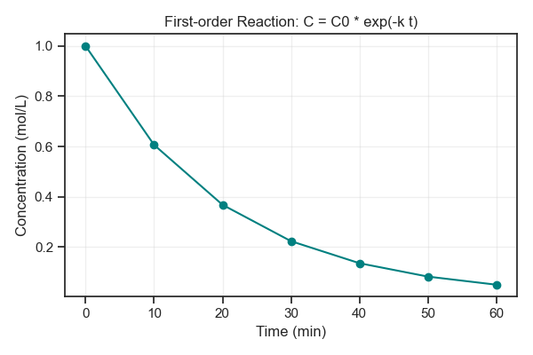
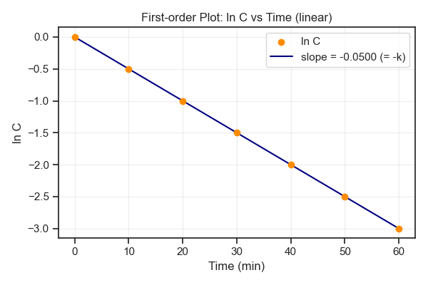

# 第55回　まとめ演習：反応速度データを可視化する

!!! abstract "この回のゴール"
    - 第5部の技術を使って、化学反応の**時間変化**を可視化する
    - 一次反応の濃度変化を折れ線で描く
    - 対数をとると直線になることを、グラフで確かめる
    - 直線の傾きから**反応速度定数 k** を求める
    - 所要時間の目安: 60分（第5部の総仕上げ）
    - 使うデータ：**一次反応の濃度モニタリング**

一次反応では、濃度が時間とともに $C = C_0 e^{-kt}$ で減っていきます。ここでは、この式に $C_0$ = 1.0 mol/L、$k$ = 0.05 min⁻¹ を入れて作った**模擬データ（誤差のない理論値・架空）**を、グラフで解析します。

`lesson55.py` を作りましょう。

```python
import numpy as np

# 一次反応のモニタリングデータ（時間ごとの濃度）
time = np.arange(0, 61, 10)          # 0,10,20,...,60 分
C0, k = 1.0, 0.05
conc = C0 * np.exp(-k * time)        # 理論値（実験ではここが測定値）

for t, c in zip(time, conc):
    print(f"t={t:>2} min : C={c:.4f} mol/L")
```

出力:

```text
t= 0 min : C=1.0000 mol/L
t=10 min : C=0.6065 mol/L
t=20 min : C=0.3679 mol/L
t=30 min : C=0.2231 mol/L
t=40 min : C=0.1353 mol/L
t=50 min : C=0.0821 mol/L
t=60 min : C=0.0498 mol/L
```

---

## 1. 濃度の時間変化を折れ線で描く

```python
import numpy as np
import matplotlib.pyplot as plt

time = np.arange(0, 61, 10)
conc = 1.0 * np.exp(-0.05 * time)

plt.figure(figsize=(6, 4))
plt.plot(time, conc, marker="o", color="teal")
plt.xlabel("Time (min)")
plt.ylabel("Concentration (mol/L)")
plt.title("First-order Reaction: C = C0 * exp(-k t)")
plt.grid(True, alpha=0.3)
plt.tight_layout()
plt.savefig("first_order.png", dpi=100)
plt.show()
```



なめらかに減っていく曲線（指数関数的減衰）が見えます。でもこの曲線からは、速度定数 k を直接は読み取れません。そこで**対数**を使います。

---

## 2. 対数をとると直線になる

$C = C_0 e^{-kt}$ の両辺の自然対数をとると、$\ln C = \ln C_0 - k t$。**$\ln C$ を時間に対してプロットすると直線**になり、その**傾きが −k** になります。

!!! note "ln C の「C」は単位で割った数"
    対数は単位のない数にしかとれないので、正式には $\ln(C / (\mathrm{mol\,L^{-1}}))$ のように、濃度を単位で割った数値の対数をとります。図の縦軸の `ln C` も、この意味です。単位を mmol/L に変えると ln C は一定値だけずれますが、**傾き（= −k）は変わりません**。

```python
import numpy as np
import matplotlib.pyplot as plt

time = np.arange(0, 61, 10)
conc = 1.0 * np.exp(-0.05 * time)
ln_conc = np.log(conc)                    # 自然対数

slope, intercept = np.polyfit(time, ln_conc, 1)
print(f"傾き = {slope:.4f}  → 速度定数 k = {-slope:.4f} /min")

plt.figure(figsize=(6, 4))
plt.scatter(time, ln_conc, color="darkorange", zorder=3, label="ln C")
plt.plot(time, slope * time + intercept, color="navy", label=f"slope = {slope:.4f} (= -k)")
plt.xlabel("Time (min)")
plt.ylabel("ln C")
plt.title("First-order Plot: ln C vs Time (linear)")
plt.legend()
plt.grid(True, alpha=0.3)
plt.tight_layout()
plt.savefig("ln_plot.png", dpi=100)
plt.show()
```

出力:

```text
傾き = -0.0500  → 速度定数 k = 0.0500 /min
```



点が見事に一直線！ 傾き −0.0500 から、**速度定数 k = 0.05 min⁻¹** が求まりました。設定した値とぴたり一致するのは、誤差のない理論値から作ったデータだからです。実際の測定値には誤差があるので、k は 0.05 から少しずれます（演習の問4で確かめます）。k が分かれば、濃度が半分になる時間（半減期）も $t_{1/2} = \ln 2 / k$ = 13.9 min と計算できます。

!!! success "これが速度論解析の基本"
    「曲線 → 対数変換 → 直線化 → 傾きから定数」。これは一次反応だけでなく、アレニウスの式（ln k vs 1/T）など、化学の多くの解析で使う強力な考え方です。グラフと数式がつながる瞬間です。

---

## AIに任せるときの指示と確認

!!! example "AIへの頼み方（例）"
    「一次反応の濃度モニタリングデータ（`time` は min、`conc` は mol/L の NumPy 配列）から、速度定数を求めてください。
    自然対数 `np.log` で ln C を計算し、ln C を時間に対してプロットして `np.polyfit` で直線を当てはめ、k（単位 min⁻¹）と半減期 ln2/k（min）を print してください。
    図の横軸は `Time (min)`、縦軸は `ln C` とし、直線からのずれ（残差）も print してください。」

!!! warning "AIの出力で確かめること"
    - 対数が `np.log`（自然対数 ln）か。`np.log10` だと傾きが 1/2.303 倍になり、k が約 0.43 倍の小さな値になります。
    - k の単位：時間を min で入れたなら k は **min⁻¹**。s⁻¹ にするには 60 で割ります（0.05 min⁻¹ = 8.3×10⁻⁴ s⁻¹）。AI が単位を付け替えただけで数値を換算していないことがあります。
    - 半減期 ln2/k（k = 0.05 min⁻¹ なら 13.9 min）で、濃度の曲線が初期値の半分になる時刻と一致するか、グラフと見比べる。
    - ln C 対 t が本当に直線か。残差（`ln_conc - (slope * time + intercept)`）が一方向に曲がっていたら一次反応ではないかもしれません（二次反応なら 1/C 対 t が直線）。
    - 濃度に 0 や負の値が含まれると、`np.log` が `-inf` や `nan` を返し、`RuntimeWarning: divide by zero encountered in log` が出ます。警告を無視していないか。

---

## 演習問題

**問1.** 本文のデータを作り、各時刻の濃度を表示してください。20分後の濃度はいくつですか？

**問2.** 濃度の時間変化を折れ線グラフで描いてください（マーカーつき、軸ラベル・タイトルつき）。

**問3.** $\ln C$ を時間に対してプロットし、`np.polyfit` で傾きを求めて、速度定数 k を計算・表示してください（k ≒ 0.05 になるはずです）。直線あてはめの線も重ねましょう。

**問4.** 実際の測定値には誤差があります。次は、誤差2%を乗せた模擬測定データ（架空）から速度定数を求めるように AI に頼んだときのコードです。問題点を2つ指摘し、直してください。あわせて半減期も求めましょう。
```python
import numpy as np

# 一次反応の模擬測定データ（架空）：真の k = 0.05 min^-1 に 2% の測定誤差
rng = np.random.default_rng(0)
time = np.arange(0, 61, 10)                                   # [min]
conc = 1.0 * np.exp(-0.05 * time) * (1 + rng.normal(0, 0.02, time.size))  # [mol/L]

slope, intercept = np.polyfit(time, np.log10(conc), 1)
k = -slope
print(f"k = {k:.4f} s^-1")
```

出力:
```text
k = 0.0216 s^-1
```

---

## 解答

??? success "問1 の解答"
    ```python
    import numpy as np
    time = np.arange(0, 61, 10)
    conc = 1.0 * np.exp(-0.05 * time)
    for t, c in zip(time, conc):
        print(f"t={t:>2} min : C={c:.4f} mol/L")
    ```
    出力の20分の行より、**20分後の濃度は 0.3679 mol/L**（およそ初期の37%）。

??? success "問2 の解答"
    ```python
    import numpy as np, matplotlib.pyplot as plt
    time = np.arange(0, 61, 10)
    conc = 1.0 * np.exp(-0.05 * time)

    plt.figure(figsize=(6, 4))
    plt.plot(time, conc, marker="o", color="teal")
    plt.xlabel("Time (min)"); plt.ylabel("Concentration (mol/L)")
    plt.title("First-order Reaction")
    plt.grid(True, alpha=0.3); plt.tight_layout()
    plt.show()
    ```

??? success "問3 の解答"
    ```python
    import numpy as np, matplotlib.pyplot as plt
    time = np.arange(0, 61, 10)
    conc = 1.0 * np.exp(-0.05 * time)
    ln_conc = np.log(conc)

    slope, intercept = np.polyfit(time, ln_conc, 1)
    print(f"k = {-slope:.4f} /min")

    plt.figure(figsize=(6, 4))
    plt.scatter(time, ln_conc, color="darkorange", zorder=3, label="ln C")
    plt.plot(time, slope * time + intercept, color="navy", label=f"slope = {slope:.4f}")
    plt.xlabel("Time (min)"); plt.ylabel("ln C")
    plt.title("First-order Plot"); plt.legend(); plt.grid(True, alpha=0.3)
    plt.tight_layout(); plt.show()
    ```
    出力:
    ```text
    k = 0.0500 /min
    ```

??? success "問4 の解答"
    **誤り1：常用対数 `np.log10` を使っている。** 一次反応の式を直線にするのは自然対数（$\ln C = \ln C_0 - kt$）です。log10 だと傾きが $k / 2.303$ になり、k が約 0.43 倍に小さく出ます（0.0216 ≒ 0.05 / 2.303）。真の値 0.05 と桁は近くても、値が合わないことで気づけます。

    **誤り2：単位が違う。** `time` の単位は min なので、傾きから出る k の単位は min⁻¹ です。s⁻¹ で表すなら 60 で割る必要があります。単位だけを書き換えるのは誤りです。

    ```python
    import numpy as np

    # 一次反応の模擬測定データ（架空）：真の k = 0.05 min^-1 に 2% の測定誤差
    rng = np.random.default_rng(0)
    time = np.arange(0, 61, 10)                                   # [min]
    conc = 1.0 * np.exp(-0.05 * time) * (1 + rng.normal(0, 0.02, time.size))  # [mol/L]

    slope, intercept = np.polyfit(time, np.log(conc), 1)          # 自然対数 ln
    k = -slope                                                    # 時間が min なので k は min^-1
    print(f"k = {k:.4f} min^-1 = {k / 60:.2e} s^-1")
    print(f"半減期 t1/2 = ln2 / k = {np.log(2) / k:.1f} min")
    ```

    出力:
    ```text
    k = 0.0498 min^-1 = 8.29e-04 s^-1
    半減期 t1/2 = ln2 / k = 13.9 min
    ```
    誤差があるので k は 0.05 ぴったりではなく 0.0498 min⁻¹ になりました。これが実験データの解析で普通に起こることです。半減期 13.9 min で濃度がほぼ半分（本文の表で 10 分 0.61、20 分 0.37 の間）になることも、表と見比べて確かめられます。

---

## 第5部　修了

おめでとうございます！ これで、化学データを**折れ線・散布図・棒グラフ・ヒストグラム・箱ひげ図・ヒートマップ**で可視化し、**近似直線や速度定数**まで求められるようになりました。第4部（集計）と第5部（可視化）で、「データを読み、整え、集計し、図にして、解析する」という一連の力が身につきました。

!!! tip "次のステップ"
    ここまでで、実験データを扱う土台は完成です。この先は——
    
    - **第6部**：RDKit で分子そのものを扱う（ケモインフォマティクス）
    - **第7部**：R で統計的な検定（有意差など）
    - **第9部**：Quarto で「コード＋図＋文章」のレポートに仕上げる
    
    まずは、身近な実験データを1つ選び、第4部・第5部の流れで「読み込み → 集計 → グラフ化」を自分でやってみましょう。それが一番の練習になります。

### 次回予告

[第56回：RDKit入門](lesson-56.md) から第6部が始まります。いよいよ分子の構造そのものを Python で扱います。ここまで本当によく頑張りました！
