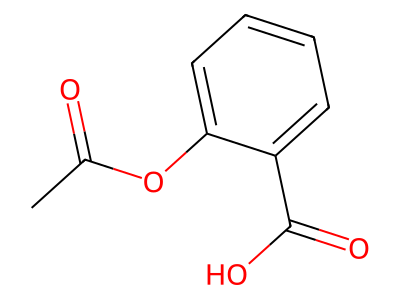
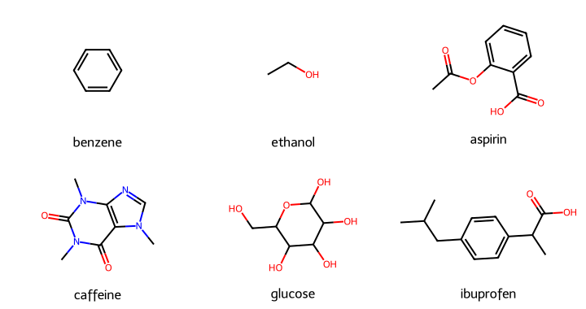

# 第58回　分子を描画する

!!! abstract "この回のゴール"
    - SMILES から**分子の構造式**を画像として描く
    - 複数の分子を**グリッド**で並べて描く
    - 画像をファイルに保存する
    - 所要時間の目安: 60分
    - 使うテーマ：**多分野の分子**の構造式

文字列（SMILES）から、人が見て分かる構造式を描けるのが RDKit の魅力です。レポートや発表資料にそのまま使えます。

!!! note "Jupyter だと画面にそのまま表示される"
    第16回の Jupyter / セル実行を使うと、描いた分子がセルの下に直接表示されて便利です。スクリプト（.py）では、画像をファイルに保存して開きます。

`lesson58.py` を作りましょう。

---

## 1. 1つの分子を描いて保存する

`Draw.MolToFile()` で、分子を画像ファイルに書き出します。

```python
from rdkit import Chem
from rdkit.Chem import Draw

mol = Chem.MolFromSmiles("CC(=O)Oc1ccccc1C(=O)O")   # アスピリン

Draw.MolToFile(mol, "aspirin.png", size=(400, 300))
print("aspirin.png を保存しました")
```

生成される画像:



SMILES 文字列が、ちゃんとした構造式になりました。ベンゼン環、エステル結合、カルボキシ基が見て取れます。

---

## 2. 複数の分子をグリッドで並べる

`Draw.MolsToGridImage()` で、たくさんの分子を一覧にできます。化合物ライブラリの俯瞰に便利です。

```python
from rdkit import Chem
from rdkit.Chem import Draw

names = ["benzene", "ethanol", "aspirin", "caffeine", "glucose", "ibuprofen"]
smiles = [
    "c1ccccc1", "CCO", "CC(=O)Oc1ccccc1C(=O)O",
    "CN1C=NC2=C1C(=O)N(C(=O)N2C)C", "OCC1OC(O)C(O)C(O)C1O",
    "CC(C)Cc1ccc(cc1)C(C)C(=O)O",
]
mols = [Chem.MolFromSmiles(s) for s in smiles]

img = Draw.MolsToGridImage(mols, legends=names, molsPerRow=3, subImgSize=(240, 190))
img.save("grid.png")
print("grid.png を保存しました")
```

生成される画像:



医薬・生化学・石油化学の分子が一覧になりました。`legends` で名前、`molsPerRow` で1行あたりの数、`subImgSize` で各分子の大きさを指定します。

!!! tip "内包表記が活きる"
    `mols = [Chem.MolFromSmiles(s) for s in smiles]` は第13回の内包表記。SMILES のリストを分子のリストに一括変換しています。

---

## 3. 描画のカスタマイズ

原子番号を表示したり、サイズを変えたりできます。

```python
from rdkit import Chem
from rdkit.Chem import Draw

mol = Chem.MolFromSmiles("CC(C)Cc1ccc(cc1)C(C)C(=O)O")   # イブプロフェン

# 大きめに描く
img = Draw.MolToImage(mol, size=(500, 400))
img.save("ibuprofen.png")
print("保存しました")
```

`Draw.MolToImage` は画像オブジェクトを返すので、`.save()` で保存できます。`Draw.MolToFile` は直接ファイルに書きます。どちらでもOKです。

---

## 演習問題

**問1.** カフェイン `CN1C=NC2=C1C(=O)N(C(=O)N2C)C` の構造式を `caffeine.png` として保存してください（サイズは自由）。

**問2.** 石油化学の分子3つ——ベンゼン `c1ccccc1`、トルエン `Cc1ccccc1`、キシレン `Cc1ccccc1C`——をグリッドで並べて `aromatics.png` に保存してください（`legends` に名前を付ける）。

**問3.** アミノ酸3つ——グリシン `NCC(=O)O`、アラニン `CC(N)C(=O)O`、セリン `OCC(N)C(=O)O`——をグリッドで描いてください。構造の共通部分（アミノ基とカルボキシ基）を見比べてみましょう。

---

## 解答

??? success "問1 の解答"
    ```python
    from rdkit import Chem
    from rdkit.Chem import Draw
    mol = Chem.MolFromSmiles("CN1C=NC2=C1C(=O)N(C(=O)N2C)C")
    Draw.MolToFile(mol, "caffeine.png", size=(400, 300))
    print("保存しました")
    ```

??? success "問2 の解答"
    ```python
    from rdkit import Chem
    from rdkit.Chem import Draw
    names = ["benzene", "toluene", "xylene"]
    smiles = ["c1ccccc1", "Cc1ccccc1", "Cc1ccccc1C"]
    mols = [Chem.MolFromSmiles(s) for s in smiles]
    img = Draw.MolsToGridImage(mols, legends=names, molsPerRow=3, subImgSize=(240, 190))
    img.save("aromatics.png")
    ```

??? success "問3 の解答"
    ```python
    from rdkit import Chem
    from rdkit.Chem import Draw
    names = ["glycine", "alanine", "serine"]
    smiles = ["NCC(=O)O", "CC(N)C(=O)O", "OCC(N)C(=O)O"]
    mols = [Chem.MolFromSmiles(s) for s in smiles]
    img = Draw.MolsToGridImage(mols, legends=names, molsPerRow=3, subImgSize=(240, 190))
    img.save("amino_acids.png")
    ```
    3つとも「アミノ基 -NH2」と「カルボキシ基 -COOH」を持つ、というアミノ酸の共通構造が見て取れます。

---

## この回のまとめ

- `Draw.MolToFile(mol, "名前.png", size=(幅,高))` で1分子を保存。
- `Draw.MolsToGridImage(mols, legends=..., molsPerRow=...)` で複数分子を一覧に。
- `Draw.MolToImage(mol)` は画像オブジェクトを返す（`.save()` で保存）。
- Jupyter なら画面に直接表示できる。

### 次回予告

[第59回：分子量・分子式・元素組成を計算する](lesson-59.md) では、分子から分子量や分子式を自動で求めます。第2回で手計算した分子量が、一発で出せます。
