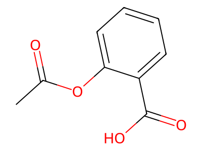
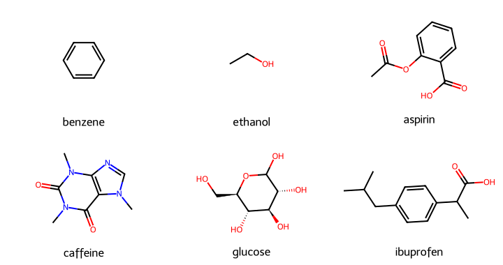

# 第58回　分子を描画する

!!! abstract "この回のゴール"
    - SMILES から**分子の構造式**を画像として描く
    - 複数の分子を**グリッド**で並べて描く
    - 画像をファイルに保存する
    - 所要時間の目安: 60分
    - 使うテーマ：**多分野の分子**の構造式

文字列（SMILES）から、人が見て分かる構造式を描けるのが RDKit の魅力です。レポートや発表資料にそのまま使えます。

!!! note "Jupyter だと画面にそのまま表示される"
    第16回の Jupyter / セル実行を使うと、描いた分子がセルの下に直接表示されて便利です。スクリプト（.py）では、画像をファイルに保存して開きます。
    ただし Jupyter では `Draw.MolsToGridImage(...)` が表示用のオブジェクトを返すため、そのままでは `.save()` できません。保存したいときは `Draw.MolsToGridImage(..., returnPNG=False)` のように `returnPNG=False` を付けます（スクリプトでも同じ結果になります）。

`lesson58.py` を作りましょう。

---

## 1. 1つの分子を描いて保存する

`Draw.MolToFile()` で、分子を画像ファイルに書き出します。

```python
from rdkit import Chem
from rdkit.Chem import Draw

mol = Chem.MolFromSmiles("CC(=O)Oc1ccccc1C(=O)O")   # アスピリン

Draw.MolToFile(mol, "aspirin.png", size=(400, 300))
print("aspirin.png を保存しました")
```

生成される画像:



SMILES 文字列が、ちゃんとした構造式になりました。ベンゼン環、エステル結合、カルボキシ基が見て取れます。

---

## 2. 複数の分子をグリッドで並べる

`Draw.MolsToGridImage()` で、たくさんの分子を一覧にできます。化合物ライブラリの俯瞰に便利です。

```python
from rdkit import Chem
from rdkit.Chem import Draw

names = ["benzene", "ethanol", "aspirin", "caffeine", "glucose", "ibuprofen"]
smiles = [
    "c1ccccc1", "CCO", "CC(=O)Oc1ccccc1C(=O)O",
    "CN1C=NC2=C1C(=O)N(C(=O)N2C)C", "OC[C@H]1OC(O)[C@H](O)[C@@H](O)[C@@H]1O",
    "CC(C)Cc1ccc(cc1)C(C)C(=O)O",
]
mols = [Chem.MolFromSmiles(s) for s in smiles]

img = Draw.MolsToGridImage(mols, legends=names, molsPerRow=3,
                           subImgSize=(240, 190), returnPNG=False)
img.save("grid.png")
print("grid.png を保存しました")
```

生成される画像:



医薬・生化学・石油化学の分子が一覧になりました。`legends` で名前、`molsPerRow` で1行あたりの数、`subImgSize` で各分子の大きさを指定します。

!!! tip "内包表記が活きる"
    `mols = [Chem.MolFromSmiles(s) for s in smiles]` は第13回の内包表記。SMILES のリストを分子のリストに一括変換しています。

---

## 3. 描画のカスタマイズ

原子の通し番号（**原子インデックス**。0から始まる番号で、元素の「原子番号」とは別物です）を表示したり、サイズを変えたりできます。

```python
from rdkit import Chem
from rdkit.Chem import Draw
from rdkit.Chem.Draw import rdMolDraw2D

mol = Chem.MolFromSmiles("CC(C)Cc1ccc(cc1)C(C)C(=O)O")   # イブプロフェン

# 大きめに描く
img = Draw.MolToImage(mol, size=(500, 400))
img.save("ibuprofen.png")

# 原子インデックスを付けて描く
d = rdMolDraw2D.MolDraw2DCairo(500, 400)
d.drawOptions().addAtomIndices = True
d.DrawMolecule(mol)
d.FinishDrawing()
with open("ibuprofen_idx.png", "wb") as f:
    f.write(d.GetDrawingText())
print("保存しました")
```

`Draw.MolToImage` は画像オブジェクトを返すので、`.save()` で保存できます。`Draw.MolToFile` は直接ファイルに書きます。どちらでもOKです。

---

## AIに任せるときの指示と確認

!!! example "AIへの頼み方（例）"
    「RDKit で、化合物名→SMILES の辞書（6件）から構造式のグリッド画像を作り、`grid.png` に保存するコードを書いてください。
    凡例（legends）は辞書の名前を**SMILES と同じ順番で**付け、1行3個、各 240×190 ピクセル。
    Jupyter でもスクリプトでも保存できるよう `returnPNG=False` を付けてください。
    無効な SMILES があれば描画前に名前を表示して止めてください。」

!!! warning "AIの出力で確かめること"
    - **凡例と分子の順番が対応しているか**：`legends=sorted(names)` のように名前だけ並べ替えていると、構造と名前がずれます。画像を開いて、ベンゼン環にメチルが1つの構造に「toluene」と付いているかを目で確認します。
    - 名前と構造が合っているか：「p-キシレン」の SMILES が `Cc1ccccc1C`（o-キシレン）になっていないか、描いた図で置換位置を見ます。
    - `mols` に `None` が混ざっていないか（`print([m is None for m in mols])`）。`None` を渡すと空欄や例外になります。
    - Jupyter で `img.save` が `AttributeError` になったら、`returnPNG=False` の付け忘れです。

---

## 演習問題

**問1.** カフェイン `CN1C=NC2=C1C(=O)N(C(=O)N2C)C` の構造式を `caffeine.png` として保存してください（サイズは自由）。

**問2.** 石油化学の分子3つ——ベンゼン `c1ccccc1`、トルエン `Cc1ccccc1`、o-キシレン `Cc1ccccc1C`——をグリッドで並べて `aromatics.png` に保存してください（`legends` に名前を付ける）。

**問3.** アミノ酸3つ——グリシン `NCC(=O)O`、アラニン `CC(N)C(=O)O`、セリン `OCC(N)C(=O)O`——をグリッドで描いてください。構造の共通部分（アミノ基とカルボキシ基）を見比べてみましょう。（ここでは立体を省いた SMILES を使っています。天然の L-アラニンは `C[C@H](N)C(=O)O`、L-セリンは `OC[C@H](N)C(=O)O` です。）

**問4.** 次は AI が書いた「芳香族化合物3つを名前付きで並べる」コードです。問題点を指摘し、直してください。

```python
from rdkit import Chem
from rdkit.Chem import Draw

aromatics = {"toluene": "Cc1ccccc1", "p-xylene": "Cc1ccccc1C", "styrene": "C=Cc1ccccc1"}
mols = [Chem.MolFromSmiles(s) for s in aromatics.values()]
names = sorted(aromatics.keys())          # 名前をアルファベット順に
img = Draw.MolsToGridImage(mols, legends=names, molsPerRow=3, subImgSize=(240, 190))
img.save("aromatics_check.png")
for n, m in zip(names, mols):
    print(n, Chem.MolToSmiles(m))
```

AI の出力:

```text
p-xylene Cc1ccccc1
styrene Cc1ccccc1C
toluene C=Cc1ccccc1
```

---

## 解答

??? success "問1 の解答"
    ```python
    from rdkit import Chem
    from rdkit.Chem import Draw
    mol = Chem.MolFromSmiles("CN1C=NC2=C1C(=O)N(C(=O)N2C)C")
    Draw.MolToFile(mol, "caffeine.png", size=(400, 300))
    print("保存しました")
    ```

??? success "問2 の解答"
    ```python
    from rdkit import Chem
    from rdkit.Chem import Draw
    names = ["benzene", "toluene", "o-xylene"]
    smiles = ["c1ccccc1", "Cc1ccccc1", "Cc1ccccc1C"]
    mols = [Chem.MolFromSmiles(s) for s in smiles]
    img = Draw.MolsToGridImage(mols, legends=names, molsPerRow=3,
                               subImgSize=(240, 190), returnPNG=False)
    img.save("aromatics.png")
    ```

??? success "問3 の解答"
    ```python
    from rdkit import Chem
    from rdkit.Chem import Draw
    names = ["glycine", "alanine", "serine"]
    smiles = ["NCC(=O)O", "CC(N)C(=O)O", "OCC(N)C(=O)O"]
    mols = [Chem.MolFromSmiles(s) for s in smiles]
    img = Draw.MolsToGridImage(mols, legends=names, molsPerRow=3,
                               subImgSize=(240, 190), returnPNG=False)
    img.save("amino_acids.png")
    ```
    3つとも「アミノ基 -NH2」と「カルボキシ基 -COOH」を持つ、というアミノ酸の共通構造が見て取れます。

??? success "問4 の解答"
    誤りは2つです。

    1. **凡例と分子の順番がずれている**：分子は辞書の順（toluene, p-xylene, styrene）なのに、名前だけ `sorted` で並べ替えています。確認用の print で「p-xylene」に `Cc1ccccc1`（トルエン）が対応していることから分かります。
    2. **p-キシレンの SMILES が誤り**：`Cc1ccccc1C` は隣り合う位置にメチルがある **o-キシレン**です。p-キシレン（1,4-位）は `Cc1ccc(C)cc1`。

    ```python
    from rdkit import Chem
    from rdkit.Chem import Draw

    aromatics = {"toluene": "Cc1ccccc1", "p-xylene": "Cc1ccc(C)cc1", "styrene": "C=Cc1ccccc1"}
    names = list(aromatics.keys())                         # SMILES と同じ順番のまま
    mols = [Chem.MolFromSmiles(aromatics[n]) for n in names]
    img = Draw.MolsToGridImage(mols, legends=names, molsPerRow=3,
                               subImgSize=(240, 190), returnPNG=False)
    img.save("aromatics_check.png")
    for n, m in zip(names, mols):
        print(n, Chem.MolToSmiles(m))
    ```

    出力:
    ```text
    toluene Cc1ccccc1
    p-xylene Cc1ccc(C)cc1
    styrene C=Cc1ccccc1
    ```

---

## この回のまとめ

- `Draw.MolToFile(mol, "名前.png", size=(幅,高))` で1分子を保存。
- `Draw.MolsToGridImage(mols, legends=..., molsPerRow=...)` で複数分子を一覧に。
- `Draw.MolToImage(mol)` は画像オブジェクトを返す（`.save()` で保存）。
- Jupyter なら画面に直接表示できる。

### 次回予告

[第59回：分子量・分子式・元素組成を計算する](lesson-59.md) では、分子から分子量や分子式を自動で求めます。第2回で手計算した分子量が、一発で出せます。
