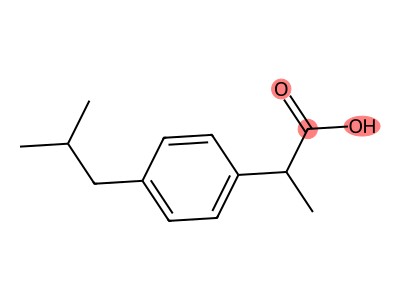

# 第61回　部分構造検索とサブストラクチャ

!!! abstract "この回のゴール"
    - **SMARTS**で「探したい部分構造」を書く
    - 分子に特定の官能基が含まれるか判定する
    - 一致した部分を強調して描画する
    - 所要時間の目安: 60分
    - 使うテーマ：**官能基の検出**（カルボキシ基・水酸基・アミノ基）

「この分子はカルボキシ基を持つか？」——こうした**部分構造検索**は、化合物の分類・フィルタリングの基本です。

`lesson61.py` を作りましょう。

---

## 1. SMARTS：検索パターンを書く

**SMARTS** は、SMILES を拡張した「検索用の記法」です。探したい部分構造を書きます。

| SMARTS | 探すもの |
|---|---|
| `C(=O)O` | カルボキシ基/エステルのカルボニル-O |
| `[OH]` | 水酸基（-OH） |
| `[NH2]` | 第一級アミノ基（-NH2） |
| `c1ccccc1` | ベンゼン環 |

`Chem.MolFromSmarts()` でパターンを作ります。

---

## 2. 部分構造を含むか判定する

`HasSubstructMatch()` で「含むか」を True / False で判定します。

```python
from rdkit import Chem

# 探すパターン：カルボキシ基（のカルボニル炭素-酸素）
pattern = Chem.MolFromSmarts("C(=O)O")

molecules = {
    "ibuprofen": "CC(C)Cc1ccc(cc1)C(C)C(=O)O",   # カルボン酸あり
    "benzene":   "c1ccccc1",                       # なし
    "ethanol":   "CCO",                            # なし
}

for name, smi in molecules.items():
    mol = Chem.MolFromSmiles(smi)
    has = mol.HasSubstructMatch(pattern)
    print(f"{name}: カルボキシ基 {'あり' if has else 'なし'}")
```

出力:

```text
ibuprofen: カルボキシ基 あり
benzene: カルボキシ基 なし
ethanol: カルボキシ基 なし
```

化合物ライブラリから「カルボン酸だけ」を選び出す、といった処理の基礎です。

---

## 3. どこに一致したかを調べる

`GetSubstructMatches()` は、一致した**原子の番号**を返します。

```python
from rdkit import Chem

pattern = Chem.MolFromSmarts("C(=O)O")
mol = Chem.MolFromSmiles("CC(C)Cc1ccc(cc1)C(C)C(=O)O")   # イブプロフェン

matches = mol.GetSubstructMatches(pattern)
print("一致した原子番号:", matches)
```

出力:

```text
一致した原子番号: ((12, 13, 14),)
```

原子番号 12・13・14 が、カルボキシ基に対応します。複数箇所あれば、タプルが複数返ります。

---

## 4. 一致部分を強調して描画

見つけた部分構造を、色付きで描けます。

```python
from rdkit import Chem
from rdkit.Chem import Draw

pattern = Chem.MolFromSmarts("C(=O)O")
mol = Chem.MolFromSmiles("CC(C)Cc1ccc(cc1)C(C)C(=O)O")

hit = mol.GetSubstructMatch(pattern)       # 最初の一致（原子番号）
img = Draw.MolToImage(mol, highlightAtoms=hit, size=(400, 300))
img.save("substructure.png")
print("保存しました")
```

生成される画像:



イブプロフェンのカルボキシ基が色付きで強調されました。構造のどこに注目しているかが、ひと目で分かります。

!!! success "分野を問わず使える"
    「エステル結合を持つ高分子モノマー」「特定の毒性基を持つ環境化学物質」「反応部位を持つ触媒」——部分構造検索は、分野ごとの"目印"を探す万能の道具です。

---

## 演習問題

**問1.** 水酸基パターン `[OH]` を作り、エタノール `CCO`・グルコース `OCC1OC(O)C(O)C(O)C1O`・ベンゼン `c1ccccc1` のそれぞれが水酸基を持つか判定してください。

**問2.** ベンゼン環パターン `c1ccccc1` を作り、トルエン `Cc1ccccc1`・オクタン `CCCCCCCC`・アスピリン `CC(=O)Oc1ccccc1C(=O)O` が芳香環を持つか判定してください。

**問3.** アミノ基パターン `[NH2]` を作り、グリシン `NCC(=O)O` が一致する原子番号を `GetSubstructMatches` で調べて表示してください。

---

## 解答

??? success "問1 の解答"
    ```python
    from rdkit import Chem
    patt = Chem.MolFromSmarts("[OH]")
    for name, smi in [("ethanol", "CCO"), ("glucose", "OCC1OC(O)C(O)C(O)C1O"), ("benzene", "c1ccccc1")]:
        mol = Chem.MolFromSmiles(smi)
        print(name, mol.HasSubstructMatch(patt))
    ```

    出力:
    ```text
    ethanol True
    glucose True
    benzene False
    ```
    グルコースは水酸基を複数持つので True。ベンゼンは持たないので False。

??? success "問2 の解答"
    ```python
    from rdkit import Chem
    patt = Chem.MolFromSmarts("c1ccccc1")
    for name, smi in [("toluene", "Cc1ccccc1"), ("octane", "CCCCCCCC"), ("aspirin", "CC(=O)Oc1ccccc1C(=O)O")]:
        mol = Chem.MolFromSmiles(smi)
        print(name, mol.HasSubstructMatch(patt))
    ```

    出力:
    ```text
    toluene True
    octane False
    aspirin True
    ```

??? success "問3 の解答"
    ```python
    from rdkit import Chem
    patt = Chem.MolFromSmarts("[NH2]")
    mol = Chem.MolFromSmiles("NCC(=O)O")
    print(mol.GetSubstructMatches(patt))
    ```

    出力:
    ```text
    ((0,),)
    ```
    原子番号0（先頭の窒素）がアミノ基に一致します。

---

## この回のまとめ

- **SMARTS** は検索用の記法。`Chem.MolFromSmarts("C(=O)O")` でパターン作成。
- `HasSubstructMatch(pattern)` で含むか判定（True/False）。
- `GetSubstructMatches(pattern)` で一致した原子番号を取得。
- `Draw.MolToImage(mol, highlightAtoms=...)` で一致部分を強調表示。

### 次回予告

[第62回：フィンガープリントと分子類似度](lesson-62.md) では、分子どうしが「どれくらい似ているか」を数値で測ります。
