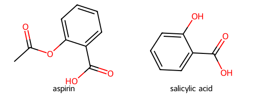

# 第62回　フィンガープリントと分子類似度

!!! abstract "この回のゴール"
    - **分子フィンガープリント**が何かを知る
    - **谷本係数（Tanimoto）**で分子の類似度を測る
    - 似た分子を数値で見つける
    - 所要時間の目安: 60分
    - 使うテーマ：**類似化合物の探索**

「この化合物に似た分子はどれ？」——創薬のリード探索や、材料の代替候補探しで重要な問いです。それを数値で答えるのがフィンガープリントと類似度です。

`lesson62.py` を作りましょう。

---

## 1. フィンガープリント：分子を"指紋"にする

**フィンガープリント**は、分子の構造的な特徴を **0と1の並び（ビット列）**に変換したものです。「どんな部分構造を含むか」を指紋のように表します。よく使われるのが **Morgan フィンガープリント（ECFP）**です。

```python
from rdkit import Chem
from rdkit.Chem import rdFingerprintGenerator

gen = rdFingerprintGenerator.GetMorganGenerator(radius=2, fpSize=2048)

mol = Chem.MolFromSmiles("CC(=O)Oc1ccccc1C(=O)O")   # アスピリン
fp = gen.GetFingerprint(mol)

print("ビット長:", fp.GetNumBits())
print("立っているビット数:", fp.GetNumOnBits())
```

出力:

```text
ビット長: 2048
立っているビット数: 24
```

2048個のビットのうち、アスピリンの特徴に対応する24個が「1（オン）」になっています。この指紋どうしを比べれば、分子の似ている度合いが分かります。

---

## 2. 谷本係数（Tanimoto）で類似度を測る

2つのフィンガープリントの**重なり具合**を、0〜1で表すのが**谷本係数**です（1に近いほど似ている）。

```python
from rdkit import Chem
from rdkit.Chem import rdFingerprintGenerator
from rdkit import DataStructs

gen = rdFingerprintGenerator.GetMorganGenerator(radius=2, fpSize=2048)

aspirin = gen.GetFingerprint(Chem.MolFromSmiles("CC(=O)Oc1ccccc1C(=O)O"))
salicylic = gen.GetFingerprint(Chem.MolFromSmiles("OC(=O)c1ccccc1O"))    # サリチル酸
ibuprofen = gen.GetFingerprint(Chem.MolFromSmiles("CC(C)Cc1ccc(cc1)C(C)C(=O)O"))

print("アスピリン vs サリチル酸:", round(DataStructs.TanimotoSimilarity(aspirin, salicylic), 3))
print("アスピリン vs イブプロフェン:", round(DataStructs.TanimotoSimilarity(aspirin, ibuprofen), 3))
```

出力:

```text
アスピリン vs サリチル酸: 0.448
アスピリン vs イブプロフェン: 0.195
```

アスピリンとサリチル酸（構造が近い）は 0.448、アスピリンとイブプロフェン（別物）は 0.195。**構造が近いほど類似度が高い**のが数値で確認できます。

比べた2分子:



アスピリンは、サリチル酸のOHがアセチル化された構造。骨格が共通なので類似度が高いのです。

---

## 3. 一番似た分子を探す

候補の中から、基準分子に最も似たものを探します。

```python
from rdkit import Chem
from rdkit.Chem import rdFingerprintGenerator
from rdkit import DataStructs

gen = rdFingerprintGenerator.GetMorganGenerator(radius=2, fpSize=2048)

query = gen.GetFingerprint(Chem.MolFromSmiles("CC(C)Cc1ccc(cc1)C(C)C(=O)O"))  # イブプロフェン

candidates = {
    "naproxen":   "COc1ccc2cc(ccc2c1)C(C)C(=O)O",
    "aspirin":    "CC(=O)Oc1ccccc1C(=O)O",
    "benzene":    "c1ccccc1",
}

for name, smi in candidates.items():
    fp = gen.GetFingerprint(Chem.MolFromSmiles(smi))
    sim = round(DataStructs.TanimotoSimilarity(query, fp), 3)
    print(f"イブプロフェン vs {name}: {sim}")
```

出力:

```text
イブプロフェン vs naproxen: 0.421
イブプロフェン vs aspirin: 0.195
イブプロフェン vs benzene: 0.077
```

ナプロキセン（同じプロフェン系の鎮痛薬）が最も似ている、と数値で分かりました。

!!! success "類似度は探索の起点"
    「既知の有効化合物に似た分子を大量のライブラリから探す」——これは創薬のスクリーニングそのもの。材料・農薬・香料などでも「良い性質の分子に似たもの」を探す発想は共通です。第8部のクラスタリング（似た者どうしのグループ分け）にもつながります。

---

## 演習問題

**問1.** カフェイン `CN1C=NC2=C1C(=O)N(C(=O)N2C)C` の Morgan フィンガープリントを作り、立っているビット数を表示してください。

**問2.** エタノール `CCO` とメタノール `CO` の類似度を谷本係数で計算してください（似た小分子です）。

**問3.** ベンゼン `c1ccccc1` を基準に、トルエン `Cc1ccccc1`・ナフタレン `c1ccc2ccccc2c1`・エタノール `CCO` の類似度を計算し、どれが最も似ているか調べてください。

---

## 解答

??? success "問1 の解答"
    ```python
    from rdkit import Chem
    from rdkit.Chem import rdFingerprintGenerator
    gen = rdFingerprintGenerator.GetMorganGenerator(radius=2, fpSize=2048)
    fp = gen.GetFingerprint(Chem.MolFromSmiles("CN1C=NC2=C1C(=O)N(C(=O)N2C)C"))
    print("立っているビット数:", fp.GetNumOnBits())
    ```

    出力:
    ```text
    立っているビット数: 25
    ```

??? success "問2 の解答"
    ```python
    from rdkit import Chem
    from rdkit.Chem import rdFingerprintGenerator
    from rdkit import DataStructs
    gen = rdFingerprintGenerator.GetMorganGenerator(radius=2, fpSize=2048)
    a = gen.GetFingerprint(Chem.MolFromSmiles("CCO"))
    b = gen.GetFingerprint(Chem.MolFromSmiles("CO"))
    print(round(DataStructs.TanimotoSimilarity(a, b), 3))
    ```

    出力:
    ```text
    0.286
    ```

??? success "問3 の解答"
    ```python
    from rdkit import Chem
    from rdkit.Chem import rdFingerprintGenerator
    from rdkit import DataStructs
    gen = rdFingerprintGenerator.GetMorganGenerator(radius=2, fpSize=2048)
    query = gen.GetFingerprint(Chem.MolFromSmiles("c1ccccc1"))
    for name, smi in [("toluene", "Cc1ccccc1"), ("naphthalene", "c1ccc2ccccc2c1"), ("ethanol", "CCO")]:
        fp = gen.GetFingerprint(Chem.MolFromSmiles(smi))
        print(name, round(DataStructs.TanimotoSimilarity(query, fp), 3))
    ```

    出力:
    ```text
    toluene 0.273
    naphthalene 0.222
    ethanol 0.0
    ```
    トルエン（ベンゼン＋メチル）が最も似ています。

---

## この回のまとめ

- フィンガープリント＝分子の特徴をビット列（0/1）で表す指紋。Morgan（ECFP）が定番。
- `rdFingerprintGenerator.GetMorganGenerator(radius=2, fpSize=2048)` で生成器を作る。
- **谷本係数**（`DataStructs.TanimotoSimilarity`）で 0〜1 の類似度。
- 類似度は、類似化合物探索・スクリーニング・クラスタリングの基礎。

### 次回予告

[第63回：化合物ライブラリを一括処理する](lesson-63.md) では、たくさんの分子をまとめて処理し、性質の表（DataFrame）を作ります。第4部の pandas と合流します。
