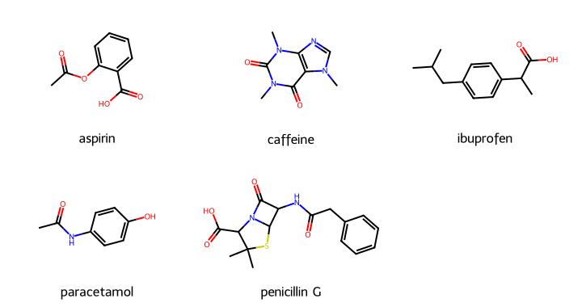

# 第70回　まとめ演習：医薬品分子の性質を比較する

!!! abstract "この回のゴール"
    - 第6部（RDKit）と第4部（pandas）を総合的に使う
    - 複数の医薬品分子の性質を一括で計算・比較する
    - リピンスキー則で薬らしさを評価する
    - 構造を一覧で描画する
    - 所要時間の目安: 60分（第6部の総仕上げ）
    - 使うテーマ：**医薬品分子の総合比較**

第6部の集大成として、代表的な医薬品分子を、構造・物性・薬らしさの観点から比較します。

`lesson70.py` を作りましょう。

---

## 1. 医薬品ライブラリを性質テーブルにする

複数の薬について、分子量・LogP・水素結合・リピンスキー違反数をまとめます。

```python
from rdkit import Chem
from rdkit.Chem import Descriptors, rdMolDescriptors
import pandas as pd

drugs = {
    "aspirin":      "CC(=O)Oc1ccccc1C(=O)O",
    "caffeine":     "CN1C=NC2=C1C(=O)N(C(=O)N2C)C",
    "ibuprofen":    "CC(C)Cc1ccc(cc1)C(C)C(=O)O",
    "paracetamol":  "CC(=O)Nc1ccc(O)cc1",
    "penicillin G": "CC1(C)SC2C(NC(=O)Cc3ccccc3)C(=O)N2C1C(=O)O",
}

def lipinski_violations(mol):
    v = 0
    if Descriptors.MolWt(mol) > 500: v += 1
    if Descriptors.MolLogP(mol) > 5: v += 1
    if rdMolDescriptors.CalcNumHBD(mol) > 5: v += 1
    if rdMolDescriptors.CalcNumHBA(mol) > 10: v += 1
    return v

rows = []
for name, smi in drugs.items():
    mol = Chem.MolFromSmiles(smi)
    rows.append({
        "drug": name,
        "MW":   round(Descriptors.MolWt(mol), 1),
        "LogP": round(Descriptors.MolLogP(mol), 2),
        "HBD":  rdMolDescriptors.CalcNumHBD(mol),
        "HBA":  rdMolDescriptors.CalcNumHBA(mol),
        "Ro5_viol": lipinski_violations(mol),
    })

df = pd.DataFrame(rows)
print(df.to_string(index=False))
```

出力:

```text
        drug    MW  LogP  HBD  HBA  Ro5_viol
     aspirin 180.2  1.31    1    3         0
    caffeine 194.2 -1.03    0    3         0
   ibuprofen 206.3  3.07    1    1         0
 paracetamol 151.2  1.35    2    2         0
penicillin G 334.4  0.86    2    4         0
```

5つの薬すべてがリピンスキー違反0＝経口薬らしい、と分かります。物性の違い（イブプロフェンは脂溶性が高い、カフェインは親水性、など）も一目で比較できます。

---

## 2. 構造を一覧で描画する

分子の構造を並べて、性質の違いと構造の関係を見ます。

```python
from rdkit.Chem import Draw

mols = [Chem.MolFromSmiles(smi) for smi in drugs.values()]
img = Draw.MolsToGridImage(mols, legends=list(drugs.keys()),
                           molsPerRow=3, subImgSize=(240, 190))
img.save("drugs.png")
print("drugs.png を保存しました")
```

生成される画像:



---

## 3. 分析する（第4部の合流）

DataFrame になっているので、比較や絞り込みが自由です。

```python
# 分子量が最も大きい薬
print("最大MW:", df.loc[df["MW"].idxmax(), "drug"], df["MW"].max())

# LogP が最も高い（最も脂溶性の高い）薬
print("最大LogP:", df.loc[df["LogP"].idxmax(), "drug"], df["LogP"].max())

# 平均分子量
print("平均MW:", round(df["MW"].mean(), 1))
```

出力:

```text
最大MW: penicillin G 334.4
最大LogP: ibuprofen 3.07
平均MW: 213.3
```

!!! success "第6部の集大成"
    **SMILES → RDKit で記述子計算 → pandas で表に → 比較・絞り込み → 構造の描画。**
    これは、創薬の初期スクリーニングそのものの流れです。分子（第6部）・データ処理（第4部）・可視化（第5部）が、1つのワークフローに統合されました。あなたはもう、化合物データを扱う実践的な力を持っています。

---

## 演習問題

**問1.** 本文の `drugs` に、あなたの知っている薬を1つ加えてください（例：ナプロキセン `COc1ccc2cc(ccc2c1)C(C)C(=O)O`）。性質テーブルに追加され、リピンスキー違反数が表示されることを確認しましょう。

**問2.** 性質テーブルから、`LogP` が 1.0 より大きい薬だけを抽出してください（第34回のフィルタ）。

**問3.** 5つの薬の構造グリッド画像を作り、`my_drugs.png` として保存してください。気づいた構造の共通点（芳香環を持つものが多い、など）を考えてみましょう。

---

## 解答

??? success "問1 の解答"
    ```python
    drugs["naproxen"] = "COc1ccc2cc(ccc2c1)C(C)C(=O)O"
    # そのまま本文のループを再実行すれば、naproxen の行が加わります
    ```
    ナプロキセン（MW 約230、LogP 約3）が追加され、違反数0（経口薬らしい）と表示されます。

??? success "問2 の解答"
    ```python
    print(df[df["LogP"] > 1.0])
    ```

    出力:
    ```text
              drug     MW  LogP  HBD  HBA  Ro5_viol
    0      aspirin  180.2  1.31    1    3         0
    2    ibuprofen  206.3  3.07    1    1         0
    3  paracetamol  151.2  1.35    2    2         0
    ```
    LogP が負のカフェイン、低いペニシリンGが除かれました。

??? success "問3 の解答"
    ```python
    from rdkit import Chem
    from rdkit.Chem import Draw
    mols = [Chem.MolFromSmiles(smi) for smi in drugs.values()]
    img = Draw.MolsToGridImage(mols, legends=list(drugs.keys()), molsPerRow=3, subImgSize=(240, 190))
    img.save("my_drugs.png")
    ```
    多くの薬が**芳香環（ベンゼン環）**と**カルボキシ基やアミド結合**を持つことに気づくはずです。構造と薬理作用の関係を考える出発点になります。

---

## 第6部　修了

おめでとうございます！ RDKit で**分子そのもの**を扱えるようになりました——SMILES の読み書き、構造の描画、分子式・分子量・記述子の計算、部分構造検索、類似度、反応、データベース連携、そして化合物ライブラリの一括解析。これは創薬・材料・生化学・石油化学など、あらゆる化学分野で通用する実践的な力です。

!!! tip "ここまでの到達点"
    第1〜6部で、**Python の基礎・数値計算・データ処理・可視化・分子の扱い**がそろいました。実験データも分子データも、読み込み・解析・可視化できます。この先は、統計的な検定（第7部・R）、機械学習（第8部）、レポート作成（第9部）へと広がります。

### 次回予告

このあとは、統計に強い **第7部：R** を追加していきます。有意差検定など、実験結果を科学的に評価する手法を学びます。ここまで本当によく頑張りました！
