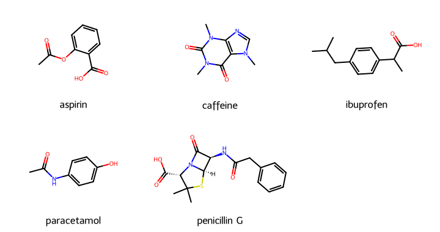

# 第70回　まとめ演習：医薬品分子の性質を比較する

!!! abstract "この回のゴール"
    - 第6部（RDKit）と第4部（pandas）を総合的に使う
    - 複数の医薬品分子の性質を一括で計算・比較する
    - リピンスキー則で薬らしさを評価する
    - 構造を一覧で描画する
    - 所要時間の目安: 60分（第6部の総仕上げ）
    - 使うテーマ：**医薬品分子の総合比較**

第6部の集大成として、代表的な医薬品分子を、構造・物性・薬らしさの観点から比較します。

`lesson70.py` を作りましょう。

---

## 1. 医薬品ライブラリを性質テーブルにする

複数の薬について、分子量・LogP・水素結合・リピンスキー違反数をまとめます。

```python
from rdkit import Chem
from rdkit.Chem import Descriptors, rdMolDescriptors
import pandas as pd

drugs = {
    "aspirin":      "CC(=O)Oc1ccccc1C(=O)O",
    "caffeine":     "CN1C=NC2=C1C(=O)N(C(=O)N2C)C",
    "ibuprofen":    "CC(C)Cc1ccc(cc1)C(C)C(=O)O",
    "paracetamol":  "CC(=O)Nc1ccc(O)cc1",
    "penicillin G": "CC1(C)S[C@@H]2[C@H](NC(=O)Cc3ccccc3)C(=O)N2[C@H]1C(=O)O",
}

def lipinski_violations(mol):
    v = 0
    if Descriptors.MolWt(mol) > 500: v += 1
    if Descriptors.MolLogP(mol) > 5: v += 1
    if rdMolDescriptors.CalcNumLipinskiHBD(mol) > 5: v += 1
    if rdMolDescriptors.CalcNumLipinskiHBA(mol) > 10: v += 1
    return v

rows = []
for name, smi in drugs.items():
    mol = Chem.MolFromSmiles(smi)
    rows.append({
        "drug": name,
        "MW":   round(Descriptors.MolWt(mol), 1),
        "LogP": round(Descriptors.MolLogP(mol), 2),
        "HBD":  rdMolDescriptors.CalcNumLipinskiHBD(mol),
        "HBA":  rdMolDescriptors.CalcNumLipinskiHBA(mol),
        "Ro5_viol": lipinski_violations(mol),
    })

df = pd.DataFrame(rows)
print(df.to_string(index=False))
```

出力:

```text
        drug    MW  LogP  HBD  HBA  Ro5_viol
     aspirin 180.2  1.31    1    4         0
    caffeine 194.2 -1.03    0    6         0
   ibuprofen 206.3  3.07    1    2         0
 paracetamol 151.2  1.35    2    3         0
penicillin G 334.4  0.86    2    6         0
```

5つの薬すべてがリピンスキー違反0＝経口薬らしい、と分かります。物性の違い（イブプロフェンは脂溶性が高い、カフェインは親水性、など）も一目で比較できます。

ただし、違反0は「経口薬になれる」保証ではありません。たとえばペニシリンGは胃酸で分解されやすいため主に注射で使われ、経口用には酸に強いペニシリンVが使われます。Ro5 は吸収（膜透過）の目安にすぎず、化学的安定性や代謝は別に考える必要があります。

---

## 2. 構造を一覧で描画する

分子の構造を並べて、性質の違いと構造の関係を見ます。

```python
from rdkit.Chem import Draw

mols = [Chem.MolFromSmiles(smi) for smi in drugs.values()]
img = Draw.MolsToGridImage(mols, legends=list(drugs.keys()),
                           molsPerRow=3, subImgSize=(240, 190), returnPNG=False)
img.save("drugs.png")
print("drugs.png を保存しました")
```

生成される画像:



---

## 3. 分析する（第4部の合流）

DataFrame になっているので、比較や絞り込みが自由です。

```python
# 分子量が最も大きい薬
print("最大MW:", df.loc[df["MW"].idxmax(), "drug"], df["MW"].max())

# LogP が最も高い（最も脂溶性の高い）薬
print("最大LogP:", df.loc[df["LogP"].idxmax(), "drug"], df["LogP"].max())

# 平均分子量
print("平均MW:", round(df["MW"].mean(), 1))
```

出力:

```text
最大MW: penicillin G 334.4
最大LogP: ibuprofen 3.07
平均MW: 213.3
```

!!! success "第6部の集大成"
    **SMILES → RDKit で記述子計算 → pandas で表に → 比較・絞り込み → 構造の描画。**
    これは、創薬の初期スクリーニングそのものの流れです。分子（第6部）・データ処理（第4部）・可視化（第5部）が、1つのワークフローに統合されました。あなたはもう、化合物データを扱う実践的な力を持っています。

---

## AIに任せるときの指示と確認

!!! example "AIへの頼み方（例）"
    「医薬品名と SMILES の辞書から、RDKit で MW・LogP・HBD・HBA（`CalcNumLipinskiHBD` / `CalcNumLipinskiHBA`）・リピンスキー違反数の DataFrame を作ってください。
    SMILES に塩（`.` で区切られた `[K+]`、`Cl` など）や電荷が含まれる場合は、`rdMolStandardize.LargestFragmentChooser` と `Uncharger` で中性の親化合物にしてから計算してください。
    分子量の大きい順に並べ、最大の薬は `idxmax` で求めてください。構造は立体（`@`）付きの SMILES で書いてください。」

!!! warning "AIの出力で確かめること"
    - **塩の形の SMILES**：データベースの医薬品は「ペニシリンGカリウム」のように塩で登録されていることが多く、そのまま計算すると MW が対イオンの分だけ大きく（334.4 → 372.5）、HBD も変わります。SMILES に `.` があるか確認します。
    - **並べ替えと「最大」の対応**：`sort_values("MW")`（小さい順）の後に `iloc[0]` を「最大」と呼んでいないか。`idxmax` を使うか、並べ替えの向きを確認します。
    - 立体を持つ薬（ペニシリン類、ナプロキセンなど）の SMILES に `@` があるか。InChIKey の後半が `UHFFFAOYSA` なら立体情報がありません。
    - 「違反0＝経口薬」と結論していないか。Ro5 は吸収の目安で、ペニシリンGのように胃酸に弱く注射で使う薬もあります。

---

## 演習問題

**問1.** 本文の `drugs` に、あなたの知っている薬を1つ加えてください（例：ナプロキセン `COc1ccc2cc(ccc2c1)[C@H](C)C(=O)O`。医薬品は S 体）。性質テーブルに追加され、リピンスキー違反数が表示されることを確認しましょう。

**問2.** 性質テーブルから、`LogP` が 1.0 より大きい薬だけを抽出してください（第34回のフィルタ）。

**問3.** 5つの薬の構造グリッド画像を作り、`my_drugs.png` として保存してください。気づいた構造の共通点（芳香環を持つものが多い、など）を考えてみましょう。

**問4.** 次は AI が書いた、データベースから取った SMILES で薬の分子量を比べるコードです。問題点を指摘し、直してください。

```python
from rdkit import Chem
from rdkit.Chem import Descriptors, rdMolDescriptors
import pandas as pd

# データベースから取ってきた SMILES（塩の形で登録されているものがある）
drugs = {
    "ibuprofen":              "CC(C)Cc1ccc(cc1)C(C)C(=O)O",
    "penicillin G potassium": "[K+].CC1(C)S[C@@H]2[C@H](NC(=O)Cc3ccccc3)C(=O)N2[C@H]1C(=O)[O-]",
    "paracetamol":            "CC(=O)Nc1ccc(O)cc1",
}
rows = []
for name, smi in drugs.items():
    mol = Chem.MolFromSmiles(smi)
    rows.append({"drug": name, "MW": round(Descriptors.MolWt(mol), 1),
                 "HBD": rdMolDescriptors.CalcNumLipinskiHBD(mol)})
df = pd.DataFrame(rows).sort_values("MW")
print(df.to_string(index=False))
print("最大MW:", df.iloc[0]["drug"])
```

AI の出力:

```text
                  drug    MW  HBD
           paracetamol 151.2    2
             ibuprofen 206.3    1
penicillin G potassium 372.5    1
最大MW: paracetamol
```

---

## 解答

??? success "問1 の解答"
    ```python
    drugs["naproxen"] = "COc1ccc2cc(ccc2c1)[C@H](C)C(=O)O"   # (S)-ナプロキセン
    # そのまま本文のループ（rows = [] から print まで）を再実行すれば、naproxen の行が加わります
    ```

    出力:
    ```text
            drug    MW  LogP  HBD  HBA  Ro5_viol
         aspirin 180.2  1.31    1    4         0
        caffeine 194.2 -1.03    0    6         0
       ibuprofen 206.3  3.07    1    2         0
     paracetamol 151.2  1.35    2    3         0
    penicillin G 334.4  0.86    2    6         0
        naproxen 230.3  3.04    1    3         0
    ```
    ナプロキセン（MW 230.3、LogP 3.04）が追加され、違反数0と表示されます。

??? success "問2 の解答"
    ```python
    print(df[df["LogP"] > 1.0])
    ```

    出力:
    ```text
              drug     MW  LogP  HBD  HBA  Ro5_viol
    0      aspirin  180.2  1.31    1    4         0
    2    ibuprofen  206.3  3.07    1    2         0
    3  paracetamol  151.2  1.35    2    3         0
    ```
    LogP が負のカフェイン、低いペニシリンGが除かれました。

??? success "問3 の解答"
    ```python
    from rdkit import Chem
    from rdkit.Chem import Draw
    mols = [Chem.MolFromSmiles(smi) for smi in drugs.values()]
    img = Draw.MolsToGridImage(mols, legends=list(drugs.keys()), molsPerRow=3, subImgSize=(240, 190), returnPNG=False)
    img.save("my_drugs.png")
    ```
    多くの薬が**芳香環（ベンゼン環）**と**カルボキシ基やアミド結合**を持つことに気づくはずです。構造と薬理作用の関係を考える出発点になります。

??? success "問4 の解答"
    誤りは2つです。

    1. **塩のまま計算している**：`[K+]` とカルボキシラート `[O-]` を含むので、MW に K の分が入り（372.5）、COOH の H が無いので HBD も 1 になっています。薬の性質を比べるときは、最大の断片を残して電荷を中和した「親化合物」で計算します（ペニシリンG：MW 334.4、HBD 2）。
    2. **「最大」の取り方**：`sort_values("MW")` は小さい順なので、`iloc[0]` は最小のパラセタモールです。表を見れば一番下が最大だと分かります。

    ```python
    from rdkit import Chem
    from rdkit.Chem import Descriptors, rdMolDescriptors
    from rdkit.Chem.MolStandardize import rdMolStandardize
    import pandas as pd

    drugs = {
        "ibuprofen":              "CC(C)Cc1ccc(cc1)C(C)C(=O)O",
        "penicillin G potassium": "[K+].CC1(C)S[C@@H]2[C@H](NC(=O)Cc3ccccc3)C(=O)N2[C@H]1C(=O)[O-]",
        "paracetamol":            "CC(=O)Nc1ccc(O)cc1",
    }
    chooser = rdMolStandardize.LargestFragmentChooser()
    uncharger = rdMolStandardize.Uncharger()

    rows = []
    for name, smi in drugs.items():
        mol = Chem.MolFromSmiles(smi)
        parent = uncharger.uncharge(chooser.choose(mol))   # 最大の断片を残し、電荷を中和
        rows.append({"drug": name, "parent_smiles": Chem.MolToSmiles(parent),
                     "MW": round(Descriptors.MolWt(parent), 1),
                     "HBD": rdMolDescriptors.CalcNumLipinskiHBD(parent)})
    df = pd.DataFrame(rows).sort_values("MW", ascending=False)
    print(df[["drug", "MW", "HBD"]].to_string(index=False))
    print("最大MW:", df.iloc[0]["drug"])
    print(df.iloc[0]["parent_smiles"])
    ```

    出力:
    ```text
                      drug    MW  HBD
    penicillin G potassium 334.4    2
                 ibuprofen 206.3    1
               paracetamol 151.2    2
    最大MW: penicillin G potassium
    CC1(C)S[C@@H]2[C@H](NC(=O)Cc3ccccc3)C(=O)N2[C@H]1C(=O)O
    ```
    親化合物の SMILES が、本文のペニシリンG と同じ構造（カリウムなし・COOH）になっていることも確認できます。

---

## 第6部　修了

おめでとうございます！ RDKit で**分子そのもの**を扱えるようになりました——SMILES の読み書き、構造の描画、分子式・分子量・記述子の計算、部分構造検索、類似度、反応、データベース連携、そして化合物ライブラリの一括解析。これは創薬・材料・生化学・石油化学など、あらゆる化学分野で通用する実践的な力です。

!!! tip "ここまでの到達点"
    第1〜6部で、**Python の基礎・数値計算・データ処理・可視化・分子の扱い**がそろいました。実験データも分子データも、読み込み・解析・可視化できます。この先は、統計的な検定（第7部・R）、機械学習（第8部）、レポート作成（第9部）へと広がります。

### 次回予告

[第71回：Rをはじめる：なぜ統計にRなのか](lesson-71.md) から、統計に強い **第7部：R** が始まります。有意差検定など、実験結果を科学的に評価する手法を学びます。ここまで本当によく頑張りました！
