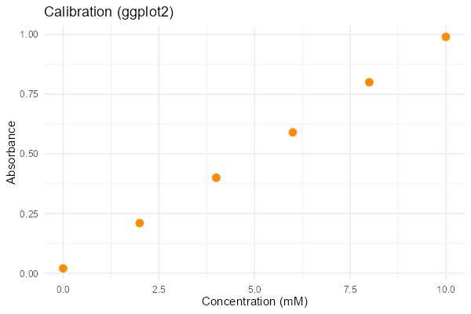

# 第76回　ggplot2入門：Rで可視化

!!! abstract "この回のゴール"
    - ggplot2 の「文法」（データ＋審美的写像＋幾何オブジェクト）を知る
    - 散布図・折れ線・棒グラフを描く
    - グラフを保存する
    - 所要時間の目安: 60分
    - 使うテーマ：**検量線・触媒別収率**

**ggplot2** は R の作図ライブラリで、統計グラフの美しさに定評があります。「グラフを文法で組み立てる」独特の考え方が特徴です。

!!! note "ラベルは英語で"
    第46回と同様、グラフのラベルは文字化けを避けるため英語で書きます。

`stats76.R` を作りましょう。

---

## 1. ggplot の3要素

ggplot2 のグラフは、最低3つの要素で組み立てます。

1. **データ**：`ggplot(データ, ...)`
2. **審美的写像 aes**：`aes(x = ..., y = ...)`（どの列を軸にするか）
3. **幾何オブジェクト geom**：`geom_point()`（点）、`geom_line()`（線）など

これらを **`+`** でつなぎます。

```r
library(tidyverse)

cal <- tibble(
  conc = c(0, 2, 4, 6, 8, 10),
  absb = c(0.02, 0.21, 0.40, 0.59, 0.80, 0.99)
)

p <- ggplot(cal, aes(x = conc, y = absb)) +
  geom_point(size = 3, color = "darkorange") +
  labs(x = "Concentration (mM)", y = "Absorbance", title = "Calibration (ggplot2)") +
  theme_minimal()

print(p)
ggsave("calibration.png", p, width = 6, height = 4, dpi = 100)
```

生成される図:



「データ `cal` を、conc を x・absb を y に対応させ（aes）、点で描く（geom_point）」と読みます。`labs` でラベル、`theme_minimal()` で見た目を整えます。

---

## 2. いろいろな geom

`geom_` を変えると、グラフの種類が変わります。

| geom | グラフ |
|---|---|
| `geom_point()` | 散布図 |
| `geom_line()` | 折れ線 |
| `geom_col()` | 棒グラフ（値をそのまま棒に） |
| `geom_boxplot()` | 箱ひげ図 |
| `geom_histogram()` | ヒストグラム |

棒グラフの例（触媒別の収率）:

```r
yields <- tibble(
  catalyst = c("Pd", "Pt", "Ni"),
  yield = c(82, 76, 62)
)

ggplot(yields, aes(x = catalyst, y = yield)) +
  geom_col(fill = "steelblue") +
  labs(x = "Catalyst", y = "Yield (%)", title = "Yield by Catalyst") +
  theme_minimal()
```

`geom_col()` は、値をそのまま棒の高さにします（第47回の棒グラフに相当）。

---

## 3. 色分け（aes の威力）

`aes` の中で `color` や `fill` にカテゴリ列を指定すると、**自動で色分け＋凡例**が付きます（seaborn の hue に相当、第51回）。

```r
polymers <- tibble(
  polymer = c("PE", "PP", "PS", "Epoxy", "Phenolic"),
  category = c("thermoplastic", "thermoplastic", "thermoplastic", "thermoset", "thermoset"),
  density = c(0.94, 0.905, 1.05, 1.20, 1.30),
  tensile = c(25, 35, 45, 60, 50)
)

ggplot(polymers, aes(x = density, y = tensile, color = category)) +
  geom_point(size = 4) +
  labs(x = "Density", y = "Tensile (MPa)") +
  theme_minimal()
```

`color = category` だけで、熱可塑性・熱硬化性が別の色になり、凡例も自動で付きます。

!!! success "文法で組み立てる強み"
    ggplot2 は「データ＋aes＋geom」を `+` で足していくだけ。要素を差し替えるだけでグラフの種類や見た目を変えられます。慣れると、複雑な統計グラフも簡潔に書けます。

---

## 演習問題

**問1.** 検量線データ `cal` を、`geom_point` ではなく `geom_line()`（折れ線）で描いてください。点と線の違いを見ましょう。

**問2.** 触媒別収率 `yields` の棒グラフを、棒の色を好きな色（例：`fill = "tomato"`）に変えて描いてください。

**問3.** `polymers` データで、x に `density`、y に `tensile`、`color = category` を指定した散布図を描き、色分けと凡例が自動で付くことを確認してください。

---

## 解答

??? success "問1 の解答"
    ```r
    ggplot(cal, aes(x = conc, y = absb)) +
      geom_line(color = "teal") +
      geom_point(size = 3) +
      labs(x = "Concentration (mM)", y = "Absorbance") +
      theme_minimal()
    ```
    `geom_line` と `geom_point` を両方足すと、点と線の両方が描けます。

??? success "問2 の解答"
    ```r
    ggplot(yields, aes(x = catalyst, y = yield)) +
      geom_col(fill = "tomato") +
      labs(x = "Catalyst", y = "Yield (%)") +
      theme_minimal()
    ```

??? success "問3 の解答"
    ```r
    ggplot(polymers, aes(x = density, y = tensile, color = category)) +
      geom_point(size = 4) +
      theme_minimal()
    ```
    2つのカテゴリが色分けされ、右側に凡例が自動で表示されます。

---

## この回のまとめ

- ggplot2 は「データ ＋ aes（軸の対応）＋ geom（図形）」を `+` で組み立てる。
- `geom_point`（散布図）・`geom_line`（折れ線）・`geom_col`（棒）など。
- `aes(color = カテゴリ)` で自動の色分け＋凡例。
- `ggsave("名前.png", p)` で保存。

### 次回予告

[第77回：記述統計と要約](lesson-77.md) では、データの中心・ばらつきを数値でまとめる方法を学びます。ここから統計の本論です。
