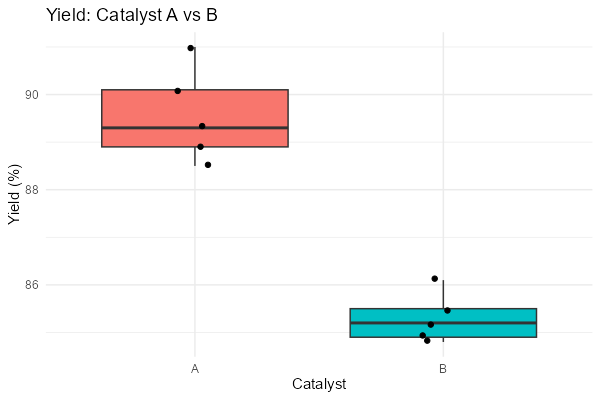

# 第80回　t検定：2群の平均を比べる

!!! abstract "この回のゴール"
    - `t.test()` で2群の平均を比べる
    - 出力（t値・p値・信頼区間）を読む
    - 箱ひげ図で違いを可視化する
    - 所要時間の目安: 60分
    - 使うテーマ：**触媒Aと触媒Bの収率比較**

「触媒Aと触媒B、収率に本当に差があるか？」——2群の平均を比べる最も基本的な検定が **t検定**です。

`stats80.R` を作りましょう。

```r
library(tidyverse)

# 触媒A・Bの収率（それぞれ5回測定）
A <- c(88.5, 90.1, 89.3, 91.0, 88.9)
B <- c(85.2, 84.8, 86.1, 85.5, 84.9)
```

---

## 1. t検定を実行する

`t.test(群1, 群2)` の1行で実行できます。

```r
t.test(A, B)
```

出力:

```text
	Welch Two Sample t-test

data:  A and B
t = 8.4427, df = 6.0488, p-value = 0.0001443
alternative hypothesis: true difference in means is not equal to 0
95 percent confidence interval:
 3.027752 5.492248
sample estimates:
mean of x mean of y 
    89.56     85.30 
```

読み方:

- **p-value = 0.0001443** … 0.05 より遥かに小さい → **有意差あり**。「AとBの収率には差がある」と結論できます。
- **t = 8.4427** … t統計量（大きいほど差が明確）。
- **95% 信頼区間 3.03〜5.49** … 平均の差は約3〜5%の範囲。区間が0を含まない＝差がある。
- **mean of x = 89.56, mean of y = 85.30** … 各群の平均。A の方が高い。

!!! note "Welch の t検定（既定）"
    R の `t.test` は既定で **Welch の t検定**（2群の分散が等しいと仮定しない、頑健な方法）を使います。これで多くの場合うまくいきます。

---

## 2. 結果を可視化する

数値だけでなく、箱ひげ図で違いを見せると説得力が増します。

```r
df <- tibble(
  yield = c(A, B),
  catalyst = rep(c("A", "B"), each = 5)
)

ggplot(df, aes(x = catalyst, y = yield, fill = catalyst)) +
  geom_boxplot() +
  geom_jitter(width = 0.1) +
  labs(x = "Catalyst", y = "Yield (%)", title = "Yield: Catalyst A vs B") +
  theme_minimal() +
  theme(legend.position = "none")
```

生成される図:



A の方が明らかに高い位置にあり、検定結果（有意差あり）と一致します。

---

## 3. 片側検定・対応のある検定

```r
# 片側検定：「A > B か」だけを問う
t.test(A, B, alternative = "greater")

# 対応のある t検定：同じサンプルの処理前後などを比べる
# t.test(before, after, paired = TRUE)
```

!!! tip "検定の前提"
    t検定は「データがおおよそ正規分布に従う」ことを前提とします。極端に歪んだデータや外れ値が多い場合は、ノンパラメトリック検定（`wilcox.test`）を検討します。まずは箱ひげ図で分布を見る習慣を。

---

## 演習問題

**問1.** 2つの反応温度での収率 `low <- c(72, 74, 71, 73, 72)`、`high <- c(80, 82, 79, 81, 83)` について、`t.test` で有意差があるか調べてください。p値はいくつですか？

**問2.** 問1の結果の95%信頼区間を読み、平均の差がおよそどの範囲かを答えてください。

**問3.** 問1のデータを箱ひげ図（`geom_boxplot`）で可視化してください（`low` と `high` を1つの tibble にまとめる）。

---

## 解答

??? success "問1 の解答"
    ```r
    low <- c(72, 74, 71, 73, 72)
    high <- c(80, 82, 79, 81, 83)
    t.test(low, high)
    ```

    出力（抜粋）:
    ```text
    t = -9.8649, df = 7.2746, p-value = 1.809e-05
    sample estimates:
    mean of x mean of y 
         72.4      81.0 
    ```
    p値 ≈ 0.0000181 で、有意差あり。高温の方が収率が高いと言えます。

??? success "問2 の解答"
    出力の "95 percent confidence interval" を見ます（この例では約 −10.65 〜 −6.55）。区間が0を含まず、すべて負なので「low の方が low−high で小さい＝high の方が高い」と読めます。平均の差はおよそ 6.55〜10.65% です。

??? success "問3 の解答"
    ```r
    df <- tibble(yield = c(low, high), temp = rep(c("low", "high"), each = 5))
    ggplot(df, aes(x = temp, y = yield, fill = temp)) +
      geom_boxplot() +
      theme_minimal() +
      theme(legend.position = "none")
    ```

---

## この回のまとめ

- `t.test(A, B)` で2群の平均を比較（既定は Welch の t検定）。
- **p < 0.05 なら有意差あり**。信頼区間が0を含まなければ差がある。
- `alternative = "greater"` で片側、`paired = TRUE` で対応あり。
- 箱ひげ図で可視化すると説得力が増す。t検定は正規性を前提。

### 次回予告

[第81回：分散分析（ANOVA）](lesson-81.md) では、3群以上の平均をまとめて比べる方法を学びます。
