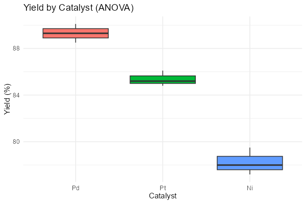

# 第81回　分散分析（ANOVA）：3群以上を比べる

!!! abstract "この回のゴール"
    - `aov()` で3群以上の平均を比べる
    - ANOVA表（F値・p値）を読む
    - どの群に差があるか、事後検定で調べる
    - 所要時間の目安: 60分
    - 使うテーマ：**3種類の触媒（Pd・Pt・Ni）の収率**

3群以上を比べたいとき、t検定を何度も繰り返すのは誤りです（偶然の有意差が増える）。**分散分析（ANOVA）**を使います。

`stats81.R` を作りましょう。

```r
library(tidyverse)

df <- tibble(
  yield = c(88.5, 90.1, 89.3,   85.2, 84.8, 86.1,   78.0, 79.5, 77.2),
  catalyst = factor(rep(c("Pd", "Pt", "Ni"), each = 3))
)
```

!!! note "`factor()` でカテゴリにする"
    ANOVA では、グループ分けの列を **`factor`（因子）**にします。`factor(...)` で「これはカテゴリ変数だ」と R に伝えます。

---

## 1. ANOVA を実行する

`aov(数値 ~ グループ, data = ...)` で分散分析を行い、`summary()` で結果を見ます。

```r
result <- aov(yield ~ catalyst, data = df)
summary(result)
```

出力:

```text
            Df Sum Sq Mean Sq F value   Pr(>F)    
catalyst     2 188.83   94.41   115.8 1.61e-05 ***
Residuals    6   4.89    0.82                     
---
Signif. codes:  0 '***' 0.001 '**' 0.01 '*' 0.05 '.' 0.1 ' ' 1
```

読み方:

- **Pr(>F) = 1.61e-05** … p値。0.05 より遥かに小さい → **有意差あり**。「3つの触媒の間に収率の差がある」。
- **F value = 115.8** … F統計量（グループ間のばらつき ÷ グループ内のばらつき。大きいほど差が明確）。
- **`***`** … 有意性の印（p < 0.001）。

!!! warning "ANOVA が言えること"
    ANOVA の有意は「**どこかに差がある**」ことを示すだけで、「どの触媒とどの触媒が違うか」までは教えてくれません。それは次の事後検定で調べます。

---

## 2. 事後検定：どの群に差があるか

`TukeyHSD()` で、すべてのペアの比較を行います。

```r
TukeyHSD(result)
```

出力（一部）:

```text
  Tukey multiple comparisons of means
    95% family-wise confidence level

$catalyst
          diff        lwr        upr     p adj
Pd-Ni   11.067  ...        ...       ...
Pt-Ni    7.133  ...        ...       ...
Pt-Pd   -3.933  ...        ...       ...
```

`diff`（平均の差）と `p adj`（調整済みp値）で、どのペアに有意差があるかが分かります。Pd-Ni の差（約11）が最も大きい、と読み取れます。

---

## 3. 可視化する

```r
ggplot(df, aes(x = catalyst, y = yield, fill = catalyst)) +
  geom_boxplot() +
  labs(x = "Catalyst", y = "Yield (%)", title = "Yield by Catalyst (ANOVA)") +
  theme_minimal() +
  theme(legend.position = "none")
```

生成される図:



Pd > Pt > Ni の順に高く、群間に明確な差があることが視覚的に分かります。

---

## 演習問題

**問1.** 3種類の溶媒での収率 `df2 <- tibble(yield = c(75,77,76, 82,84,83, 70,69,71), solvent = factor(rep(c("water","ethanol","acetone"), each=3)))` について、`aov` で有意差があるか調べてください。

**問2.** 問1の ANOVA表の p値（`Pr(>F)`）を読み、有意差があるか判断してください。

**問3.** 問1の結果に `TukeyHSD` を適用し、どの溶媒ペアの差が最も大きいか調べてください。

---

## 解答

??? success "問1・問2 の解答"
    ```r
    df2 <- tibble(
      yield = c(75, 77, 76,  82, 84, 83,  70, 69, 71),
      solvent = factor(rep(c("water", "ethanol", "acetone"), each = 3))
    )
    summary(aov(yield ~ solvent, data = df2))
    ```

    出力:
    ```text
                Df Sum Sq Mean Sq F value   Pr(>F)    
    solvent      2    254     127     127 1.23e-05 ***
    Residuals    6      6       1                     
    ```
    p値 ≈ 0.0000123 で有意差あり。溶媒によって収率が違うと言えます。

??? success "問3 の解答"
    ```r
    TukeyHSD(aov(yield ~ solvent, data = df2))
    ```
    `diff` を見ると、ethanol と acetone の差（約13）が最大です。ethanol が最も収率が高く、acetone が最も低いためです。

---

## この回のまとめ

- 3群以上の比較は t検定の繰り返しではなく **ANOVA**（`aov`）。
- グループ列は `factor()` にする。`summary()` で F値・p値を読む。
- p < 0.05 なら「どこかに差がある」。**どのペアかは `TukeyHSD`** で。
- 箱ひげ図で群間の違いを可視化。

### 次回予告

[第82回：カイ二乗検定](lesson-82.md) では、カテゴリデータ（成功/失敗など）の偏りを調べる検定を学びます。
