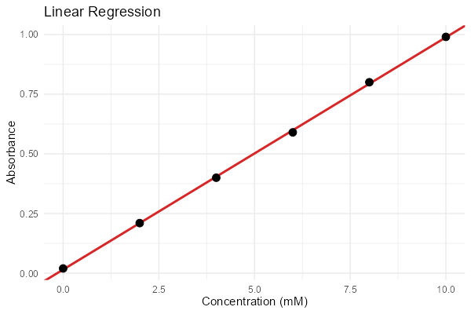

# 第83回　相関と回帰（単回帰）

!!! abstract "この回のゴール"
    - 相関係数で2量の関係の強さを測る
    - `lm()` で回帰直線（単回帰）を求める
    - 回帰の要約（傾き・切片・R²）を読む
    - 所要時間の目安: 60分
    - 使うテーマ：**濃度と吸光度（検量線）**

「濃度が上がると吸光度も上がる」——2量の関係を数値化するのが**相関**、直線を当てはめるのが**回帰**です。

`stats83.R` を作りましょう。

```r
library(tidyverse)

cal <- tibble(
  conc = c(0, 2, 4, 6, 8, 10),
  absb = c(0.02, 0.21, 0.40, 0.59, 0.80, 0.99)
)
```

---

## 1. 相関係数

`cor()` で相関係数（−1〜+1）を求めます。

```r
cor(cal$conc, cal$absb)
```

出力:

```text
[1] 0.9999185
```

ほぼ 1（完全な正の相関）。濃度と吸光度がきれいに比例していることが分かります。`cor.test()` を使えば、相関が有意かの検定（p値）も出せます。

---

## 2. 回帰直線を求める（lm）

`lm(y ~ x)`（linear model）で、最小二乗法による回帰直線を求めます。

```r
fit <- lm(absb ~ conc, data = cal)
summary(fit)
```

出力（抜粋）:

```text
Coefficients:
             Estimate Std. Error t value Pr(>|t|)    
(Intercept) 0.0152381  0.0046851   3.252   0.0313 *  
conc        0.0972857  0.0007737 125.738  2.4e-08 ***

Residual standard error: 0.006473 on 4 degrees of freedom
Multiple R-squared:  0.9997,	Adjusted R-squared:  0.9997 
F-statistic: 1.581e+04 on 1 and 4 DF,  p-value: 2.399e-08
```

読み方:

- **(Intercept) 0.0152** … 切片（濃度0での吸光度）。
- **conc 0.0973** … 傾き（濃度が1増えると吸光度が0.0973増える）。→ 検量線は **吸光度 = 0.0973 × 濃度 + 0.0152**。
- **Multiple R-squared: 0.9997** … 決定係数R²。1に近いほど直線がよく当てはまる（99.97%を説明）。
- **p-value: 2.4e-08** … 回帰が有意か。0.05より遥かに小さい＝意味のある関係。

第50回で `numpy.polyfit` を使ったのと同じ直線あてはめが、R では `lm` で、しかも統計的な検定つきで得られます。

---

## 3. 可視化する

```r
ggplot(cal, aes(x = conc, y = absb)) +
  geom_point(size = 3) +
  geom_smooth(method = "lm", se = TRUE, color = "crimson") +
  labs(x = "Concentration (mM)", y = "Absorbance", title = "Linear Regression") +
  theme_minimal()
```

生成される図:



`geom_smooth(method = "lm")` が、回帰直線と信頼帯（薄い影）を自動で描きます。点が直線にぴたりと乗っています。

---

## 演習問題

**問1.** 温度と反応速度 `temp <- c(20, 30, 40, 50, 60)`、`rate <- c(1.2, 2.1, 3.5, 5.0, 7.2)` の相関係数を `cor` で求めてください。

**問2.** 問1のデータで `lm(rate ~ temp)` を実行し、傾き・切片・R² を読んでください。

**問3.** 問1のデータを散布図＋回帰直線（`geom_smooth(method = "lm")`）で可視化してください。

---

## 解答

??? success "問1 の解答"
    ```r
    temp <- c(20, 30, 40, 50, 60)
    rate <- c(1.2, 2.1, 3.5, 5.0, 7.2)
    cor(temp, rate)
    ```

    出力:
    ```text
    [1] 0.9880776
    ```
    約0.988。強い正の相関です。

    ```r
    fit <- lm(rate ~ temp)
    coef(fit)                    # 切片と傾き
    summary(fit)$r.squared       # 決定係数
    ```

    出力:
    ```text
    (Intercept)        temp 
      -2.160      0.149 
    [1] 0.9762572
    ```
    傾き約0.149（温度1℃で速度0.149増）、R²約0.976でよく当てはまります。

??? success "問3 の解答"
    ```r
    df <- tibble(temp = temp, rate = rate)
    ggplot(df, aes(x = temp, y = rate)) +
      geom_point(size = 3) +
      geom_smooth(method = "lm", se = TRUE) +
      theme_minimal()
    ```

---

## この回のまとめ

- `cor(x, y)` で相関係数（−1〜+1）。`cor.test` で有意性も。
- `lm(y ~ x)` で回帰直線（最小二乗法）。`summary()` で傾き・切片・R²・p値。
- **R²（決定係数）**が1に近いほど直線がよく当てはまる。
- `geom_smooth(method = "lm")` で回帰直線を可視化。

### 次回予告

[第84回：重回帰分析](lesson-84.md) では、複数の要因から結果を予測する重回帰を学びます。
