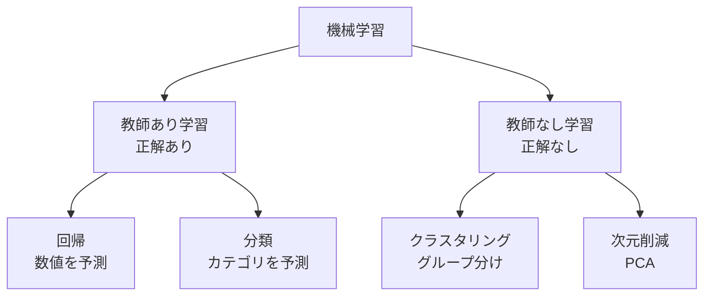

# 第91回　機械学習とは：化学での使いどころ

!!! abstract "この回のゴール"
    - 機械学習とは何かを、化学の文脈で理解する
    - 教師あり／教師なし学習の違いを知る
    - 化学での使いどころ（QSAR など）をイメージする
    - 所要時間の目安: 60分

!!! info "第8部スタート：機械学習"
    ここからは **機械学習（ML）**を学びます。データから「パターン」を学ばせ、**未知のものを予測**したり、**似たものをグループ分け**したりします。化学では、分子の性質予測（QSAR）や材料スクリーニングで活躍します。Python の **scikit-learn** を使います。

---

## 1. 機械学習とは

機械学習は、「データから規則を**自動で学ぶ**」技術です。人がルールを書く代わりに、たくさんの例からコンピュータがパターンを見つけます。

!!! example "化学での例"
    - **物性予測**：分子の構造（記述子）から、沸点・溶解度・毒性を予測する。
    - **活性予測（QSAR）**：分子の構造から、薬としての活性を予測する。
    - **材料スクリーニング**：候補材料の中から、望む性質を持つものを絞り込む。
    - **反応予測**：条件から収率を予測する。

    「実験する前に、計算で当たりをつける」——これが機械学習の価値です。

---

## 2. 教師あり学習と教師なし学習

機械学習は、大きく2つに分かれます。

| 種類 | 何をする | 化学の例 |
|---|---|---|
| **教師あり学習** | 「入力 → 正解」の例から学び、未知の入力を予測 | 記述子 → 沸点（回帰）、記述子 → 活性/不活性（分類） |
| **教師なし学習** | 正解なしで、データの構造を見つける | 化合物を似た者どうしにグループ分け（クラスタリング）、次元削減（PCA） |

**教師あり**はさらに2つ：

- **回帰（regression）**：数値を予測する（沸点、収率、溶解度…）。
- **分類（classification）**：カテゴリを予測する（活性/不活性、溶ける/溶けない…）。

---

## 3. 機械学習の基本の流れ

どの手法も、おおむね次の流れです（第92回から実践します）。

1. **データを用意**：特徴量（入力）と、必要なら正解（目的変数）。
2. **訓練データとテストデータに分ける**：学習用と、性能確認用。
3. **モデルを学習させる**（`fit`）：訓練データからパターンを学ぶ。
4. **予測する**（`predict`）：新しいデータに適用。
5. **評価する**：予測がどれだけ当たるかを測る。

!!! warning "機械学習は魔法ではない"
    - **データの質が命**：偏った・少ない・汚いデータからは、良いモデルは作れません（第41回の前処理が効きます）。
    - **相関 ≠ 因果**（第52回）：予測できても「なぜ」を説明するとは限りません。
    - **外挿は危険**：学習した範囲の外では、予測は当てになりません（第85回の検量線と同じ）。

    「AIが予測したから正しい」ではなく、**結果を検証する**姿勢が、ここでも大切です。

---

## 演習問題

**問1.** 次のそれぞれは、回帰・分類・クラスタリングのどれに当たりますか？ (a) 分子の構造から沸点（数値）を予測、(b) 化合物を「活性/不活性」に振り分ける、(c) 1000個の化合物を似た者どうしのグループに分ける。

**問2.** 「教師あり学習」と「教師なし学習」の違いを、自分の言葉で説明してください。

**問3.** あなたの興味のある化学分野で、機械学習が役立ちそうな場面を1つ考えてみてください（例：材料の物性予測、反応条件の最適化など）。

---

## 解答

??? success "問1 の解答"
    - (a) 数値を予測 → **回帰**
    - (b) カテゴリ（活性/不活性）に振り分け → **分類**
    - (c) 正解なしでグループ分け → **クラスタリング**（教師なし）

??? success "問2 の解答"
    - **教師あり学習**：「入力と正解の組」を大量に与えて学習させ、未知の入力に対する答えを予測する（例：記述子と沸点の組から学び、新しい分子の沸点を予測）。
    - **教師なし学習**：正解を与えず、データそのものの構造（似ている・かたまり）を見つける（例：化合物を自動でグループ分け）。

??? success "問3 の解答（例）"
    「高分子の組成・構造から、引張強度やガラス転移温度を予測する」「触媒の記述子から反応収率を予測し、有望な触媒を絞り込む」など。**実験の前に計算で候補を絞る**場面が、機械学習の出番です。

---

## この回のまとめ

- 機械学習は、データからパターンを自動で学ぶ技術。
- **教師あり**（回帰・分類）と**教師なし**（クラスタリング・次元削減）。
- 基本の流れ：データ準備 → 分割 → 学習(fit) → 予測(predict) → 評価。
- データの質が命。外挿は危険。結果は必ず検証する。

### 次回予告

[第92回：scikit-learn入門](lesson-92.md) では、機械学習ライブラリ scikit-learn の基本の使い方（fit / predict）を学びます。
