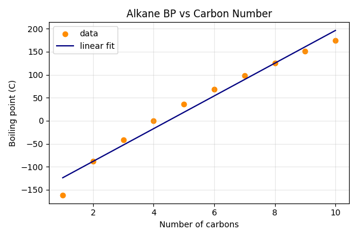

# 第93回　回帰モデルで物性を予測する

!!! abstract "この回のゴール"
    - 回帰で分子の物性（沸点）を予測する
    - 学習した傾き・切片・R² を読む
    - 未知の分子の物性を予測する
    - 所要時間の目安: 60分
    - 使うテーマ：**直鎖アルカンの沸点予測**

回帰は「数値を予測する」教師あり学習です。ここでは、直鎖アルカンの**炭素数から沸点を予測**します。

`ml93.py` を作りましょう。

```python
import numpy as np
from sklearn.linear_model import LinearRegression

# 直鎖アルカン C1〜C10 の炭素数と沸点[℃]
n_carbon = np.array([1, 2, 3, 4, 5, 6, 7, 8, 9, 10]).reshape(-1, 1)
bp = np.array([-161.5, -88.6, -42.1, -0.5, 36.1, 68.7, 98.4, 125.7, 150.8, 174.1])
```

---

## 1. モデルを学習させる

```python
model = LinearRegression()
model.fit(n_carbon, bp)

print("傾き:", round(model.coef_[0], 2))
print("切片:", round(model.intercept_, 2))
print("R^2:", round(model.score(n_carbon, bp), 3))
```

出力:

```text
傾き: 35.54
切片: -159.37
R^2: 0.972
```

- **傾き 35.54** … 炭素が1個増えると、沸点が約35.5℃上がる。
- **R² 0.972** … 炭素数だけで沸点の約97%を説明できる（よく当てはまる）。

炭素数という単純な特徴だけで、沸点がかなり予測できると分かりました。

---

## 2. 未知の分子を予測する

学習したモデルで、データにない炭素数の沸点を予測します。

```python
# C11（ウンデカン）の沸点を予測
pred = model.predict([[11]])
print("C11 の予測沸点:", round(pred[0], 1), "℃")
```

出力:

```text
C11 の予測沸点: 231.6 ℃
```

（実際のウンデカンの沸点は約196℃。直線モデルでは高炭素数でずれが出ます——沸点は本当は少し曲線的に増えるためです。）

生成した回帰の図:



点（実測）に直線（予測）がよく沿っていますが、両端で少しずれています。

!!! warning "外挿には注意"
    C11 は学習データ（C1〜C10）の**外側**です。外挿（範囲外の予測）は誤差が大きくなりがち。第85回の検量線と同じ注意です。より広い範囲や、非線形モデル（曲線）を使うと精度が上がります。

---

## 3. 複数の特徴量を使う

実際の物性予測では、複数の記述子（分子量・極性・分岐など）を特徴量にします。書き方は同じで、X の列を増やすだけです（第97回で詳しく）。

```python
# 例：分子量と炭素数の2つを特徴に（イメージ）
# X = np.column_stack([mw, n_carbon])   # 2列にする
# model.fit(X, bp)
```

`fit` / `predict` の型は変わりません。特徴量を増やすほど、複雑な関係も学べます（ただし過学習に注意、第95回）。

---

## 演習問題

**問1.** 本文のアルカンデータで回帰モデルを学習させ、傾き・切片・R² を表示してください。

**問2.** モデルで C12（ドデカン）の沸点を予測してください。学習範囲外なので、参考値として見ましょう。

**問3.** 別の物性データ（分子量と融点など、自分で5点ほど用意）で回帰し、R² を確認してください。R² が高ければ、その特徴量で物性がよく説明できる、ということです。

---

## 解答

??? success "問1 の解答"
    ```python
    import numpy as np
    from sklearn.linear_model import LinearRegression
    n_carbon = np.array([1,2,3,4,5,6,7,8,9,10]).reshape(-1, 1)
    bp = np.array([-161.5,-88.6,-42.1,-0.5,36.1,68.7,98.4,125.7,150.8,174.1])
    model = LinearRegression().fit(n_carbon, bp)
    print("傾き:", round(model.coef_[0], 2))
    print("切片:", round(model.intercept_, 2))
    print("R^2:", round(model.score(n_carbon, bp), 3))
    ```

    出力:
    ```text
    傾き: 35.54
    切片: -159.37
    R^2: 0.972
    ```

??? success "問2 の解答"
    ```python
    print("C12 の予測:", round(model.predict([[12]])[0], 1), "℃")
    ```

    出力:
    ```text
    C12 の予測: 267.1 ℃
    ```
    （実際のドデカンは約216℃。外挿なので直線モデルでは高めに出ます。）

??? success "問3 の解答（例）"
    ```python
    import numpy as np
    from sklearn.linear_model import LinearRegression
    X = np.array([[46],[60],[74],[88],[102]])   # 分子量など
    y = np.array([10, 25, 42, 55, 70])           # 何かの物性
    model = LinearRegression().fit(X, y)
    print("R^2:", round(model.score(X, y), 3))
    ```
    R² が1に近ければ、その特徴量で物性がよく説明できます。

---

## この回のまとめ

- 回帰（`LinearRegression`）で数値の物性を予測。
- `coef_`（傾き）・`intercept_`（切片）・`score`（R²）で結果を読む。
- `predict` で未知の分子を予測。ただし**外挿は誤差大**。
- 特徴量を増やすと複雑な関係も学べる（型は同じ）。

### 次回予告

[第94回：分類モデル](lesson-94.md) では、「溶ける／溶けない」のようなカテゴリを予測する分類を学びます。
