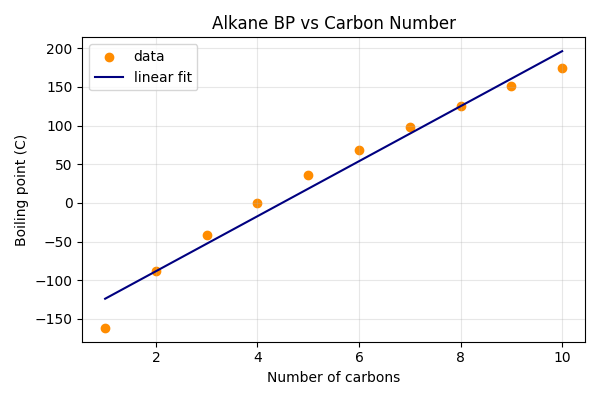

# 第93回　回帰モデルで物性を予測する

!!! abstract "この回のゴール"
    - 回帰で分子の物性（沸点）を予測する
    - 学習した傾き・切片・R² を読む
    - 未知の分子の物性を予測する
    - 所要時間の目安: 60分
    - 使うテーマ：**直鎖アルカンの沸点予測**

回帰は「数値を予測する」教師あり学習です。ここでは、直鎖アルカンの**炭素数から沸点を予測**します。

`ml93.py` を作りましょう。

```python
import numpy as np
from sklearn.linear_model import LinearRegression

# 直鎖アルカン C1〜C10 の炭素数と沸点[℃]
n_carbon = np.array([1, 2, 3, 4, 5, 6, 7, 8, 9, 10]).reshape(-1, 1)
bp = np.array([-161.5, -88.6, -42.1, -0.5, 36.1, 68.7, 98.4, 125.7, 150.8, 174.1])
```

---

## 1. モデルを学習させる

```python
model = LinearRegression()
model.fit(n_carbon, bp)

print("傾き:", round(model.coef_[0], 2))
print("切片:", round(model.intercept_, 2))
print("R^2:", round(model.score(n_carbon, bp), 3))
```

出力:

```text
傾き: 35.54
切片: -159.37
R^2: 0.972
```

- **傾き 35.54** … 炭素が1個増えると、沸点が約35.5℃上がる。
- **R² 0.972** … 炭素数だけで沸点の約97%を説明できる（よく当てはまる。学習に使ったデータでの値です）。

炭素数という単純な特徴だけで、沸点がかなり予測できると分かりました。

---

## 2. 未知の分子を予測する

学習したモデルで、データにない炭素数の沸点を予測します。

```python
# C11（ウンデカン）の沸点を予測
pred = model.predict([[11]])
print("C11 の予測沸点:", round(pred[0], 1), "℃")
```

出力:

```text
C11 の予測沸点: 231.6 ℃
```

（実際のウンデカンの沸点は約196℃。直線モデルでは高炭素数でずれが出ます——沸点は本当は少し曲線的に増えるためです。）

生成した回帰の図:



点（実測）はおおむね直線に沿っていますが、両端では実測が直線より**下**、中央では**上**にあります。残差（実測 − 予測）を数値で見てみましょう。

```python
resid = bp - model.predict(n_carbon)
print("残差[℃]:", resid.round(1))
```

出力:

```text
残差[℃]: [-37.7  -0.3  10.6  16.7  17.8  14.8   9.    0.7  -9.7 -22. ]
```

残差が「マイナス → プラス → マイナス」と**規則的に並んでいます**（メタンでは約38 ℃のずれ）。R² が 0.97 と高くても、残差にこのようなパターンがあれば「直線というモデルの形が合っていない」サインです。

!!! warning "外挿には注意"
    C11 は学習データ（C1〜C10）の**外側**です。外挿（範囲外の予測）は誤差が大きくなりがち。第85回の検量線と同じ注意です。より広い範囲や、非線形モデル（曲線）を使うと精度が上がります。

---

## 3. 複数の特徴量を使う

実際の物性予測では、複数の記述子（分子量・極性・分岐など）を特徴量にします。書き方は同じで、X の列を増やすだけです（第97回で詳しく）。

```python
# 例：分子量と炭素数の2つを特徴に（イメージ）
# X = np.column_stack([mw, n_carbon])   # 2列にする
# model.fit(X, bp)
```

`fit` / `predict` の型は変わりません。特徴量を増やすほど、複雑な関係も学べます（ただし過学習に注意、第95回）。

---

## AIに任せるときの指示と確認

!!! example "AIへの頼み方（例）"
    「直鎖アルカン C1〜C10 の炭素数（整数）と沸点 [℃] の NumPy 配列があります。
    scikit-learn の LinearRegression で、X=炭素数（2次元）、y=沸点 として回帰し、傾き [℃/炭素]・切片・R² を表示してください。
    さらに残差（実測−予測）を全点表示し、C11 の沸点を予測してください。C11 は学習範囲外であることをコメントに書いてください。」

!!! warning "AIの出力で確かめること"
    - **X と y の向き**：`fit(炭素数, 沸点)` になっているか。逆でも R² は同じ値になる（単回帰の R² は相関係数の2乗なので対称）ため、R² では気づけない。予測値が化学的にありうるか（C11 なら C10 の 174 ℃ より高いはず）で確かめる。
    - **傾きの単位と符号**：傾きは「℃ / 炭素1個」で正の値。CH₂ 1個あたり数十 ℃ なら妥当。
    - **残差のパターン**：`bp - model.predict(n_carbon)` を print し、プラス・マイナスが規則的に並んでいないか。規則的なら直線モデルでは不十分。
    - **外挿の扱い**：C11・C12 の予測を「予測値」と断定していないか。実測（ウンデカン約196 ℃）と比べ、直線モデルが高めに外すことを確認する。
    - **温度の単位**：℃ と K が混ざっていないか（沸点 −161.5 は ℃、111.6 なら K）。

---

## 演習問題

**問1.** 本文のアルカンデータで回帰モデルを学習させ、傾き・切片・R² を表示してください。

**問2.** モデルで C12（ドデカン）の沸点を予測してください。学習範囲外なので、参考値として見ましょう。

**問3.** 別の物性データ（直鎖アルコールの分子量と沸点など、自分で5点ほど用意）で回帰し、R² を確認してください。R² が高ければ、その特徴量で物性がよく説明できる、ということです。（融点は結晶の詰まり方の影響で炭素数の偶奇によってジグザグに変わるため、直線にはなりにくい物性です。）

**問4.** 次は、C11（ウンデカン）の沸点を予測するために AI が書いたコードとその出力です。問題点を指摘し、直してください。

```python
import numpy as np
from sklearn.linear_model import LinearRegression

n_carbon = np.array([1, 2, 3, 4, 5, 6, 7, 8, 9, 10])
bp = np.array([-161.5, -88.6, -42.1, -0.5, 36.1, 68.7, 98.4, 125.7, 150.8, 174.1])  # [℃]

model = LinearRegression()
model.fit(bp.reshape(-1, 1), n_carbon)          # 学習
print("R^2:", round(model.score(bp.reshape(-1, 1), n_carbon), 3))
print("C11 の予測沸点:", round(model.predict([[11]])[0], 1), "℃")
```

出力:

```text
R^2: 0.972
C11 の予測沸点: 4.8 ℃
```

---

## 解答

??? success "問1 の解答"
    ```python
    import numpy as np
    from sklearn.linear_model import LinearRegression
    n_carbon = np.array([1,2,3,4,5,6,7,8,9,10]).reshape(-1, 1)
    bp = np.array([-161.5,-88.6,-42.1,-0.5,36.1,68.7,98.4,125.7,150.8,174.1])
    model = LinearRegression().fit(n_carbon, bp)
    print("傾き:", round(model.coef_[0], 2))
    print("切片:", round(model.intercept_, 2))
    print("R^2:", round(model.score(n_carbon, bp), 3))
    ```

    出力:
    ```text
    傾き: 35.54
    切片: -159.37
    R^2: 0.972
    ```

??? success "問2 の解答"
    ```python
    print("C12 の予測:", round(model.predict([[12]])[0], 1), "℃")
    ```

    出力:
    ```text
    C12 の予測: 267.1 ℃
    ```
    （実際のドデカンは約216℃。外挿なので直線モデルでは高めに出ます。）

??? success "問3 の解答（例）"
    ```python
    import numpy as np
    from sklearn.linear_model import LinearRegression
    # 直鎖第一級アルコール C1〜C5：分子量 [g/mol] と沸点 [℃]
    X = np.array([[32.04], [46.07], [60.10], [74.12], [88.15]])   # メタノール〜1-ペンタノール
    y = np.array([64.7, 78.4, 97.2, 117.7, 138.0])
    model = LinearRegression().fit(X, y)
    print("R^2:", round(model.score(X, y), 3))
    ```

    出力:
    ```text
    R^2: 0.995
    ```
    R² が1に近ければ、その特徴量で物性がよく説明できます（ただし5点・学習データ上の値なので、第95回の方法で確かめるのが本来の手順です）。

??? success "問4 の解答"
    **誤り**：`fit(bp, n_carbon)` と、X と y が逆になっています。このモデルは「沸点 → 炭素数」を学習しているので、`predict([[11]])` は「沸点 11 ℃ の分子の炭素数（4.8）」を返しています。それに「℃」を付けて表示したため、もっともらしく見えます。

    **どう気づくか**：
    - R² は 0.972 で本文と同じです。単回帰の R² は X と y を入れ替えても変わらないので、**R² では見抜けません**。
    - 予測値を化学的に確かめます。C11 の沸点が C5（ペンタン, 36.1 ℃）より低い 4.8 ℃ になるはずがありません。C10（174.1 ℃）より高くなるはずです。

    ```python
    import numpy as np
    from sklearn.linear_model import LinearRegression

    n_carbon = np.array([1, 2, 3, 4, 5, 6, 7, 8, 9, 10]).reshape(-1, 1)   # X：炭素数（2次元）
    bp = np.array([-161.5, -88.6, -42.1, -0.5, 36.1, 68.7, 98.4, 125.7, 150.8, 174.1])  # y：沸点 [℃]

    model = LinearRegression()
    model.fit(n_carbon, bp)                          # X=炭素数, y=沸点
    print("R^2:", round(model.score(n_carbon, bp), 3))
    print("C11 の予測沸点:", round(model.predict([[11]])[0], 1), "℃")
    ```

    出力:
    ```text
    R^2: 0.972
    C11 の予測沸点: 231.6 ℃
    ```
    C10 より高い値になりました。ただし実測（約196 ℃）より高く、外挿では直線モデルが外れることも併せて確認しましょう。

---

## この回のまとめ

- 回帰（`LinearRegression`）で数値の物性を予測。
- `coef_`（傾き）・`intercept_`（切片）・`score`（R²）で結果を読む。
- `predict` で未知の分子を予測。ただし**外挿は誤差大**。
- 特徴量を増やすと複雑な関係も学べる（型は同じ）。

### 次回予告

[第94回：分類モデル](lesson-94.md) では、「溶ける／溶けない」のようなカテゴリを予測する分類を学びます。
