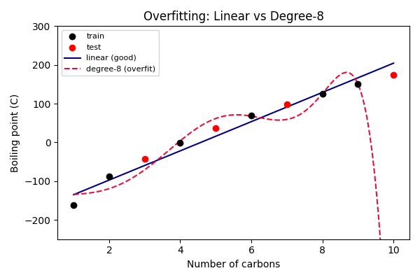

# 第95回　訓練・テスト分割と過学習

!!! abstract "この回のゴール"
    - データを訓練用とテスト用に分ける理由を理解する
    - `train_test_split` を使う
    - **過学習（オーバーフィッティング）**とは何かを体験する
    - 所要時間の目安: 60分
    - 使うテーマ：**沸点予測モデルの汎化性能**

「訓練データで正解率100%」——それは本当に良いモデルでしょうか？ **未知のデータで当たるか**が本当の実力です。それを測るのが訓練・テスト分割です。

`ml95.py` を作りましょう。

```python
import numpy as np
from sklearn.model_selection import train_test_split
from sklearn.linear_model import LinearRegression

n_carbon = np.array([1,2,3,4,5,6,7,8,9,10]).reshape(-1, 1)
bp = np.array([-161.5,-88.6,-42.1,-0.5,36.1,68.7,98.4,125.7,150.8,174.1])
```

---

## 1. 訓練データとテストデータに分ける

`train_test_split` で、データを「学習用」と「性能確認用」に分けます。

```python
X_train, X_test, y_train, y_test = train_test_split(
    n_carbon, bp, test_size=0.4, random_state=1
)

print("訓練データ数:", len(X_train))
print("テストデータ数:", len(X_test))
```

出力:

```text
訓練データ数: 6
テストデータ数: 4
```

- **訓練データ**でモデルを学習させる。
- **テストデータ**（学習に使っていない）で性能を測る。

!!! note "`random_state` で再現性"
    `train_test_split` はランダムに分けます。`random_state` を固定すると、毎回同じ分け方になり、結果が再現できます（第26回の seed と同じ）。研究では必ず固定しましょう。

---

## 2. 訓練とテストで性能を比べる

学習は訓練データだけで行い、性能は両方で測ります。

```python
model = LinearRegression()
model.fit(X_train, y_train)          # 訓練データで学習

print("訓練データでの R^2:", round(model.score(X_train, y_train), 3))
print("テストデータでの R^2:", round(model.score(X_test, y_test), 3))
```

出力:

```text
訓練データでの R^2: 0.977
テストデータでの R^2: 0.933
```

訓練0.977・テスト0.933。**テストでも高い**＝未知のデータにも通用する良いモデル、と言えます。

---

## 3. 過学習（オーバーフィッティング）

モデルを複雑にしすぎると、訓練データを「丸暗記」してしまい、**未知のデータで性能が落ちます**。これが**過学習**です。高次の多項式で試してみましょう。

```python
from sklearn.preprocessing import PolynomialFeatures
from sklearn.pipeline import make_pipeline

# 8次の多項式（複雑すぎるモデル）
poly = make_pipeline(PolynomialFeatures(8), LinearRegression())
poly.fit(X_train, y_train)

print("訓練データでの R^2:", round(poly.score(X_train, y_train), 3))
print("テストデータでの R^2:", round(poly.score(X_test, y_test), 3))
```

出力:

```text
訓練データでの R^2: 0.977
テストデータでの R^2: -46.128
```

訓練は0.977と良いのに、**テストは −46.128（大惨事）**！ 訓練データにぴったり合わせすぎて、未知のデータではめちゃくちゃな予測をしています。これが過学習です。

生成した図（直線 vs 8次多項式）:



黒（訓練点）にはよく合う8次曲線（赤破線）が、点の間や外側で暴れています。単純な直線（青）の方が、実は良い予測をします。

!!! warning "複雑 ≠ 良い"
    「モデルが複雑なほど良い」は誤りです。**訓練で良くてもテストで悪ければ、使えないモデル**。訓練とテストの両方を見て、差が小さく・両方高いモデルを選びます。「シンプルで十分説明できるなら、シンプルな方が良い」（オッカムの剃刀）。

---

## 演習問題

**問1.** 本文のデータを `train_test_split`（`test_size=0.3, random_state=0`）で分け、訓練・テストの数を表示してください。

**問2.** 線形回帰を訓練データで学習させ、訓練とテストの R² を比べてください。両方高ければ良いモデルです。

**問3.** 8次多項式モデルで同じことをして、訓練とテストの R² の差を見てください。過学習（訓練だけ高い）が起きますか？

---

## 解答

??? success "問1 の解答"
    ```python
    import numpy as np
    from sklearn.model_selection import train_test_split
    n_carbon = np.array([1,2,3,4,5,6,7,8,9,10]).reshape(-1,1)
    bp = np.array([-161.5,-88.6,-42.1,-0.5,36.1,68.7,98.4,125.7,150.8,174.1])
    Xtr, Xte, ytr, yte = train_test_split(n_carbon, bp, test_size=0.3, random_state=0)
    print("訓練:", len(Xtr), "テスト:", len(Xte))
    ```

    出力:
    ```text
    訓練: 7 テスト: 3
    ```

??? success "問2 の解答"
    ```python
    from sklearn.linear_model import LinearRegression
    m = LinearRegression().fit(Xtr, ytr)
    print("訓練 R^2:", round(m.score(Xtr, ytr), 3))
    print("テスト R^2:", round(m.score(Xte, yte), 3))
    ```
    線形モデルでは訓練・テストとも高く、差が小さい（＝過学習していない良いモデル）はずです。

??? success "問3 の解答"
    ```python
    from sklearn.preprocessing import PolynomialFeatures
    from sklearn.pipeline import make_pipeline
    p = make_pipeline(PolynomialFeatures(8), LinearRegression()).fit(Xtr, ytr)
    print("訓練 R^2:", round(p.score(Xtr, ytr), 3))
    print("テスト R^2:", round(p.score(Xte, yte), 3))
    ```
    訓練 R² は高いのにテスト R² が大きく下がる（負になることも）——これが過学習です。複雑なモデルほど起きやすくなります。

---

## この回のまとめ

- モデルの実力は、**学習に使っていないテストデータ**で測る。
- `train_test_split(X, y, test_size=, random_state=)` で分割。
- **過学習**：訓練に合わせすぎ、テストで性能が落ちる。
- 訓練・テスト両方を見て、差が小さく両方高いモデルを選ぶ。複雑 ≠ 良い。

### 次回予告

[第96回：モデル評価](lesson-96.md) では、R²・正解率・混同行列・交差検証など、モデルを多面的に評価する方法を学びます。
