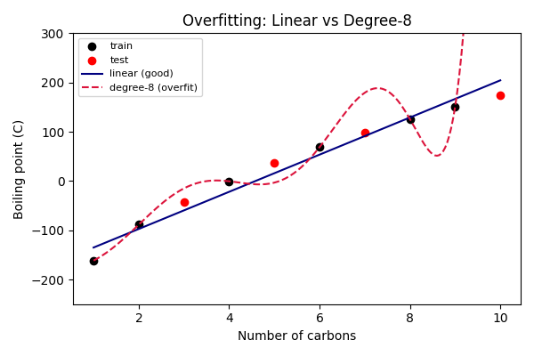

# 第95回　訓練・テスト分割と過学習

!!! abstract "この回のゴール"
    - データを訓練用とテスト用に分ける理由を理解する
    - `train_test_split` を使う
    - **過学習（オーバーフィッティング）**とは何かを体験する
    - 所要時間の目安: 60分
    - 使うテーマ：**沸点予測モデルの汎化性能**

「訓練データで正解率100%」——それは本当に良いモデルでしょうか？ **未知のデータで当たるか**が本当の実力です。それを測るのが訓練・テスト分割です。

`ml95.py` を作りましょう。

```python
import numpy as np
from sklearn.model_selection import train_test_split
from sklearn.linear_model import LinearRegression

n_carbon = np.array([1,2,3,4,5,6,7,8,9,10]).reshape(-1, 1)
bp = np.array([-161.5,-88.6,-42.1,-0.5,36.1,68.7,98.4,125.7,150.8,174.1])
```

---

## 1. 訓練データとテストデータに分ける

`train_test_split` で、データを「学習用」と「性能確認用」に分けます。

```python
X_train, X_test, y_train, y_test = train_test_split(
    n_carbon, bp, test_size=0.4, random_state=1
)

print("訓練データ数:", len(X_train))
print("テストデータ数:", len(X_test))
```

出力:

```text
訓練データ数: 6
テストデータ数: 4
```

- **訓練データ**でモデルを学習させる。
- **テストデータ**（学習に使っていない）で性能を測る。

!!! note "`random_state` で再現性"
    `train_test_split` はランダムに分けます。`random_state` を固定すると、毎回同じ分け方になり、結果が再現できます（第26回の seed と同じ）。研究では必ず固定しましょう。

---

## 2. 訓練とテストで性能を比べる

学習は訓練データだけで行い、性能は両方で測ります。

```python
model = LinearRegression()
model.fit(X_train, y_train)          # 訓練データで学習

print("訓練データでの R^2:", round(model.score(X_train, y_train), 3))
print("テストデータでの R^2:", round(model.score(X_test, y_test), 3))
```

出力:

```text
訓練データでの R^2: 0.977
テストデータでの R^2: 0.933
```

訓練0.977・テスト0.933。テストでも高く、この範囲（C1〜C10）の直鎖アルカンにはよく当てはまりそうです。ただしテストは**わずか4点**で、どの4点を選ぶかで値は変わります（`random_state` を変えて試してみましょう）。少ないデータでは1回の分割を過信せず、交差検証（第96回）で確かめます。

---

## 3. 過学習（オーバーフィッティング）

モデルを複雑にしすぎると、訓練データを「丸暗記」してしまい、**未知のデータで性能が落ちます**。これが**過学習**です。高次の多項式で試してみましょう。

```python
from sklearn.preprocessing import PolynomialFeatures
from sklearn.pipeline import make_pipeline

# 8次の多項式（複雑すぎるモデル）
poly = make_pipeline(PolynomialFeatures(8), LinearRegression())
poly.fit(X_train, y_train)

print("訓練データでの R^2:", round(poly.score(X_train, y_train), 3))
print("テストデータでの R^2:", round(poly.score(X_test, y_test), 3))
```

出力:

```text
訓練データでの R^2: 1.0
テストデータでの R^2: -301.832
```

訓練は **1.0（完璧）**なのに、**テストは −301.832（大惨事）**！ 8次多項式は係数が9個あり、6点しかない訓練データを**必ず全点通る**曲線を作れてしまいます。テストの予測を見てみましょう。

```python
print("テストの炭素数:", X_test.ravel())
print("8次の予測:", poly.predict(X_test).round(1))
print("実測:     ", y_test)
```

出力:

```text
テストの炭素数: [ 3 10  7  5]
8次の予測: [ -15.  2941.2  179.1   -3.3]
実測:      [-42.1 174.1  98.4  36.1]
```

特に、訓練範囲（C1〜C9）の外にある C10 を 2941 ℃ と予測しています。訓練データにぴったり合わせすぎて、未知のデータ（とくに範囲の外）ではめちゃくちゃな予測をしています。これが過学習です。（8次の多項式は数値的に不安定なので、環境によって予測値の下の桁が変わることがあります。）

生成した図（直線 vs 8次多項式）:



黒（訓練点）にはよく合う8次曲線（赤破線）が、点の間や外側で暴れています。単純な直線（青）の方が、実は良い予測をします。

!!! warning "複雑 ≠ 良い"
    「モデルが複雑なほど良い」は誤りです。**訓練で良くてもテストで悪ければ、使えないモデル**。訓練とテストの両方を見て、差が小さく・両方高いモデルを選びます。「シンプルで十分説明できるなら、シンプルな方が良い」（オッカムの剃刀）。

---

## AIに任せるときの指示と確認

!!! example "AIへの頼み方（例）"
    「直鎖アルカン C1〜C10 の炭素数（2次元配列 `n_carbon`）と沸点 [℃]（`bp`）があります。
    `train_test_split(test_size=0.4, random_state=1)` で分割し、**訓練データだけで** LinearRegression と 8次多項式（make_pipeline）を学習させ、
    それぞれの訓練 R² とテスト R² を表示してください。テストに入った炭素数と、テストの予測値・実測値も並べて表示してください。」

!!! warning "AIの出力で確かめること"
    - **fit に渡しているのが訓練データか**：`model.fit(n_carbon, bp)` のように全データで学習してから `score(X_test, y_test)` を測っていたら、テストを見たうえでの成績（データ漏洩）。`fit(X_train, y_train)` になっているか見る。
    - **random_state があるか**：無いと実行のたびにテスト R² が変わり、結果を報告できない。
    - **テストの中身を見る**：`print(X_test.ravel())` で、どの炭素数がテストに入ったか。10 点中 3〜4 点しかない、範囲の端（C1・C10）が入っている／いない、で R² は大きく変わる。
    - **訓練 R² = 1.0 は疑う**：パラメータ数（8次なら9個）がデータ数以上なら、丸暗記で必ず 1.0 になる。
    - **予測値の化学的な妥当性**：テストや C11 の予測が「沸点は炭素数とともに単調に増える」に反していないか（負の数百 ℃、数千 ℃ などは明らかにおかしい）。

---

## 演習問題

**問1.** 本文のデータを `train_test_split`（`test_size=0.3, random_state=0`）で分け、訓練・テストの数を表示してください。

**問2.** 線形回帰を訓練データで学習させ、訓練とテストの R² を比べてください。両方高ければ良いモデルです。

**問3.** 8次多項式モデルで同じことをして、訓練とテストの R² の差を見てください。さらに C11 の沸点も予測させてください。テスト R² だけで過学習を見抜けますか？

**問4.** 次は、線形回帰の「テストデータでの R²」を求めるために AI が書いたコードです。実行するたびに 0.932、0.958、0.964 … と値が変わりました。問題点を2つ指摘し、直してください。

```python
import numpy as np
from sklearn.model_selection import train_test_split
from sklearn.linear_model import LinearRegression

n_carbon = np.array([1,2,3,4,5,6,7,8,9,10]).reshape(-1, 1)
bp = np.array([-161.5,-88.6,-42.1,-0.5,36.1,68.7,98.4,125.7,150.8,174.1])

X_train, X_test, y_train, y_test = train_test_split(n_carbon, bp, test_size=0.4)
model = LinearRegression().fit(n_carbon, bp)
print("テストデータでの R^2:", round(model.score(X_test, y_test), 3))
```

---

## 解答

??? success "問1 の解答"
    ```python
    import numpy as np
    from sklearn.model_selection import train_test_split
    n_carbon = np.array([1,2,3,4,5,6,7,8,9,10]).reshape(-1,1)
    bp = np.array([-161.5,-88.6,-42.1,-0.5,36.1,68.7,98.4,125.7,150.8,174.1])
    Xtr, Xte, ytr, yte = train_test_split(n_carbon, bp, test_size=0.3, random_state=0)
    print("訓練:", len(Xtr), "テスト:", len(Xte))
    ```

    出力:
    ```text
    訓練: 7 テスト: 3
    ```

??? success "問2 の解答"
    ```python
    from sklearn.linear_model import LinearRegression
    m = LinearRegression().fit(Xtr, ytr)
    print("訓練 R^2:", round(m.score(Xtr, ytr), 3))
    print("テスト R^2:", round(m.score(Xte, yte), 3))
    ```

    出力:
    ```text
    訓練 R^2: 0.973
    テスト R^2: 0.957
    ```
    線形モデルでは訓練・テストとも高く、差が小さい（過学習していない）ことが分かります。

??? success "問3 の解答"
    ```python
    from sklearn.preprocessing import PolynomialFeatures
    from sklearn.pipeline import make_pipeline
    p = make_pipeline(PolynomialFeatures(8), LinearRegression()).fit(Xtr, ytr)
    print("訓練 R^2:", round(p.score(Xtr, ytr), 3))
    print("テスト R^2:", round(p.score(Xte, yte), 3))
    print("テストの炭素数:", Xte.ravel())
    print("C11 の予測:", round(p.predict([[11]])[0], 1))
    ```

    出力:
    ```text
    訓練 R^2: 1.0
    テスト R^2: 0.955
    テストの炭素数: [3 9 5]
    C11 の予測: -526.9
    ```
    この分け方では、テストの3点がすべて訓練範囲の**内側**にあるため、テスト R² は 0.955 と高く、過学習がテストの数字には現れません。ところが範囲の外の C11 を予測させると −526.9 ℃ という、ありえない値になります。
    - テストがたった3点だと、**どの点がテストに入ったかで結論が変わる**（本文の `random_state=1` では −301.8 だった）。
    - 過学習したモデルは、とくに範囲の外で壊れる。
    
    だからこそ、少ないデータでは交差検証（第96回）で何通りも分けて確かめ、予測値が化学的にありうるかも必ず見ます。

??? success "問4 の解答"
    **誤り1（データ漏洩）**：`fit(n_carbon, bp)` と**全データ**で学習しています。テストの点も学習に使われているので、「未知のデータでの成績」になりません。分割しただけで、分けた意味がありません。

    **誤り2（再現性）**：`train_test_split` に `random_state` がないため、実行のたびに分け方が変わり、R² も変わります。

    確かめ方：`fit` の引数が `X_train, y_train` か目で確認します。`random_state=1` で固定して比べると、漏洩したコードではテスト R² が 0.961、正しく訓練データだけで学習すると 0.933 で、漏洩版は甘く出ます。

    ```python
    import numpy as np
    from sklearn.model_selection import train_test_split
    from sklearn.linear_model import LinearRegression

    n_carbon = np.array([1,2,3,4,5,6,7,8,9,10]).reshape(-1, 1)
    bp = np.array([-161.5,-88.6,-42.1,-0.5,36.1,68.7,98.4,125.7,150.8,174.1])

    X_train, X_test, y_train, y_test = train_test_split(
        n_carbon, bp, test_size=0.4, random_state=1)
    print("テストに使う炭素数:", X_test.ravel())
    model = LinearRegression().fit(X_train, y_train)      # 訓練データだけで学習
    print("訓練データでの R^2:", round(model.score(X_train, y_train), 3))
    print("テストデータでの R^2:", round(model.score(X_test, y_test), 3))
    ```

    出力:
    ```text
    テストに使う炭素数: [ 3 10  7  5]
    訓練データでの R^2: 0.977
    テストデータでの R^2: 0.933
    ```

---

## この回のまとめ

- モデルの実力は、**学習に使っていないテストデータ**で測る。
- `train_test_split(X, y, test_size=, random_state=)` で分割。
- **過学習**：訓練に合わせすぎ、テストで性能が落ちる。
- 訓練・テスト両方を見て、差が小さく両方高いモデルを選ぶ。複雑 ≠ 良い。

### 次回予告

[第96回：モデル評価](lesson-96.md) では、R²・正解率・混同行列・交差検証など、モデルを多面的に評価する方法を学びます。
