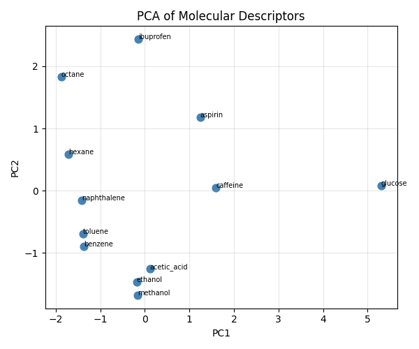

# 第98回　次元削減と可視化（PCA）

!!! abstract "この回のゴール"
    - 次元削減（たくさんの特徴を少数にまとめる）を知る
    - **主成分分析（PCA）**で記述子を2次元に圧縮する
    - 化合物の分布を散布図で可視化する
    - 所要時間の目安: 60分
    - 使うテーマ：**分子記述子空間の可視化**

分子を6個の記述子（第97回）で表すと、6次元空間の点になります。人は6次元を見られません。**PCA**で2次元に圧縮すれば、化合物の分布を「地図」として眺められます。

`ml98.py` を作りましょう（第97回の `df` と記述子を使います）。

---

## 1. PCA で2次元に圧縮する

PCA は「情報をできるだけ保ったまま、次元を減らす」手法です。標準化（第97回）してから適用します。

```python
from sklearn.preprocessing import StandardScaler
from sklearn.decomposition import PCA

features = ["MW", "LogP", "TPSA", "HBD", "HBA", "RotB"]
X_scaled = StandardScaler().fit_transform(df[features])

pca = PCA(n_components=2)
pcs = pca.fit_transform(X_scaled)      # 6次元 → 2次元

print("各主成分の説明率:", pca.explained_variance_ratio_.round(3))
print("2成分の累積説明率:", round(pca.explained_variance_ratio_[:2].sum(), 3))
```

出力:

```text
各主成分の説明率: [0.62  0.262]
2成分の累積説明率: 0.882
```

- **第1主成分（PC1）が62%、第2主成分（PC2）が26.2%**の情報を持つ。
- **2成分あわせて88.2%**を説明。つまり、6次元の情報の約9割を、2次元でほぼ表せています。

---

## 2. 2次元で可視化する

圧縮した2成分を散布図にします。

```python
import matplotlib.pyplot as plt

plt.figure(figsize=(6, 5))
plt.scatter(pcs[:, 0], pcs[:, 1], color="steelblue", s=60)
for i, name in enumerate(df["name"]):
    plt.annotate(name, (pcs[i, 0], pcs[i, 1]), fontsize=7)
plt.xlabel("PC1")
plt.ylabel("PC2")
plt.title("PCA of Molecular Descriptors")
plt.grid(True, alpha=0.3)
plt.tight_layout()
plt.savefig("pca.png", dpi=100)
plt.show()
```

生成した図:



似た性質の分子が近くに、違う分子が遠くに配置されます。炭化水素（benzene, hexane…）、極性分子（glucose）、医薬品（aspirin, ibuprofen…）が、それぞれのエリアに分かれる様子が見えます。**高次元のデータが、2次元の地図になった**のです。

!!! note "主成分の意味"
    PC1・PC2 は、元の記述子を組み合わせた「合成軸」です。多くの場合、PC1 は分子の大きさ（MW・炭素数）、PC2 は極性（TPSA・HBD）などに対応します。`pca.components_` で、各主成分がどの記述子から作られたかを見られます。

---

## 3. 何次元に減らすか

```python
# すべての主成分の説明率を見て、何次元残すか決める
pca_full = PCA().fit(X_scaled)
print("累積説明率:", pca_full.explained_variance_ratio_.cumsum().round(3))
```

累積説明率が「95%を超える」あたりまで残す、といった判断をします。2次元で88%なら、可視化には十分です。

!!! success "次元削減の使いどころ"
    - **可視化**：高次元データを2〜3次元で眺める（今回）。
    - **前処理**：特徴量が多すぎるとき、情報を保ちつつ減らして過学習を防ぐ。
    - **ノイズ除去**：重要な成分だけ残す。
    
    大量の記述子を扱う本格的なケモインフォマティクスで、PCA は頻繁に使われます。

---

## 演習問題

**問1.** 第97回の記述子を標準化し、PCA で2成分に圧縮して、各成分の説明率と累積説明率を表示してください。

**問2.** 2成分の散布図を描き、各点に分子名のラベルを付けてください。似た分子が近くに集まっているか観察しましょう。

**問3.** `PCA()`（成分数を指定しない）で全成分の累積説明率を計算し、95%を超えるのに何成分必要か調べてください。

---

## 解答

??? success "問1 の解答"
    ```python
    from sklearn.preprocessing import StandardScaler
    from sklearn.decomposition import PCA
    features = ["MW","LogP","TPSA","HBD","HBA","RotB"]
    Xs = StandardScaler().fit_transform(df[features])
    pca = PCA(n_components=2).fit(Xs)
    print(pca.explained_variance_ratio_.round(3))
    print("累積:", round(pca.explained_variance_ratio_.sum(), 3))
    ```

    出力:
    ```text
    [0.62  0.262]
    累積: 0.882
    ```

??? success "問2 の解答"
    ```python
    import matplotlib.pyplot as plt
    pcs = PCA(n_components=2).fit_transform(Xs)
    plt.figure(figsize=(6,5))
    plt.scatter(pcs[:,0], pcs[:,1], s=60)
    for i, name in enumerate(df["name"]):
        plt.annotate(name, (pcs[i,0], pcs[i,1]), fontsize=7)
    plt.xlabel("PC1"); plt.ylabel("PC2"); plt.tight_layout()
    plt.show()
    ```

??? success "問3 の解答"
    ```python
    from sklearn.decomposition import PCA
    cum = PCA().fit(Xs).explained_variance_ratio_.cumsum()
    print(cum.round(3))
    ```
    累積説明率の配列を見て、初めて0.95を超える位置が「必要な成分数」です。

---

## この回のまとめ

- PCA は情報を保ったまま次元を減らす（`PCA(n_components=2)`）。
- `explained_variance_ratio_` で各主成分の説明率、累積で全体を確認。
- 高次元の記述子を2次元に圧縮して、化合物の分布を可視化できる。
- 可視化・前処理・ノイズ除去に使う。標準化してから適用。

### 次回予告

[第99回：クラスタリング](lesson-99.md) では、化合物を「似た者どうし」のグループに自動で分けます。
