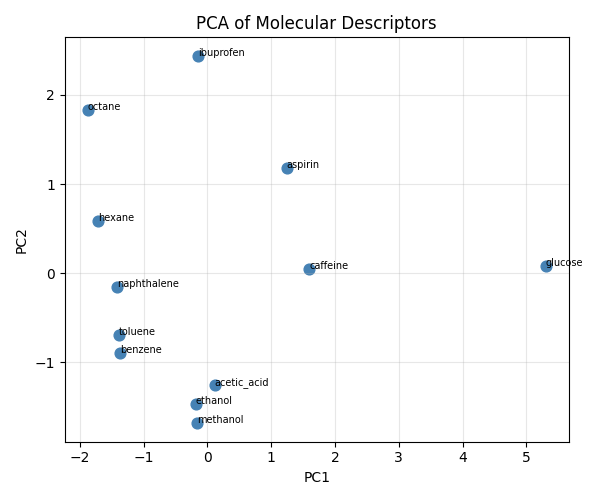

# 第98回　次元削減と可視化（PCA）

!!! abstract "この回のゴール"
    - 次元削減（たくさんの特徴を少数にまとめる）を知る
    - **主成分分析（PCA）**で記述子を2次元に圧縮する
    - 化合物の分布を散布図で可視化する
    - 所要時間の目安: 60分
    - 使うテーマ：**分子記述子空間の可視化**

分子を6個の記述子（第97回）で表すと、6次元空間の点になります。人は6次元を見られません。**PCA**で2次元に圧縮すれば、化合物の分布を「地図」として眺められます。

`ml98.py` を作りましょう（第97回の `df` と記述子を使います）。

---

## 1. PCA で2次元に圧縮する

PCA は「情報をできるだけ保ったまま、次元を減らす」手法です。標準化（第97回）してから適用します（標準化しないと、数値の大きい MW だけで PC1 が決まってしまいます。問4で確かめます）。

```python
from sklearn.preprocessing import StandardScaler
from sklearn.decomposition import PCA

features = ["MW", "LogP", "TPSA", "HBD", "HBA", "RotB"]
X_scaled = StandardScaler().fit_transform(df[features])

pca = PCA(n_components=2)
pcs = pca.fit_transform(X_scaled)      # 6次元 → 2次元

print("各主成分の説明率:", pca.explained_variance_ratio_.round(3))
print("2成分の累積説明率:", round(pca.explained_variance_ratio_[:2].sum(), 3))
```

出力:

```text
各主成分の説明率: [0.62  0.262]
2成分の累積説明率: 0.882
```

- **第1主成分（PC1）が62%、第2主成分（PC2）が26.2%**の情報を持つ。
- **2成分あわせて88.2%**を説明。つまり、6次元の情報の約9割を、2次元でほぼ表せています。

---

## 2. 2次元で可視化する

圧縮した2成分を散布図にします。

```python
import matplotlib.pyplot as plt

plt.figure(figsize=(6, 5))
plt.scatter(pcs[:, 0], pcs[:, 1], color="steelblue", s=60)
for i, name in enumerate(df["name"]):
    plt.annotate(name, (pcs[i, 0], pcs[i, 1]), fontsize=7)
plt.xlabel("PC1")
plt.ylabel("PC2")
plt.title("PCA of Molecular Descriptors")
plt.grid(True, alpha=0.3)
plt.tight_layout()
plt.savefig("pca.png", dpi=100)
plt.show()
```

生成した図:



似た性質の分子が近くに、違う分子が遠くに配置されます。炭化水素（benzene, toluene, naphthalene, hexane, octane）は左側に、小さな極性分子（methanol, ethanol, acetic_acid）は下側に、医薬品（aspirin, caffeine, ibuprofen）は右上寄りに、そして極性の特に高い glucose は右端に離れて位置しています。**高次元のデータが、2次元の地図になった**のです。

!!! note "主成分の意味"
    PC1・PC2 は、元の記述子を組み合わせた「合成軸」です。どの記述子から作られたかは `pca.components_`（負荷量）で確かめます。

    ```python
    import pandas as pd
    print(pd.DataFrame(pca.components_, columns=features, index=["PC1", "PC2"]).round(2))
    ```

    出力:
    ```text
           MW  LogP  TPSA   HBD   HBA  RotB
    PC1  0.26 -0.44  0.51  0.46  0.51 -0.09
    PC2  0.59  0.38  0.11 -0.01  0.07  0.70
    ```

    このデータでは、PC1 は TPSA・HBD・HBA が大きく LogP が負の「**極性**」の軸（右ほど極性が高い：glucose が右端）、PC2 は RotB・MW が大きい「**大きさ・柔軟性**」の軸（上ほど大きく柔らかい：ibuprofen・octane が上）です。軸の意味はデータごとに違うので、**必ず負荷量を見て**解釈します。なお、主成分の符号（向き）は計算の都合で反転することがあり、符号そのものに意味はありません。

---

## 3. 何次元に減らすか

```python
# すべての主成分の説明率を見て、何次元残すか決める
pca_full = PCA().fit(X_scaled)
print("累積説明率:", pca_full.explained_variance_ratio_.cumsum().round(3))
```

出力:

```text
累積説明率: [0.62  0.882 0.969 0.992 0.997 1.   ]
```

累積説明率が「95%を超える」あたりまで残す、といった判断をします。2次元で88%なら、可視化には十分です。この例では3成分で 96.9 % です。

!!! success "次元削減の使いどころ"
    - **可視化**：高次元データを2〜3次元で眺める（今回）。
    - **前処理**：特徴量が多すぎるとき、情報を保ちつつ減らして過学習を防ぐ。
    - **ノイズ除去**：重要な成分だけ残す。
    
    大量の記述子を扱う本格的なケモインフォマティクスで、PCA は頻繁に使われます。

---

## AIに任せるときの指示と確認

!!! example "AIへの頼み方（例）"
    「第97回の DataFrame `df`（列 name, MW, LogP, TPSA, HBD, HBA, RotB）について、6記述子を StandardScaler で標準化してから PCA で2次元にしてください。
    各主成分の説明率と累積説明率、`components_` を列名つきの表（行 PC1・PC2）で表示し、分子名ラベルつきの散布図を `pca.png` に保存してください。
    PC1・PC2 がそれぞれどの記述子の組み合わせかを、負荷量の値を根拠に説明してください。」

!!! warning "AIの出力で確かめること"
    - **標準化しているか**：`PCA().fit(df[features])` のように生の値を渡すと、分散の大きい MW（標準偏差 約 61）が PC1 をほぼ独占する。累積説明率が 0.99 以上と異様に高いときは疑う。
    - **説明率の読み方**：`explained_variance_ratio_` の和が 1 を超えていないか、`[:2].sum()` と全体の和を混同していないか。
    - **軸の解釈の根拠**：「PC1 は分子の大きさ」のような説明が、`components_` の値と合っているか自分で表を見て確かめる。AI は一般論で解釈を書きがち。
    - **ラベルと点の対応**：`df["name"]` と `pcs` の行の順番が同じか（途中で行を削除・並べ替えしていないか）。glucose のような極端な分子が、表の値どおりの位置にあるかで確かめる。

---

## 演習問題

**問1.** 第97回の記述子を標準化し、PCA で2成分に圧縮して、各成分の説明率と累積説明率を表示してください。

**問2.** 2成分の散布図を描き、各点に分子名のラベルを付けてください。似た分子が近くに集まっているか観察しましょう。

**問3.** `PCA()`（成分数を指定しない）で全成分の累積説明率を計算し、95%を超えるのに何成分必要か調べてください。

**問4.** 次は、第97回の `df` を PCA で2次元にするために AI が書いたコードと出力です。AI は「2成分で情報の 99.9 % を保持できたので、分子の違いはほぼ完全に2次元で表せます」と説明しました。問題点を指摘し、直してください。

```python
from sklearn.decomposition import PCA

features = ["MW", "LogP", "TPSA", "HBD", "HBA", "RotB"]
pca = PCA(n_components=2)
pcs = pca.fit_transform(df[features])
print("累積説明率:", round(pca.explained_variance_ratio_.sum(), 3))
print(pd.DataFrame(pca.components_, columns=features, index=["PC1", "PC2"]).round(2))
```

出力:

```text
累積説明率: 0.999
       MW  LogP  TPSA   HBD   HBA  RotB
PC1  0.92 -0.01  0.39  0.01  0.02  0.01
PC2 -0.39 -0.07  0.92  0.04  0.05 -0.03
```

---

## 解答

??? success "問1 の解答"
    ```python
    from sklearn.preprocessing import StandardScaler
    from sklearn.decomposition import PCA
    features = ["MW","LogP","TPSA","HBD","HBA","RotB"]
    Xs = StandardScaler().fit_transform(df[features])
    pca = PCA(n_components=2).fit(Xs)
    print(pca.explained_variance_ratio_.round(3))
    print("累積:", round(pca.explained_variance_ratio_.sum(), 3))
    ```

    出力:
    ```text
    [0.62  0.262]
    累積: 0.882
    ```

??? success "問2 の解答"
    ```python
    import matplotlib.pyplot as plt
    pcs = PCA(n_components=2).fit_transform(Xs)
    plt.figure(figsize=(6,5))
    plt.scatter(pcs[:,0], pcs[:,1], s=60)
    for i, name in enumerate(df["name"]):
        plt.annotate(name, (pcs[i,0], pcs[i,1]), fontsize=7)
    plt.xlabel("PC1"); plt.ylabel("PC2"); plt.tight_layout()
    plt.show()
    ```

??? success "問3 の解答"
    ```python
    from sklearn.decomposition import PCA
    cum = PCA().fit(Xs).explained_variance_ratio_.cumsum()
    print(cum.round(3))
    ```
    出力:
    ```text
    [0.62  0.882 0.969 0.992 0.997 1.   ]
    ```
    初めて 0.95 を超えるのは3番目（0.969）なので、**3成分**必要です。プログラムで求めるなら `int((cum >= 0.95).argmax()) + 1` → `3`。

??? success "問4 の解答"
    **誤り**：標準化せずに PCA をしています。PCA は「分散の大きい方向」を探すので、単位も桁も違う記述子をそのまま渡すと、数値の大きい MW（標準偏差 約 61）と TPSA（約 35）だけで2成分が決まります。負荷量を見ると PC1 は MW が 0.92、PC2 は TPSA が 0.92 で、LogP・HBD・HBA・RotB はほぼ 0。「99.9 %」は、**MW と TPSA の2列の情報をほぼ保持した**というだけです。

    確かめ方：`df[features].std()` で列ごとのスケールを比べる。`components_` を表で見て、どの記述子が効いているか確かめる。

    ```python
    from sklearn.pipeline import make_pipeline
    from sklearn.preprocessing import StandardScaler
    from sklearn.decomposition import PCA

    features = ["MW", "LogP", "TPSA", "HBD", "HBA", "RotB"]
    print(df[features].std().round(1))                 # 列ごとのスケールの違いを確認
    pipe = make_pipeline(StandardScaler(), PCA(n_components=2))
    pcs = pipe.fit_transform(df[features])
    pca = pipe.named_steps["pca"]
    print("累積説明率:", round(pca.explained_variance_ratio_.sum(), 3))
    print(pd.DataFrame(pca.components_, columns=features, index=["PC1", "PC2"]).round(2))
    ```

    出力:
    ```text
    MW      60.8
    LogP     2.0
    TPSA    34.9
    HBD      1.4
    HBA      1.8
    RotB     1.8
    dtype: float64
    累積説明率: 0.882
           MW  LogP  TPSA   HBD   HBA  RotB
    PC1  0.26 -0.44  0.51  0.46  0.51 -0.09
    PC2  0.59  0.38  0.11 -0.01  0.07  0.70
    ```
    標準化すると、6つの記述子すべてが主成分に寄与し、累積説明率は 0.882 になりました。

---

## この回のまとめ

- PCA は情報を保ったまま次元を減らす（`PCA(n_components=2)`）。
- `explained_variance_ratio_` で各主成分の説明率、累積で全体を確認。
- 高次元の記述子を2次元に圧縮して、化合物の分布を可視化できる。
- 可視化・前処理・ノイズ除去に使う。標準化してから適用。

### 次回予告

[第99回：クラスタリング](lesson-99.md) では、化合物を「似た者どうし」のグループに自動で分けます。
