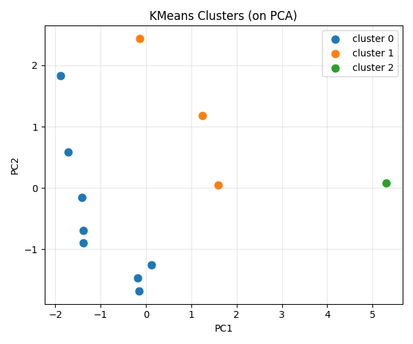

# 第99回　クラスタリング（化合物のグループ分け）

!!! abstract "この回のゴール"
    - 教師なし学習の**クラスタリング**を知る
    - `KMeans` で化合物を似た者どうしにグループ分けする
    - 結果を可視化・解釈する
    - 所要時間の目安: 60分
    - 使うテーマ：**化合物ライブラリの自動グループ分け**

**クラスタリング**は「正解なし」で、データを**似た者どうしのかたまり**に分ける教師なし学習です。「この化合物ライブラリには、どんなグループがあるか？」を自動で見つけます。

`ml99.py` を作りましょう（第97回の記述子 `df` を使います）。

---

## 1. KMeans でグループ分け

**KMeans** は、指定した数（k）のグループにデータを分ける定番手法です。標準化（第97回）してから使います。

```python
from sklearn.preprocessing import StandardScaler
from sklearn.cluster import KMeans

features = ["MW", "LogP", "TPSA", "HBD", "HBA", "RotB"]
X_scaled = StandardScaler().fit_transform(df[features])

km = KMeans(n_clusters=3, random_state=42, n_init=10)
km.fit(X_scaled)
df["cluster"] = km.labels_          # 各分子のグループ番号

print(df[["name", "cluster"]].to_string(index=False))
```

出力:

```text
       name  cluster
   methanol        0
    ethanol        0
    benzene        0
    toluene        0
     octane        0
    aspirin        1
   caffeine        1
    glucose        2
     hexane        0
naphthalene        0
  ibuprofen        1
acetic_acid        0
```

3つのグループに自動で分かれました。読み解くと:

- **クラスタ0**：小さめ・単純な分子（アルコール・酢酸・炭化水素）
- **クラスタ1**：医薬品的な分子（aspirin, caffeine, ibuprofen）
- **クラスタ2**：glucose（水酸基が多く極性が特異）だけ独立

正解を与えていないのに、化学的に意味のあるグループができました。

!!! note "クラスタ番号そのものに意味はない"
    「0・1・2」は区別のための名札にすぎず、`random_state` やデータの順番を変えると番号が入れ替わります。「クラスタ1＝医薬品」と決めつけず、毎回 `df.groupby("cluster")[features].mean()` で各クラスタの特徴を見て解釈します。

---

## 2. 可視化する

PCA（第98回）で2次元にして、クラスタを色分けで表示します。

```python
import matplotlib.pyplot as plt
from sklearn.decomposition import PCA

pcs = PCA(n_components=2).fit_transform(X_scaled)

plt.figure(figsize=(6, 5))
for c in range(3):
    mask = km.labels_ == c
    plt.scatter(pcs[mask, 0], pcs[mask, 1], label=f"cluster {c}", s=60)
plt.xlabel("PC1")
plt.ylabel("PC2")
plt.title("KMeans Clusters (on PCA)")
plt.legend()
plt.grid(True, alpha=0.3)
plt.tight_layout()
plt.savefig("clusters.png", dpi=100)
plt.show()
```

生成した図:



色分けされたグループが、PCAの地図の上で分かれて見えます。glucose（クラスタ2）が右端に離れて独立しているのが分かります。

!!! note "k（グループ数）の決め方"
    KMeans は「いくつに分けるか（k）」を先に決める必要があります。適切な k は、**エルボー法**（クラスタ内のばらつきの減り方を見る）や**シルエット係数**で判断します。まずはいくつか試して、化学的に意味のある分け方を探すのが実践的です。なお、このデータでシルエット係数を計算すると k=2 が最大（0.502）になりますが、それは glucose を切り離しただけの分け方です。指標の値だけで決めず、化学的に意味があるかと合わせて判断します。

---

## 3. クラスタリングの使いどころ

!!! success "教師なしで構造を発見"
    - **化合物ライブラリの俯瞰**：大量の化合物にどんなグループがあるか把握。
    - **多様性の確保**：各クラスタから代表を選び、偏りなくスクリーニング。
    - **異常検知**：glucose のように1個だけでクラスタを作る分子や、クラスタの中心から遠い分子は、外れ値の候補です（KMeans はすべての点をどこかのクラスタに入れるので、「どこにも属さない」点を直接見つけたいときは DBSCAN などの手法を使います）。
    
    「ラベルがないデータから構造を見つける」のがクラスタリングの価値。正解を知らなくても、データが教えてくれます。

---

## AIに任せるときの指示と確認

!!! example "AIへの頼み方（例）"
    「第97回の DataFrame `df`（name と6記述子）を StandardScaler で標準化し、KMeans(n_clusters=3, random_state=42, n_init=10) でクラスタリングしてください。
    クラスタごとの分子名の一覧と、クラスタごとの各記述子の平均（標準化前の値）を表示してください。
    さらに k=2〜6 のシルエット係数を表で出し、PCA 2次元の散布図をクラスタで色分けしてください。」

!!! warning "AIの出力で確かめること"
    - **標準化しているか**：生の値でクラスタリングすると、MW と TPSA だけでほぼ分け方が決まる（他の記述子が効かない）。
    - **random_state と n_init**：指定がないと、実行のたびに・scikit-learn のバージョンによって結果が変わりうる（`n_init` の既定値は 1.4 で 10 から `"auto"` に変わった）。
    - **番号で解釈していないか**：「クラスタ1は医薬品」という説明が、今回の実行の `groupby` の結果と一致しているか。番号は実行ごとに入れ替わる。
    - **1個だけのクラスタ**：glucose のように1分子だけのクラスタは、外れ値に引っぱられた結果かもしれない。`df["cluster"].value_counts()` を確認する。
    - **PCA 図の色と表の対応**：散布図の色が `km.labels_` と同じ順番の行から描かれているか（途中で並べ替えていないか）。

---

## 演習問題

**問1.** 第97回の記述子を標準化し、`KMeans(n_clusters=3, random_state=42, n_init=10)` でクラスタリングして、各分子のクラスタ番号を表示してください。

**問2.** クラスタ数を `n_clusters=2` に変えて実行し、2グループに分けるとどう分かれるか見てください（どの分子が切り離されるでしょうか）。

**問3.** PCA で2次元にして、クラスタを色分けした散布図を描いてください。グループが空間的に分かれているか確認しましょう。

**問4.** 次は、第97回の `df` をクラスタリングするために AI が書いたコードと出力です。AI は「6つの記述子を総合して、炭化水素・医薬品・小さな極性分子の3グループに分かれました」と説明しました。問題点を指摘し、直してください。

```python
from sklearn.cluster import KMeans

features = ["MW", "LogP", "TPSA", "HBD", "HBA", "RotB"]
km = KMeans(n_clusters=3, random_state=42, n_init=10).fit(df[features])
df["cluster"] = km.labels_
for c, g in df.groupby("cluster"):
    print(c, g["name"].tolist())
```

出力:

```text
0 ['benzene', 'toluene', 'octane', 'hexane', 'naphthalene']
1 ['aspirin', 'caffeine', 'glucose', 'ibuprofen']
2 ['methanol', 'ethanol', 'acetic_acid']
```

---

## 解答

??? success "問1 の解答"
    ```python
    from sklearn.preprocessing import StandardScaler
    from sklearn.cluster import KMeans
    features = ["MW","LogP","TPSA","HBD","HBA","RotB"]
    Xs = StandardScaler().fit_transform(df[features])
    km = KMeans(n_clusters=3, random_state=42, n_init=10).fit(Xs)
    df["cluster"] = km.labels_
    print(df[["name","cluster"]].to_string(index=False))
    ```
    3つのグループ（単純分子・医薬品的分子・glucose）に分かれます。

??? success "問2 の解答"
    ```python
    km2 = KMeans(n_clusters=2, random_state=42, n_init=10).fit(Xs)
    df["cluster2"] = km2.labels_
    print(df[["name","cluster2"]].to_string(index=False))
    ```
    出力:
    ```text
           name  cluster2
       methanol         1
        ethanol         1
        benzene         1
        toluene         1
         octane         1
        aspirin         1
       caffeine         1
        glucose         0
         hexane         1
    naphthalene         1
      ibuprofen         1
    acetic_acid         1
    ```
    2グループにすると、**glucose だけ**が1つのグループになり、残り11分子がもう1つにまとまりました。glucose は極性記述子（TPSA 110.4、HBD 5、HBA 6）が他の分子から飛び抜けているため、KMeans はまず glucose を切り離します。KMeans は外れた点に強く引っぱられる、という性質が分かります。

??? success "問3 の解答"
    ```python
    import matplotlib.pyplot as plt
    from sklearn.decomposition import PCA
    pcs = PCA(n_components=2).fit_transform(Xs)
    for c in sorted(set(km.labels_)):
        mask = km.labels_ == c
        plt.scatter(pcs[mask,0], pcs[mask,1], label=f"cluster {c}", s=60)
    plt.legend(); plt.xlabel("PC1"); plt.ylabel("PC2"); plt.tight_layout()
    plt.show()
    ```

??? success "問4 の解答"
    **誤り**：標準化せずに KMeans をしています。KMeans は距離でグループを決めるので、数値の大きい MW（標準偏差 約 61）と TPSA（約 35）が距離をほぼ独占し、LogP・HBD・HBA・RotB（標準偏差 2 前後）はほとんど効いていません。実際、`df[["MW", "TPSA"]]` の2列だけで同じ設定の KMeans をすると、まったく同じ分け方になります。「6つの記述子を総合して」という説明は誤りで、見た目がもっともらしいだけです（glucose が「医薬品」側に入っているのは、MW 180 と大きいため）。

    確かめ方：`df[features].std()` でスケールを比べる。記述子を減らしても結果が変わらないか試す。

    ```python
    from sklearn.preprocessing import StandardScaler
    from sklearn.cluster import KMeans

    features = ["MW", "LogP", "TPSA", "HBD", "HBA", "RotB"]
    X_scaled = StandardScaler().fit_transform(df[features])
    km = KMeans(n_clusters=3, random_state=42, n_init=10).fit(X_scaled)
    df["cluster"] = km.labels_
    for c, g in df.groupby("cluster"):
        print(c, g["name"].tolist())
    print(df.groupby("cluster")[["MW", "TPSA"]].mean().round(1))
    ```

    出力:
    ```text
    0 ['methanol', 'ethanol', 'benzene', 'toluene', 'octane', 'hexane', 'naphthalene', 'acetic_acid']
    1 ['aspirin', 'caffeine', 'ibuprofen']
    2 ['glucose']
                MW   TPSA
    cluster              
    0         79.6    9.7
    1        193.6   54.2
    2        180.2  110.4
    ```
    標準化すると、極性の非常に高い glucose が独立し、医薬品3つがまとまりました（本文 §1 と同じ）。

---

## この回のまとめ

- クラスタリングは教師なしで「似た者どうし」に分ける。
- `KMeans(n_clusters=k, random_state=, n_init=10)` で k 個のグループに。
- 標準化してから適用、PCA で可視化。
- k の決め方はエルボー法など。化合物の俯瞰・多様性確保・異常検知に。

### 次回予告

[第100回：まとめ演習（QSAR）](lesson-100.md) では、第8部の総仕上げとして、分子の構造から物性を予測する QSAR を、一気通貫で作ります。
